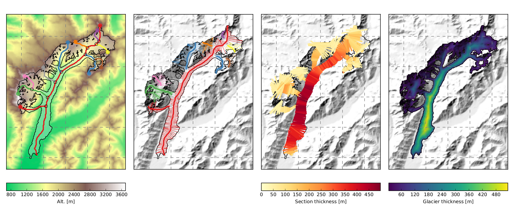

.. image:: docs/_static/logo.png

|

**OGGM is a modular open source model for glacier dynamics**

The model accounts for glacier geometry (including contributory branches) and
includes an explicit ice dynamics module. It can simulate past and
future mass-balance, volume and geometry of (almost) any glacier in the world
in a fully automated and extensible workflow. We rely exclusively on publicly
available data for calibration and validation.

Installation, documentation
---------------------------

The documentation is hosted on ReadTheDocs: http://docs.oggm.org

Get in touch
------------

- View the source code `on GitHub`_.
- Report bugs or share your ideas on the `issue tracker`_.
- Improve the model by submitting a `pull request`_.
- Follow us on `Twitter`_.
- Or you can always send us an `e-mail`_ the good old way.

.. _e-mail: https://mailman.zfn.uni-bremen.de/cgi-bin/mailman/listinfo/oggm-users
.. _on GitHub: https://github.com/OGGM/oggm
.. _issue tracker: https://github.com/OGGM/oggm/issues
.. _pull request: https://github.com/OGGM/oggm/pulls
.. _Twitter: https://twitter.com/OGGM1

About
-----

:Version:
    .. image:: https://img.shields.io/pypi/v/oggm.svg
        :target: https://pypi.python.org/pypi/oggm
        :alt: Pypi version
        
    .. image:: https://img.shields.io/pypi/pyversions/oggm.svg
        :target: https://pypi.python.org/pypi/oggm
        :alt: Supported python versions

:Citation:
    .. image:: https://img.shields.io/badge/Citation-GMD%20paper-orange.svg
        :target: https://www.geosci-model-dev-discuss.net/gmd-2018-9/
        :alt: GMD Paper

    .. image:: https://zenodo.org/badge/43965645.svg
        :target: https://zenodo.org/badge/latestdoi/43965645
        :alt: Zenodo

:Tests:       
    .. image:: https://coveralls.io/repos/github/OGGM/oggm/badge.svg?branch=master
        :target: https://coveralls.io/github/OGGM/oggm?branch=master
        :alt: Code coverage

    .. image:: https://travis-ci.org/OGGM/oggm.svg?branch=master
        :target: https://travis-ci.org/OGGM/oggm
        :alt: Linux build status

    .. image:: https://img.shields.io/badge/Cross-validation-blue.svg
        :target: https://cluster.klima.uni-bremen.de/~github/crossval/
        :alt: Mass-balance cross validation

    .. image:: https://readthedocs.org/projects/oggm/badge/?version=latest
        :target: http://docs.oggm.org/en/latest/
        :alt: Documentation status

    .. image:: https://img.shields.io/badge/benchmarked%20by-asv-green.svg?style=flat
        :target: https://cluster.klima.uni-bremen.de/~github/asv/
        :alt: Benchmark status

:License:
    .. image:: https://img.shields.io/pypi/l/oggm.svg
        :target: http://www.gnu.org/licenses/gpl-3.0.en.html
        :alt: GNU GPLv3 license

:Authors:

    See the `version history`_ for a list of all contributors.

    .. _version history: http://docs.oggm.org/en/latest/whats-new.html
