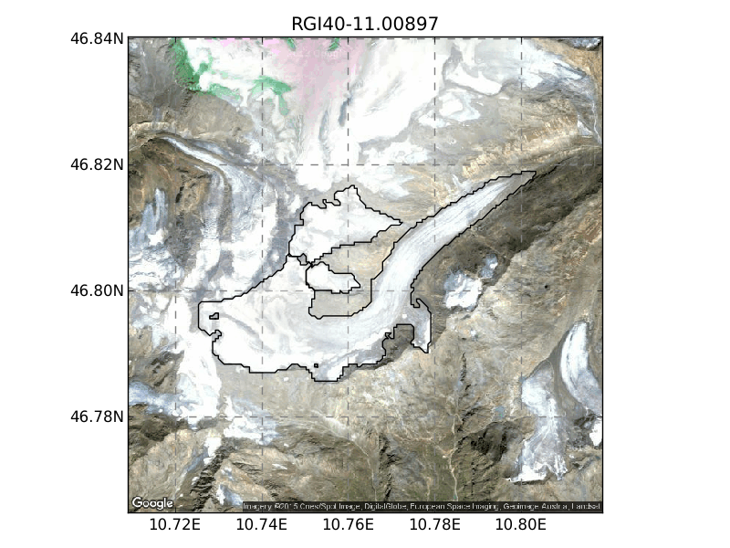

.. -*- rst -*- -*- restructuredtext -*-
.. This file should be written using restructured text conventions
.. default-role:: math

.. image:: ./files/logo.png

Ongoing work on the development of an Open Global Glacier Model. The model is based on `Marzeion et al., (2012) <http://www.the-cryosphere.net/6/1295/2012/tc-6-1295-2012.html>`_ and contains several extensions to account for the actual geometry of the glacier and include ice dynamics.

Example
-------

The Hintereisferner glacier provides a perfect testbed for the model:

Installation
------------

OGGM is compatible with Python 2.7 and Python 3+.

To work with OGGM we recommend to clone the repository:

   $ git clone git@github.com:OGGM/oggm.git

OGGM has several dependencies. See 
`INSTALL.rst <./docs/INSTALL.rst>`_ 
for more information.

About
-----

:Status:
    Experimental - in development

:Tests:
    .. image:: https://coveralls.io/repos/OGGM/oggm/badge.svg?branch=master&service=github
      :target: https://coveralls.io/github/OGGM/oggm?branch=master

    .. image:: https://travis-ci.org/OGGM/oggm.svg?branch=master
        :target: https://travis-ci.org/OGGM/oggm
    
:License:
    GNU GPLv3

:Authors:
    - Fabien Maussion - fabien.maussion@uibk.ac.at
    - Ben Marzeion
    - Kévin Fourteau
    - Christian Wild
    - Michael Adamer

:Funding:
    Austrian Research Foundation FWF, Projects P22443-N21 and P25362-N26

    .. image:: http://acinn.uibk.ac.at/sites/all/themes/imgi/images/acinn_logo.png
