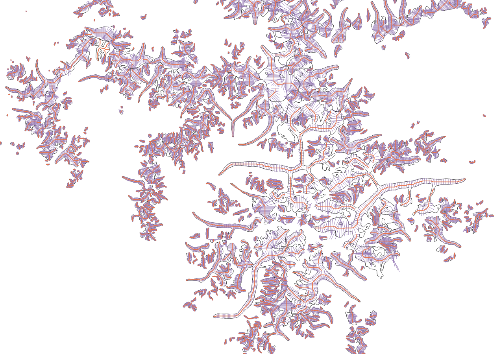

Other datasets
==============

This page lists some datasets that are either generated or used by OGGM and
that can be useful to others.

Shapefiles of glacier centerlines, flowlines and widths
-------------------------------------------------------

These variables are a standard output of OGGM, and can be useful to many.
You will find the files here: https://cluster.klima.uni-bremen.de/~oggm/gdirs/oggm_v1.6/L1-L2_files/centerlines/RGI62/b_010/L2/summary

.. note::

  Note that centerlines computed by OGGM are now a standard product for
  RGI version 7! Check out the `RGI User Guide <https://www.glims.org/rgi_user_guide>`_

The following files are available:

- ``centerlines``: the geometrical centerlines
- ``centerlines_smoothed``: the geometrical centerlines smoothed to look nicer and guaranteed to match the glacier outlines (not used in the model but useful outside of it)
- ``flowlines``: the centerlines converted to "flowlines", i.e. interpolated to a regular grid and where upslope trajectories are cropped
- ``geom_widths``: the geometrical intersection of the flowlines' normals with the glacier outlines
- ``widths``: the geometrical widths corrected to reflect the glacier's elevation-area distribution

If you use these data, please cite `Maussion et al., 2019 <https://gmd.copernicus.org/articles/12/909/2019/>`_.

    Shapefile of OGGM's flowlines and widths for a subset of RGI region 15

Useful data tables
------------------

These data are tabular summary from available global datasets:

- https://cluster.klima.uni-bremen.de/~oggm/rgi/rgi62_stats.h5: the global RGI stripped from the geometries
- https://cluster.klima.uni-bremen.de/~oggm/g2ti/rgi62_itmix_df.h5: ice volumes from [Farinotti_etal_2019]_ in tabular form
- https://cluster.klima.uni-bremen.de/~oggm/geodetic_ref_mb/hugonnet_2021_ds_rgi60_pergla_rates_10_20_worldwide_filled.hdf: glacier geodetic mass balance data from `Hugonnet et al., 2021 <https://www.nature.com/articles/s41586-021-03436-z>`_ corrected for RGI region 12 and missing glaciers, in tabular form
- `an example of OGGM output summary <https://cluster.klima.uni-bremen.de/~oggm/gdirs/oggm_v1.4/L3-L5_files/ERA5/elev_bands/qc3/pcp1.6/no_match/RGI62/b_040/L5/summary/>`_
  from the pre-processed directories. Useful outputs include terminus position, topographical
  variables, etc.

HDF files can be read with `pandas' read_hdf <https://pandas.pydata.org/pandas-docs/stable/reference/api/pandas.read_hdf.html>`_ function.
