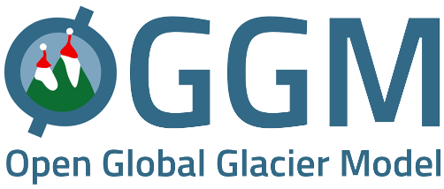
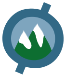
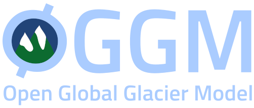
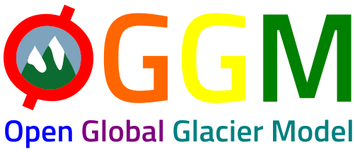
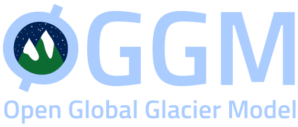
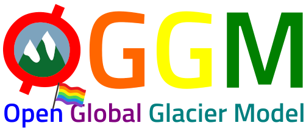

.. _citing-oggm:

Citing OGGM
===========

Publication
-----------

If you want to refer to OGGM in your publications or presentations, please
refer to the paper in `Geoscientific Model Development`_.

BibTeX entry::

    @Article{gmd-12-909-2019,
    AUTHOR = {Maussion, F. and Butenko, A. and Champollion, N. and
              Dusch, M. and Eis, J. and Fourteau, K. and Gregor, P. and
              Jarosch, A. H. and Landmann, J. and Oesterle, F. and
              Recinos, B. and Rothenpieler, T. and Vlug, A. and Wild, C. T. and
              Marzeion, B.},
    TITLE = {The Open Global Glacier Model (OGGM) v1.1},
    JOURNAL = {Geoscientific Model Development},
    VOLUME = {2019},
    YEAR = {2019},
    PAGES = {909--931},
    URL = {https://www.geosci-model-dev.net/12/909/2019/},
    DOI = {10.5194/gmd-12-909-2019}
    }

.. _Geoscientific Model Development: https://www.geosci-model-dev.net/12/909/2019/

Software DOI
------------

If you want to refer to a specific version of the software you can use
the `Zenodo citation`_ for this purpose. An example BibTeX entry::

    @misc{OGGM_v1.5.2,
    author       = {Fabien Maussion and Timo Rothenpieler and Matthias Dusch and
                    Anouk Vlug and Nicolas Champollion and Ben Marzeion and Lilian Schuster and
                    Moritz Oberrauch and Fei Li and Johannes Landmann and Julia Eis and
                    Alex Jarosch and Sarah Hanus and David Rounce and Matteo Castellani and
                    Sadie L. Bartholomew and Chris Merrill and David Loibl and Lizz Ultee and
                    Schmitty Smith and Anton Butenko and Patrick Schmitt and Philipp Gregor},
    title        = {OGGM/oggm: v1.5.2},
    month        = aug,
    year         = 2021,
    publisher    = {Zenodo},
    version      = {v1.5.2},
    doi          = {10.5281/zenodo.5327634},
    url          = {https://doi.org/10.5281/zenodo.5327634}
    }

.. _Zenodo citation: https://zenodo.org/badge/latestdoi/43965645

Logo
----

The OGGM logos are free to use!

**full logo**:
`pdf <_static/logos/oggm.pdf>`_,
`logo large (2008x858) <_static/logos/oggm_l.png>`_,
`logo large (2008x858) with alpha channel <_static/logos/oggm_l_alpha.png>`_,
`logo small (502x215) <_static/logos/oggm_s.png>`_,
`logo small (502x215) with alpha channel <_static/logos/oggm_s_alpha.png>`_

**icon logo**:
`icon small (135x157) <_static/logos/oggm_icon.png>`_,
`icon small (135x157) with alpha channel <_static/logos/oggm_icon_alpha.png>`_

**dark background logo**:
`dark large (2008x858) with alpha channel <_static/logos/oggm_dark_l_alpha.png>`_,
`dark small (502x215) with alpha channel <_static/logos/oggm_dark_s_alpha.png>`_

**OGGM rainbow**:
`rainbow large (2004x856) with alpha channel <_static/logos/oggm_rainbow_l_alpha.png>`_,
`rainbow small (502x215) with alpha channel <_static/logos/oggm_rainbow_s_alpha.png>`_

**night dark background logo**:
`night dark large (2008x858) with alpha channel <_static/logos/oggm_night_l_alpha.png>`_,
`night dark small (502x215) with alpha channel <_static/logos/oggm_night_s_alpha.png>`_

**OGGM pride**:
`pride large (2004x856) with alpha channel <_static/logos/oggm_pride_l_alpha.png>`_,
`pride small (502x215) with alpha channel <_static/logos/oggm_pride_s_alpha.png>`_

|

**Acknowledgments:** thanks to Ben Marzeion for the original logo design, and Larissa van der Laan for the rainbow and dark logos!
