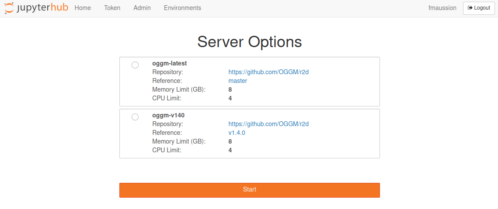

Try OGGM online
===============

You can try OGGM in your web browser **without having to install anything**!
This is the best way to run the tutorials or even do exploratory research
to test the model, before you move on to more serious computations.

.. _oggm-hub:

OGGM-Hub
--------

`hub.oggm.org`_ is our own `JupyterHub <https://jupyter.org/hub>`_ deployment
of OGGM on our servers in Bremen. It works similarly to MyBinder or Google Colab,
but it is bound to a username (you'll need an account) and is therefore persistent
(your files are saved between sessions). It also gives you access to more computing
resources than most free services.

.. figure:: https://img.shields.io/badge/Launch-OGGM%20hub-F37524.svg?style=popout&logo=data:image/png;base64,iVBORw0KGgoAAAANSUhEUgAAACAAAAAlCAYAAAAjt+tHAAAACXBIWXMAABcSAAAXEgFnn9JSAAAAB3RJTUUH4wENDyoWA+0MpQAAAAZiS0dEAP8A/wD/oL2nkwAACE5JREFUWMO9WAtU1FUaH1BTQVJJKx+4BxDEgWEGFIzIVUMzPVBauYng8Jr3AxxAHObBvP6MinIUJdLwrTwqzXzkWVMSLW3N7bTrtmvpno7l6WEb7snMB6DffvfOzJ87A5a27t5zvjP/x/1/v9/9Xve7IxA84BFXYBMIi+zBIoUrOCLbxD9PVLgE/9MRtdhKfycW2gfGFzkMCFgXV2CPEStdAyQqLui/BhiXU3lP8xJkzkclSu77SapqSEYRyZ2bE+TO0b8JdGKRozeRRZWDcHXDEuWuEQkyx8gkJTcirtA2VCh3DvJYwJGT7AUngu9PDJ9nGH5/yM9oBU+X1fK3sXlVQyQKVyyu5lkELcUVviZRcHvECtc+BNiNz+vFSq5cWGifm6Sq/oghcE2s4GggRC+23Bv2hHwbfz1eankIFachkBsB/8mu7F4EyZyNzrNGUMsU2H4dfMxCI2v+cAQuRyWX+lSu5HrkbgSU3GcxeVWpgujZQd74uDs4+pS/jpZaxiD45kCFaHpIlDspaKp2JaQV10CavgYma5aDGJ/jN/RdAImvULc2Jt8WRnEIiQWGAPSZCr8oxiBrYRWRa6J8qqEW5tkbIXdlExSteQPkdbtR3oSC2lbIXr4DMq0bIb1kNU+SIXIdSdTE5FlHEoz4woDgFslc3mLhHIRA9X6rRuAUzQqY79gM2oa3wbTjCNib2/3E0eL5Xbb1MKjr98JLrq0wRbeCkmbioUskc64dm22iGRHPZ9gslSf4pLZ+yGwBTr7DghMzS1c1g2n7UbAhSFXTMbDueq+XmHYcpe9szcfAjNfEOjPK1lJr8AtSVneK5a5KksrelBUIAIASiFhUORx9fIE1+xPo37zVLRTgbsBEzDveg8bDH+Nvm3euZ77+1f0wa9l6PxJoiX9jZmX6V68iZ3/0kZI1/WS1GxZw234VvBIts+/05/CvH38G7vXjYGHeke+0DftgWukaak2fblI/hIW2CJ5AssqNvuc+7TE9BxkV66hPfwncsrMN1h04Dddu3gIyzpz/hhKyBpAoqH0dJuGCkhjrYkF7zlNac02C2AJbPGMiTLEVkLNyF9gxuHgwFDv6lyVEwM5c+BLu3LlDCXR2dcOu9rM0HlgCS7f8EeZaNvgFJV6vmVhkHyaIlzmCRDKHnvU9MVlp4ztg84L5zNr21y+g4dAZMOPKHc3vQ1atC56tk0P37dvgGx1Xr4OztR2t02MFkiEkkNnURIufwuyLInkfjOmxiSXwjLEeU+s4r8C47Qi0nvgb3Ojsgj99dgncb7wPFdvfgdHlT8MAlRDaPz/NE+jsvg0HPzoPRsYVJHs0mJ5PLanlSWAgdmDPIBZg5PdDafcRIL4ixcbZesIT4bjalbs/gPNf/0ABiLGb2/8B05eXwrDiFBisEYG+xcUT6OruggOfnAR9416o2uWxILHkktcO0rjyBWOSkkoaBmB1v2RmByNllRQSnwXI6vd+eI6u3je++O4KJNiyYIhOAqEoydw8/t2Nzptg318PT7qKqZt8cVC26RDMNr4SmA3TBNg49EM5xRJ40ckQ2P4unDx3EQKHvsUJ4UtSIEyfBAM1CXDpyrf0+c+3roN0SwWEl6SDdlMr2JuOUwKljYeoa1kCmG2/JyUxOKHI0cLWAFLTiQts+LFswxbYcOwt+P7qDxhs3TyBC5cvwnjzLBiCBEJ1YnAdbKDPf7zxEyS75kOoVgypDhkSOEFjoHjDfphRXkdT3BdrSGYK1n8uGCPSwgZhxtJ1NIrNO4/AVK4YQvUiyKjNg8N//4BPOTLmvaKBocWTqBUilk2Dn25eg8tXOyipEF0ijCqbDvkNG4FrPQnKdXvozskHocL1DTYyIkGU1Bo0ocCWxhJ4smQVqNe/DbKNm2FMeQYM1opAII+FREcWtJ37kCeg2lkFw0omUwIkFox7VsPWk3sgWBFHn4Xpk2GKU0FjgdQVP/8ruSPYK47z7APZxhB8cJHPBJUb5pjrYYa7DAZphVTZw6gsSDEBptbkwLZTb8HBs8dAZM/0AnlkiF4C0aaZNDjDvFaINM6F3LpGDMCGwEJkw2YlxLsNc/2xHuj9GhCNE6JKFlHz+wAICZL3jxhSYUTpFB6IJ4D3IdpEhpAYRi5Jh6QyA6RqatgN6Sa6fZZ/B1xgexzN/2kPCTfEq5fBY7rZqIgo7QEjQUeEBe8tnvmjtFkgUlqoPqazasbq+5jnQJHr6VYlai4Id8RMLA6drCsSkMQoXSZVSFb0y6A9riAyWvcciNRm1LOc7a6uYPBl+a1+TuV6z8a0sHIATihmXUFIiFVWiNLmQ7g+nbok0CKsycn7ofpUiNRKQay2+oN7fL9iXI5psKcDr/L1hMqe3kDuHIwTDaQksySSVE60hhGiNIXwuG4OgqQgWAJKPISgEPBHdNNhnHYhCNVL6fxJKlYHXf1ezDh6Stp0oC2gK1Y42XPeQDTTy+irgJacEHHhyqrQtCYkVAFCTSlKGd5XQqLaAhKVw8/fjOkPSZTVkT6Msdl9HPUmMt3qw/PLgnCrFmIPtw3j4lbvvt8dAOTuE9gbdK9G5pjC+zr89BqhmSUCac0Wpk13vIAKLt/vqchb6/+Mi5odmq3lT8dohfs4I05X98fVr2LjAQvWUVR8GEl1BAKSediAnsccr4/Nt6YTFRmla3l1v1tkur8zKnYsKQj0lx4/Vt9C8Kf4CZNzQ4c+b4gam22Mf2iuLkIQ8/wA9nvZqq140FX/9v8E0P+5GDy3EbybEMA60RSHBYu+TDL0/dFM1QP4uyPDd1QLIxtVKuZuE66+QyznXhb8v0bkYrPf/ag/VIwYLzWHsdXzQYz/ABScQI1BUjcgAAAAAElFTkSuQmCC
  :target: https://hub.oggm.org
  :align: left

In order to be able to log in, you will need to have a (free) user account.
It is super easy, just :ref:`contact` if you want to try it out! Please briefly
introduce yourself and tell us why you would like an account, so that we can
guide you towards the next steps.

.. warning::

    `hub.oggm.org`_ is still experimental and we cannot guarantee that your
    work will *always* be safe here. We will do our best, but, you know, we
    are scientists after all. Please, **make a copy of your files from
    time to time**!

.. _hub.oggm.org: https://hub.oggm.org

How does this work?
~~~~~~~~~~~~~~~~~~~

We use a single compute node located in Bremen to welcome the hub users.
Currently (we are still trying things out) each user gets enough CPUs (4) and
enough RAM (8Gb) to run OGGM on several glaciers at once.
This is not enough to do heavy work, but will get you through the exploratory
phase or even small regional runs. Each user also gets a persistent 16Gb disk
to save output data, notebooks and scripts. The OGGM-specific input data
(i.e. everything that is downloaded automatically between users, see
:ref:`system settings <system-settings>`) is shared among
users (the ``shared`` folder in your ``$HOME``). The first time you run a
new glacier, OGGM will first check if the data is available in the ``shared`` folder,
and if not it will download it for you and the other users.

    Welcome screen of https://hub.oggm.org

When logging in, you can choose between several environments. We suggest to
pick the latest OGGM version if you are not sure, and in general stick to
whatever worked for you last time.
These environments are restarted each time you log-out and log-in again
(don't worry, your ``HOME`` and all it contains won't be erased!). This means
that while you *can* install things in the root tree (e.g. with ``pip install``),
it won't be there the next time you open your hub. If you have special
requirements, please let us now so that we can add them, or install them in
your ``HOME`` with ``pip install --user``.

Accessing the tutorials (and other content) with nbgitpuller
~~~~~~~~~~~~~~~~~~~~~~~~~~~~~~~~~~~~~~~~~~~~~~~~~~~~~~~~~~~~

Per default, your user space after logging in should be empty. We recommend
using `nbgitpuller <https://jupyterhub.github.io/nbgitpuller>`_ to
automatically download content from our
`tutorials repository <https://github.com/OGGM/tutorials>`_ for you.

You can execute this command in your JupyterHub terminal (`Launcher -> Start a terminal`)::

    $ gitpuller https://github.com/OGGM/tutorials master tutorials

That will copy the notebooks into the ``tutorials`` folder
in your home directory (on OGGM-Hub, not your local machine).
You can use a similar command to pull content from other repositories as well (e.g. the
`OGGM-Edu notebooks <https://github.com/OGGM/oggm-edu-notebooks>`_).

Another way to pull content into your hub is to use a special weblink.
Say, for example, that you would like to download the content of Lizz's
`glacier course <https://github.com/ehultee/CdeC-glaciologia>`_
(Spanish notebooks) into your lab as well. You can use the
`nbgitpuller link generator <https://jupyterhub.github.io/nbgitpuller/link>`_
to create the following links which, once clicked, will open your workspace
with the new notebooks in it. Here are some useful links to add notebooks to
your hub:

- `Add OGGM's tutorial notebooks to your hub <https://hub.oggm.org/hub/user-redirect/git-pull?repo=https://github.com/OGGM/tutorials%26amp%3Bbranch=master%26amp%3Burlpath=lab/tree/tutorials/notebooks/welcome.ipynb%3Fautodecode>`_
- `Add Lizz's Clubes de Ciencia Perú 2019 notebooks to your hub <https://hub.oggm.org/hub/user-redirect/git-pull?repo=https%3A%2F%2Fgithub.com%2Fehultee%2FCdeC-glaciologia&urlpath=lab%2Ftree%2FCdeC-glaciologia%2F>`_

.. important::

    `nbgitpuller` will never overwrite changes that **the user** made to the
    files in the pulled folder. This is very important to remember: sometimes
    you would like to get an updated version of the notebooks
    for example, and this will not work if you made changes to the file there.
    Therefore, it is always a good idea to make a working copy
    of the original file/folder before working on it (right-click -> rename).

    The full set of rules used by `nbgitpuller` while pulling is explained
    `here <https://jupyterhub.github.io/nbgitpuller/topic/automatic-merging.html>`_.
