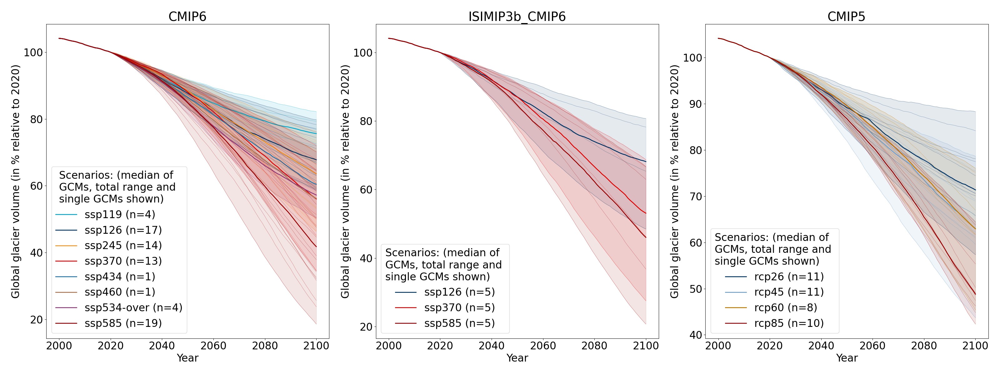
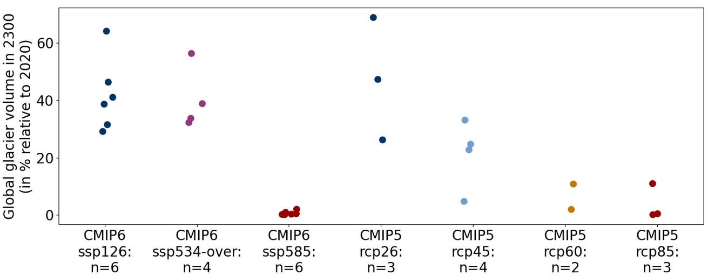

OGGM global glacier projections
===============================

.. image:: https://zenodo.org/badge/DOI/10.5281/zenodo.8286065.svg
   :target: https://doi.org/10.5281/zenodo.8286065

|

Since OGGM v1.6.1, each version of OGGM now provides a set of global glacier
projections realized with the default set-up of OGGM for that version.
We provide an OGGM simulation for all climate models we are aware of and have
access to.

A detailed description of the experimental-setup, information on the data
structure, analysis of the data and a brief comparison to `Rounce et al. (2023) <https://www.science.org/doi/10.1126/science.abo1324>`_
together with the analysis jupyter notebooks can be found in the
`OGGM/oggm-standard-projections-csv-files repository <https://github.com/OGGM/oggm-standard-projections-csv-files>`_.

These projections use :ref:`eb-flowlines`, make use of the :ref:`dynamic-spinup`,
the new "informed 3-step" :ref:`mb-calib` method for each glacier with geodetic data,
and use the W5E5v2.0 climate dataset `(Lange et al., 2021) <https://doi.org/10.48364/ISIMIP.342217>`_
for the historical climate.

We have driven OGGM with a range of climate projections from different GCMs until 2100 and,
where available, once more until 2300. All the climate projections products that are available
on our cluster have been used.

There are three categories available: CMIP6, CMIP6 GCMs from the
`bias-corrected ISIMIP3b GCMs <https://www.isimip.org/gettingstarted/isimip3b-bias-adjustment/>`_,
and CMIP5 GCMs. An overview of the number of GCMs per scenario and the resulting
global glacier volume changes is given in the figures below.
Feel free to make a selection of GCMs that suits your purpose when using the data.

    Global glacier volume from 2000 to 2100 relative to 2020 (in %) for the different CMIP options using the common running glaciers in all experiments until 2100. The amount of GCMs per scenario is given in the legend.

    Global glacier volume in 2300 relative to 2020 (in %) using all available climate scenarios for all common running glaciers until 2100 and 2300. The amount of GCMs per scenario is given in the xtick labels. Note that the GCMs until 2300 do not represent very well the ensemble until 2100. For example, the CMIP6 GCMs until 2300 are rather hotter until 2100 compared to the entire CMIP6 GCM ensemble.

For more information and access to the data, visit the
`OGGM/oggm-standard-projections-csv-files <https://github.com/OGGM/oggm-standard-projections-csv-files>`_
repository.

Data usage requirements
-----------------------

If you use these data (either aggregated csv or the per-glacier netcdf files), please cite the dataset as following:

*Lilian Schuster, Patrick Schmitt, Anouk Vlug, & Fabien Maussion. (2023). OGGM/oggm-standard-projections-csv-files: v1.0 (v1.0). Zenodo. https://doi.org/10.5281/zenodo.8286065*

In addition, please cite OGGM (Maussion et al., 2019) and the specific OGGM version as
specified in the OGGM documentation: :ref:`citing-oggm`.

We also recommend to refer to the CMIP option that you are using (references are listed in the data repository).
