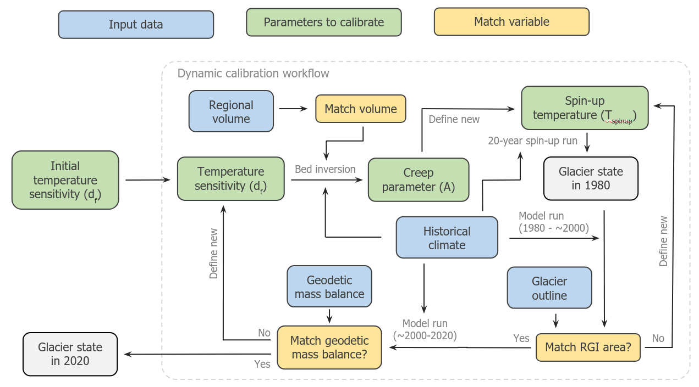

.. _dynamic-spinup:

Dynamic spinup
==============

OGGM offers an option for reconstructing the recent past of a glacier by using
a so called "dynamic spinup", during which the state of the glacier in the past
is estimated by an iterative approach. MAny possible past (1979) states are
tested, and the first one which leads to a correct representation of today's
glacier geometry after a forward run from 1979 to the RGI date.
For the match criterion, you can choose if you want to match
area OR volume at the RGI date.

Furthermore, this dynamic spinup can be combined
with a dynamic calibration of the temperature sensitivity :math:`d_f`.
This calibration attempts to also calibrate :math:`d_f` to match geodetic MB
data as described in :doc:`mass-balance-monthly`, but taking the
dynamically changing glacier geometry into account.

Both functions, the dynamic spinup and the dynamic :math:`d_f` calibration,
are combined in one consistent model calibration and initialisation workflow.
This workflow also includes the glacier bed inversion for consistency. See the
following schematic for a description of the standard steps in the spinup.

   Default dynamic calibration workflow (adapted from Aguayo et al. 2023, in prep.)

We offer pre-processed directories including a dynamic spinup run. You can
check out this `10 minute tutorial <https://oggm.org/tutorials/stable/notebooks/10minutes/dynamical_spinup.html>`_
for a short introduction to the spinup functions and how to use the
pre-processed directories.

If you are looking for an in-depth explanation of the dynamic functions you
should check out this
`advanced tutorial <https://oggm.org/tutorials/stable/notebooks/advanced/dynamical_spinup.html>`_.
