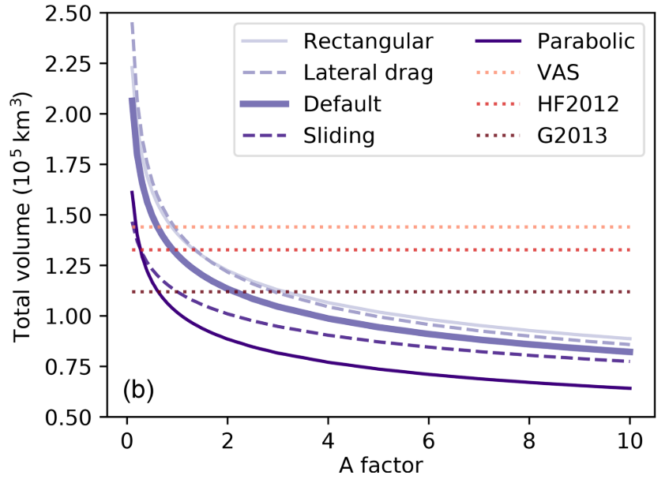

.. currentmodule:: oggm

***********************
FAQ and Troubleshooting
***********************

We list here some of the questions we get most often, either on our Slack
workspace or on `github <https://github.com/OGGM/oggm>`_.

What is the difference between OGGM and other glacier models?
-------------------------------------------------------------

There are plenty of established ice dynamics models, and some of them are
**open-source** (e.g. `PISM <http://www.pism-docs.org/wiki/doku.php>`_,
`Elmer/Ice <http://elmerice.elmerfem.org/>`_, `IGM <https://github.com/jouvetg/igm>`_).

The purpose of OGGM is to be an *easy to use*, *fully automated*
**global glacier model**, i.e. applicable to any glacier in the
world with or without specific tuning or tweaking. Therefore, it does not attempt to
replace (and even less compete with) these established ice dynamics models:
it can be seen as a "framework", a
set of unified tools that eases the process of working with many mountain
glaciers at once.

There is a standard modelling chain in OGGM (with a mass balance model
and a flowline model) but there is no obligation to use all
of these tools. For example, we can easily picture a workflow where people will
use OGGM to create homogenized initial conditions (topography, climate) but
use a higher order dynamical model like IGM instead of the simplified OGGM
dynamics. For these kind of workflows, we created the
`OGGM-contrib <https://github.com/OGGM/oggmcontrib>`_ example package which
should help OGGM users to implement their own physics in OGGM.

Can I use OGGM to simulate <my favourite glacier>?
--------------------------------------------------

The short answer is: "yes, but..."

The longer answer is that OGGM has been designed to work with *all* the world's
glaciers and calibrated as well as we can, but with publicly available global
datasets. We are quite confident that OGGM provides
reasonable global estimates of glacier mass balance and glacier change: this
is a result of the law of large numbers, assuming that the uncertainty for
each single glacier can be large but random and Gaussian.

If you use OGGM for a single or a handful of glaciers, chances are that the
outcome is disappointing. For these kind of applications, you'll probably
need to re-calibrate OGGM using local data, for example of mass balance
or observations of past glacier change.

Can I use OGGM to simulate long-term glacier evolution?
-------------------------------------------------------

It depends what you mean by "long-term": at centennial time scales, probably,
yes. At millennial time scales, maybe. At glacial time scales, probably not.
The major issue we have to face with OGGM is that it uses a "glacier-centric"
approach: it can simulate the mountain glaciers and ice-caps we know from
contemporary inventories, but it cannot simulate glaciers which existed before
but have disappeared today.

Also, if glaciers grow into large ice complexes and ice caps, the
flowline assumption becomes much less valid than for typical valley glaciers
found today. For these situations, fully distributed models like IGM or PISM
are more appropriate.

In addition, there is some issues about glacier growth: you have to be sure the
limit border you have defined is large enough to allow a large growth of glaciers;
secondly, you need to authorize the merge of glaciers which is implemented
into OGGM but not automated ; last, there might be not negligible changes
in the landscape around the glacier as well as evolution of the glacier
bed for long-term simulations.

We are currently in the process of testing and tuning OGGM for post-LIA
simulations in the Alps. Reach out if you would like to know more about our
progress.

I have a question about OGGM, can we talk about it per email/phone?
-------------------------------------------------------------------

Thanks for your interest in OGGM! Usually, we prefer to keep 
usage questions on `github issues <https://github.com/OGGM/oggm/issues>`_
so that everybody can learn from all questions and their answers.
You can also join our Slack discussion channel if you want a 
more interactive forum. Keep in touch with us per email if you'd 
like to join, we are a very open community!

Can I export OGGM centerlines to a shapefile?
---------------------------------------------

Yes! There is a function to do exactly that:
:py:func:`utils.write_centerlines_to_shape`. We also provide some already
processed ones in :doc:`assets`.

Can I export OGGM's <special variable> to <another programme>?
--------------------------------------------------------------

Yes! Although it might make you have to write some code. The developers
cannot think of all the great ideas/potential applications you have for the
model. We also do a lot of work *within* the OGGM framework, i.e. most of the
data we need is already there. Some variables are hidden, see
e.g.
`here <https://github.com/OGGM/oggm/issues/1096>`_ and
`there <https://github.com/OGGM/oggm/issues/1136>`_ for discussions on github.

If you need some specific variables, please write on GitHub and we can discuss.

What is the ice dynamics parameter "Glen A" in OGGM?
----------------------------------------------------

Out-of-the box, non-preprocessed OGGM will use fixed values for the creep
parameter :math:`A` and the sliding parameter :math:`f_s`:

.. ipython:: python

   from oggm import cfg
   cfg.initialize()
   cfg.PARAMS['glen_a']
   cfg.PARAMS['fs']

That is, :math:`A` is set to the standard value for temperate ice as given in
[Cuffey_Paterson_2010]_, and sliding is set to zero. While these values are
reasonable, they are unlikely to be the ones yielding the best results at the
global scale, and even more unlikely at regional or local scales. In particular,
in the absence of sliding parameter, it is recommended to set :math:`A` to a
higher value to compensate for this missing process (effectively making ice
"less stiff").

.. admonition:: **New in version 1.4!**

    Since v1.4, OGGM can now calibrate :math:`A`
    based on the consensus from [Farinotti_etal_2019]_ on any number
    of glaciers. We recommend to use a large number of glaciers: OGGM's default
    glacier directories are calibrated at the RGI region level. This
    value is then also used by the forward dynamical model for consistency,
    according to the parameter
    `use_inversion_params_for_run <https://github.com/OGGM/oggm/blob/e60becbc112a4c7cb734c0de1604bb7bd2b9e1f2/oggm/params.cfg#L326>`_.

    The pre-processed directories at level 3 to 5 are already calibrated to the
    consensus estimate at the RGI region level, i.e. unless specified
    otherwise, OGGM will use the pre-calibrated :math:`A` value for these glaciers.

There is a way to calibrate :math:`A` for the ice thickness inversion
procedure based on observations of ice thickness (see
`this blog post about g2ti <https://oggm.org/2018/05/21/g2ti/>`_ for an example).
At the global scale, a value in the range of [1.1-1.5] times the default value
gives volume estimates close to [Farinotti_etal_2019]_. At regional scale, these
values can differ, with a value closer to a factor 3, for example for the Alps. Note
that this depends on other variables as well, such as our estimates of
solid precipitation amounts (i.e mass turnover). This makes things
complicated, as regions with overestimated solid precipitation can
be compensated by a higher :math:`A`, and the other way around.

Finally, note that a change in :math:`A` has a very strong influence
for values close to the default value, but this influence reduces to the
power of 1/5 for large values of A (in other words, there is a big
difference between values of 1 to 1.3 times the default :math:`A`, but a
comparatively small difference for values between 3 to 5 times the
default :math:`A`). This is best shown by this figure from
[Maussion_etal_2019]_:

    Global volume estimated as a function of the multiplication factor
    applied to the ice creep parameter A, with five different setups:
    defaults, with sliding velocity, with lateral drag, and with rectangular
    and parabolic bed shapes only (instead of the default mixed
    parabolic/rectangular). In addition, we plotted the estimates from
    standard volume–area scaling (VAS, :math:`V = 0.034 S^{1.375}`),
    Huss and Farinotti (2012) (HF2012) and Grinsted (2013) (G2013).
    The latter two estimates are provided for indication only as they
    are based on a different glacier inventory

Now, what you are probably asking yourself: **how to choose the "best A" for my application?**

Sorry, but we don't know yet. We are working on it though! At the moment,
what we recommend to do is to calibrate :math:`A` so that the regional
(or even local) estimates match the volume consensus of
`Farinotti et al. (2019) <https://www.nature.com/articles/s41561-019-0300-3>`_
using the :py:func:`workflow.calibrate_inversion_from_consensus` global
task. This is what we do for the default pre-processed directories at the
RGI region level, so that you don't have to worry about it.

Which type of flowlines should I use: elevation bands or multiple?
------------------------------------------------------------------

We have written a documentation chapter about the :ref:`flprocons`.

Some glaciers exit with errors. What should I do?
-------------------------------------------------

Many things can go wrong when simulating all the world glaciers with a single
model. We've tried our best, but still many glaciers cannot be simulated
automatically. Possible reasons include complex glacier geometries that cannot
be simulated by flowlines, very cold climates which don't allow melting to
occur, or numerical instabilities during the simulation. Altogether, 4218
glaciers (3.6% of the total area worldwide) could not be modelled by
OGGM in the
`standard global simulations <https://www.geosci-model-dev.net/12/909/2019/>`_.
Some regions experience more errors than others (see the paper).

When you experience errors, you have to decide if they are due to an error
in your code or a problem in OGGM itself. The number and type of errors
might help you out to decide if you want to act and troubleshoot them
(see below). Also, always keep in mind that the *number* of errors is less
important than the *glacier area* they represent. Plenty or errors on
small glaciers is not as bad as one large glacier missing.

Then, you have to carefully consider how to deal with missing glaciers. Most
studies will upscale diagnostic quantities using power laws or interpolation:
for example, use volume-area-scaling to compute the volume of glaciers that
are missing after an OGGM run. Importantly, you have to always be aware that
these quantities will be missing from the compiled run outputs, and should
be accounted for in quantitative analyses.

What does the "`Glacier exceeds domain boundaries`" error mean?
---------------------------------------------------------------

This happens when a glacier grows larger than the original map boundaries.
We recommend to increase the glacier map in this case, by setting
`cfg.PARAMS['border']` to a larger value, e.g. 100 or 200. The larger this
value, the larger the glacier can grow (the drawback is that simulations
become slower and hungrier in memory because the number of grid points
increases as well). We do not recommend to go larger than 250. However, 
for these cases it is likely that something else is wrong in your workflow
or OGGM itself.

What does the "`CFL  error`" mean?
----------------------------------

This happens when the ice dynamics simulation is unstable. In OGGM we use an
adaptive time stepping scheme (which should avoid these kind of situations),
but we also implemented thresholds for small time steps: i.e. if a simulation
requires very small time steps we exit with an error in order to avoid extremely
slow runs. There is not much you can do here, unless maybe use a lower
`CFL value <https://github.com/OGGM/oggm/blob/e60becbc112a4c7cb734c0de1604bb7bd2b9e1f2/oggm/params.cfg#L298>`_,
or set your own thresholds for small time steps (at the cost of computation time).

Can I use my own Glacier inventory and outlines in OGGM?
--------------------------------------------------------

Yes! You will be able to include your own inventory and glacier outlines in OGGM
as long as the format of your `shapefile <https://en.wikipedia.org/wiki/Shapefile>`_
is the same as the RGI file (v5 and v6 are supported). The attribute table should match
the RGI format with the same amount of columns and variable names. See
:ref:`outlines` for more information about the list of glacier attributes
needed by OGGM.
If you decide to use your own inventory (e.g. maybe because it has a better glacier outline) we
encourage you to contact the `GLIMS core team <https://www.glims.org/maps/contact_info.html>`_
to let them know how your inventory improves the glacier digitalization compared to the
current RGI version. If you want to see an example on how to give OGGM a different shapefile than RGI,
have a look to this
`tutorial <https://oggm.org/tutorials/stable/notebooks/use_your_own_inventory.html>`_!

.. _pitfalls.numerics:

Ice velocities in OGGM are sometimes noisy or unrealistic. How so?
------------------------------------------------------------------

Short answer: **the "Flux-based" model in OGGM is numerically unstable in some conditions**

**New in OGGM 1.6:** in OGGM 1.6 and above, we use a considerably improved
semi-implicit scheme. However, for technical reasons, the "flux-based"
scheme is still used for multiple flowlines.

OGGM uses a CFL criterion to decide on the timestep to use during the
ice dynamics model iteration. The "flux-based" scheme of OGGM is fast and
flexible (e.g. it allows to compute the ice flow on multiple flowlines),
but it is not following textbook recommendations on numerical stability.

See `this github issue <https://github.com/OGGM/oggm/issues/909>`_ for a
discussion pointing this out, and `this example <https://github.com/OGGM/oggm/issues/860>`_.

As of OGGM v1.2, we have fixed the most pressing issues.
`This blog post <https://oggm.org/2020/01/18/stability-analysis/>`_ explains
it in detail, but for a summary:

- the old algorithm was flawed, but did not result in significant errors
  at large scales
- the new algorithm is faster and more likely to be stable
- we don't guarantee statibility in 100% of the cases, but when the model
  becomes unstable it will raise an error.

**We test OGGM for mass-conservation in several use cases**. What might happen,
however, is that the calculated velocities display "wobbles" or artifacts,
which are a sign of instability. If this occurs, set the global parameter
``cfg.PARAMS['cfl_number']`` to a lower value (0.01 or 0.005 are worth a try).

References
----------

.. [Farinotti_etal_2019] Farinotti, D., Huss, M., Fürst, J. J., Landmann, J.,
    Machguth, H., Maussion, F. and Pandit, A.: A consensus estimate for the ice
    thickness distribution of all glaciers on Earth, Nat. Geosci., 12(3),
    168–173, doi:10.1038/s41561-019-0300-3, 2019.

.. [Maussion_etal_2019] Maussion, F., Butenko, A., Champollion, N., Dusch, M.,
    Eis, J., Fourteau, K., Gregor, P., Jarosch, A. H., Landmann, J., Oesterle,
    F., Recinos, B., Rothenpieler, T., Vlug, A., Wild, C. T. and Marzeion, B.:
    The Open Global Glacier Model (OGGM) v1.1, Geosci. Model Dev., 12(3),
    909–931, doi:10.5194/gmd-12-909-2019, 2019.

