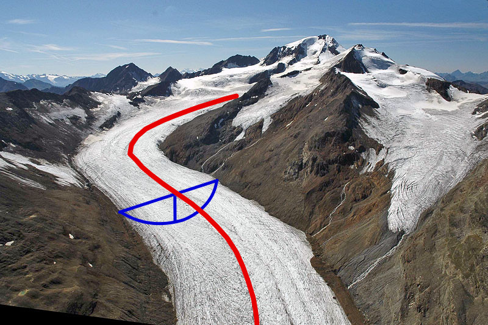
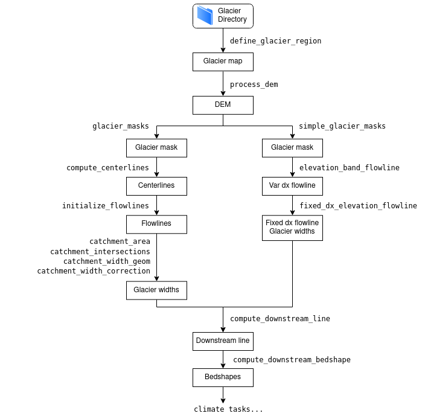
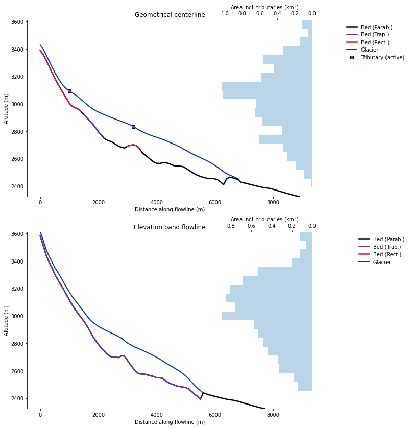

.. currentmodule:: oggm

Glacier flowlines
=================

.. ipython:: python
   :suppress:

    fpath = "_code/prepare_centerlines.py"
    with open(fpath) as f:
        code = compile(f.read(), fpath, 'exec')
        exec(code)

.. ipython:: python
   :suppress:

    from oggm import graphics

OGGM's default model is a "flowline model", which means that the glacier ice flow is
assumed to happen along a representative "1.5D" flowline, as in the image
below. "1.5D" here is used to emphasize that although glacier ice can flow
only in one direction along the flowline, each point of the glacier has
a geometrical width. This width means that flowline glaciers are able to match
the observed area-elevation distribution of true glaciers, and can parametrize
the changes in glacier width with thickness changes.

   Example of a glacier flowline. Background image from
   http://www.swisseduc.ch/glaciers/alps/hintereisferner/index-de.html

.. admonition:: **New in version 1.4!**

   Since v1.4, OGGM now has two different ways to convert a
   2D glacier into a 1.5 flowline glacier:

   1. via **geometrical centerlines**, which are computed from the glacier geometry
      and routing algorithms. This was the single option in OGGM before v1.4.
   2. via binned **elevation bands flowlines**, which are computed by the binning and
      averaging of 2D slopes into a "bulk" flowline glacier. This is the method
      first developed and applied by [Huss_Farinotti_2012]_.

Both methods have strengths and weaknesses, which we discuss in more depth
below. First, let's have a look at how they work.

Geometrical centerlines
-----------------------

Centerline determination
~~~~~~~~~~~~~~~~~~~~~~~~

Our algorithm is an implementation of the procedure described by
`Kienholz et al., (2014)`_. Apart from some minor changes (mostly the choice
of some parameters), we stay close to the original algorithm.

.. _Kienholz et al., (2014): http://www.the-cryosphere.net/8/503/2014/

The basic idea is to find the terminus of the glacier (its lowest point) and
a series of centerline "heads" (local elevation maxima). The centerlines are then
computed with a least cost routing algorithm minimizing both (i) the total
elevation gain and (ii) the distance to the glacier terminus:

.. ipython:: python

    @savefig plot_fls_centerlines.png width=80%
    graphics.plot_centerlines(gdir)

The glacier has a major centerline (the longest one), and
tributary branches (in this case: two). The Hintereisferner glacier is a
good example of a wrongly outlined glacier: the two northern glacier sub-catchments
should have been classified as independent entities since they do not flow
to the main flowline (more on this below).

At this stage, the centerlines are still not fully suitable
for modelling. Therefore, a rather simple
procedure converts them to "flowlines", which
now have a regular grid spacing (which they will
keep for the rest of the workflow). The tail of the tributaries are cut
of before reaching the flowline they are tributing to:

.. ipython:: python

    @savefig plot_fls_flowlines.png width=80%
    graphics.plot_centerlines(gdir, use_flowlines=True)

This step is needed to better represent glacier widths at flowline junctions.
The empty circles on the main flowline indicate the location where the respective
tributaries are connected (i.e. where the ice flux that is originating from the
tributary will be added to the main flux when running the model dynamic).

Downstream lines
~~~~~~~~~~~~~~~~

For the glacier to be able to grow, we need to determine the flowlines
downstream of the current glacier geometry:

.. ipython:: python

    @savefig plot_fls_downstream.png width=80%
    graphics.plot_centerlines(gdir, use_flowlines=True, add_downstream=True)

The downsteam lines area is also computed using a routing algorithm minimizing
the distance between the glacier terminus and the border of the map as well
as the total elevation gain, therefore following the valley floor.

Catchment areas
~~~~~~~~~~~~~~~

Each flowline has its own "catchment area". These areas are computed
using similar flow routing methods as the one used for determining the
flowlines. Their purpose is to attribute each glacier pixel to the right
tributary in order to compute mass gain and loss for each tributary.
This will also influence the later computation of the glacier widths:

.. ipython:: python

    tasks.catchment_area(gdir)
    @savefig plot_fls_catchments.png width=80%
    graphics.plot_catchment_areas(gdir)

Flowline widths
~~~~~~~~~~~~~~~

Finally, the flowline widths are computed in two steps.

First, we compute the geometrical width at each grid point. The width is drawn
from the intersection of a line perpendicular to the flowline and either (i)
the glacier outlines or (ii) the catchment boundaries:

.. ipython:: python

    tasks.catchment_width_geom(gdir)
    @savefig plot_fls_width.png width=80%
    graphics.plot_catchment_width(gdir)

Then, these geometrical widths are corrected so that the altitude-area
distribution of the "flowline-glacier" is as close as possible as the actual
distribution of the glacier using its full 2D geometry. This correction is responsible
for the large widths of the main red flowline in its upper part.
This width increase comes from the two northern glacier sub-catchments that are not
included in the main flowline.

.. ipython:: python

    tasks.catchment_width_correction(gdir)
    @savefig plot_fls_width_cor.png width=80%
    graphics.plot_catchment_width(gdir, corrected=True)

Note that a *perfect* match is not possible since the sample size is
not the same between the "1.5D" and the 2D representation of the glacier,
but it's close enough.

.. _eb-flowlines:

Elevation bands flowlines
-------------------------

The "elevation bands flowlines" method is another way to transform a glacier into a
flowline. The implementation is considerably easier as the geometrical
centerlines, and is used in [Huss_Farinotti_2012]_,
[Huss_Hock_2015]_ as well as [Werder_et_al_2019]_. We follow the
exact same methodology.

The elevation range of the glacier is divided into N equal bands,
each spanning an elevation difference of :math:`\Delta z` = 30 m (this
parameter can be changed). The area of each band is calculated by
summing the areas of all cells in the band.
A representative slope angle for each band is needed for estimating
the ice flow. This calculation is also critical as it will determine the
horizontal length of an elevation band and hence the overall glacier length.
This slope is computed as the mean of all cell slopes over a certain
quantile range (see [Werder_et_al_2019]_ for details), chosen to remove
outliers and to return a slope angle that is both representative of the
main trunk of the glacier and somewhat consistent with its real length.

The flowlines obtained this way have an irregular spacing, dependent on the
bin size and slope. For OGGM, we then convert this first flowline to a regularly
space one by interpolating to the target resolution, which is the same
as the geometrical centerlines (default: 2 dx of the underlying map).

The resulting glacier flowlines can be understood as a "bulk" representation
of the glacier, representing the average size and slope of each
elevation band.

.. _fl_compat:

Compatibility within the OGGM framework
---------------------------------------

Both methods are creating a "1.5D" glacier. After computation,
**both representations are programmatically equivalent** for the ice thickness inversion and
ice dynamics models. They are both stored as a list of
:py:class:`~oggm.Centerline` objects. Glaciers can have only one
elevation-band flowline per glacier, while there can be several geometrical
centerlines. The downstream lines are computed the same way for both the
elevation-band and geometrical flowlines.

   Flowchart illustrating the different ways to compute the flowlines
   and at which point in the workflow they can be treated equivalently

Both flowline types are available for download and for use in the OGGM
framework. The plot below has been obtained from the
`centerlines versus elevation-band flowlines comparison tutorial <https://oggm.org/tutorials/stable/notebooks/10minutes/elevation_bands_vs_centerlines.html>`_.

   Cross-sections of the two flowline types at the example Hintereisferner
   with OGGM version 1.4. Note the different lengths. The main flowline in
   the geometrical centerline case does not reach as high here because
   other flowlines (tributaries) are higher for this glacier.

.. _flprocons:

Pros and cons of both methods
-----------------------------

Since the flowline representation of the glacier is **always** a simplification,
it is impossible to say which method "is best".

This list below  tries to be as objective as possible and can help you decide on
which to pick. At the individual glacier scale, the impact on the
results can be large, but our own quick assessment shows that at the global
scale the differences are rather small (yet to be quantified with more
precision).

Geometrical centerlines
~~~~~~~~~~~~~~~~~~~~~~~

- Pros:

  - Closer to the "true" length of the glacier.
  - Grid points along the centerlines preserve their geometrical information,
    i.e. one can compute the exact location of ice thickness change.
  - It is possible to have different model parameters for each flowline (e.g.
    different mass balance models), although this is coming with its own
    challenges.
  - Arguably: better suitability for mass balance parameterizations taking
    glacier geometry and exposition into account.
  - Arguably: better representation of the main glacier flow?

- Cons:

  - Complex and error prone: considerably more code than the elevation band
    flowlines.
  - Less robust: more glaciers are failing in the preprocessing than with
    the simpler method.
    When glaciers are badly outlined (or worse, when ice caps are not
    properly divided), or with bad DEMs, the geometrical flowline
    can "look" very ugly.
  - Computationally expensive (more grid points on average, more prone
    to numerical instabilities).
  - Complex handling of mass balance parameters for tributaries at the
    inversion (leading to multiple temperature sensitivity parameters
    for large glaciers).
  - Related: **all "new generation" maas-balance models in OGGM currently
    handle only a single flowline because of this complexity.**

.. admonition:: **Summary**

   **When to use:** when geometry matters, and when length is an important variable.
   For mountain glaciers (e.g. Alps, Himalayas). With the old mass balance
   model.

   **When not to use:** for ice caps, badly outlined glaciers, very large and
   flat glaciers, for global applications where geometrical details matter less.
   With the more fancy mass balance models.

Elevation-band flowlines
~~~~~~~~~~~~~~~~~~~~~~~~

- Pros:

  - Robust approach: much less sensitive to DEM and outline errors. This is
    probably its best attribute, and makes it very interesting for large-scale
    applications.
  - Computationally cheap and simple: less error prone.
  - Simpler mass balance, because no complexity with the tributaries.
  - Arguably: better representation of the main glacier flow?

- Cons:

  - Geometry is lost, glaciers cannot be plotted on a map anymore.
  - Glacier length is not the "true" length.
  - Somewhat arbitrary: it's not clear why averaging the slopes with subjectively
    chosen quantiles is a good idea.
  - Only one flowline.

.. admonition:: **Summary**

   **When to use:** when "true" geometry does not matter. When doing simulations
   at large scales, and when robustness to bad / uncertain boundary conditions
   is important. With the new generation mass balance models.

   **When not to use:** when glacier geometry or (absolute) length matters.

As of OGGM v1.4, the OGGM developers use both representations:
elevation bands at the global scale, and geometrical centerlines for simulations
in mountain regions where geometry matters (e.g. hazards assessments).

References
----------

.. [Huss_Farinotti_2012] Huss, M. and Farinotti, D.: Distributed ice thickness
   and volume of all glaciers around the globe, J. Geophys. Res. Earth Surf.,
   117(4), F04010, doi:10.1029/2012JF002523, 2012.

.. [Huss_Hock_2015] Huss, M. and Hock, R.: A new model for global glacier
   change and sea-level rise, Front. Earth Sci., 3(September), 1–22,
   doi:10.3389/feart.2015.00054, 2015.

.. [Werder_et_al_2019] Werder, M. A., Huss, M., Paul, F., Dehecq, A. and
   Farinotti, D.: A Bayesian ice thickness estimation model for large-scale
   applications, J. Glaciol., 1–16, doi:10.1017/jog.2019.93, 2019.

Implementation details
----------------------

.. admonition:: Code used to generate the examples
   :class: note, dropdown

   .. literalinclude:: _code/prepare_centerlines.py
