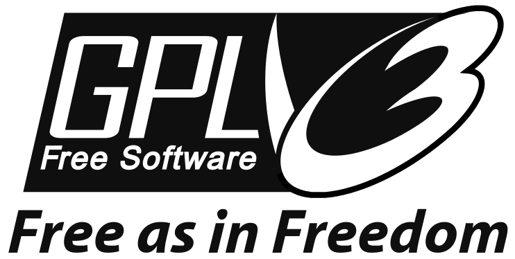

A modular open source glacier model in Python
---------------------------------------------

The model accounts for glacier geometry (including contributory branches) and
includes an explicit ice dynamics module. It can simulate past and
future mass-balance, volume and geometry of (almost) any glacier in the world
in a fully automated and extensible workflow. We rely exclusively on publicly
available data for calibration and validation.

.. note::

    **This is the software documentation: for general information about the
    OGGM project and related news, visit** `oggm.org <http://oggm.org>`_.

.. include:: _generated/version_text.txt

Principles
^^^^^^^^^^

Physical principles implemented in the model and their underlying assumptions,
with as little code as possible. For more detailed information, we recommend
to read the OGGM
`description paper <https://www.geosci-model-dev-discuss.net/gmd-2018-9/>`_ as
well.

* :doc:`introduction`
* :doc:`flowlines`
* :doc:`mass-balance`
* :doc:`ice-dynamics`
* :doc:`inversion`

.. toctree::
    :maxdepth: 1
    :hidden:
    :caption: Principles

    introduction.rst
    flowlines.rst
    mass-balance.rst
    ice-dynamics.rst
    inversion.rst

Using OGGM
^^^^^^^^^^

How to use the model, with concrete python code examples.

* :doc:`installing-oggm`
* :doc:`getting-started`
* :doc:`input-data`
* :doc:`mpi`
* :doc:`run`
* :doc:`api`
* :doc:`faq`
* :doc:`whats-new`

.. toctree::
    :maxdepth: 1
    :hidden:
    :caption: Using OGGM

    installing-oggm.rst
    getting-started.rst
    input-data.rst
    mpi.rst
    run.rst
    api.rst
    faq.rst
    whats-new.rst

Contributing
^^^^^^^^^^^^

Do you want to contribute to the model? This is the right place to start.

* :doc:`citing-oggm`
* :doc:`add-module`
* :doc:`contributing`

.. toctree::
    :maxdepth: 1
    :hidden:
    :caption: Contributing

    citing-oggm.rst
    add-module.rst
    contributing.rst

.. _contact:

Get in touch
------------

- View the source code `on GitHub`_.
- Report bugs or share your ideas on the `issue tracker`_.
- Improve the model by submitting a `pull request`_.
- Follow us on `Twitter`_.
- Or you can always send us an `e-mail`_ the good old way.

.. _e-mail: https://mailman.zfn.uni-bremen.de/cgi-bin/mailman/listinfo/oggm-users
.. _on GitHub: https://github.com/OGGM/oggm
.. _issue tracker: https://github.com/OGGM/oggm/issues
.. _pull request: https://github.com/OGGM/oggm/pulls
.. _Twitter: https://twitter.com/OGGM1

License and citation
--------------------

OGGM is available under the open source `GNU GPLv3 license`_.

.. _GNU GPLv3 license: http://www.gnu.org/licenses/gpl-3.0.en.html

OGGM is free software. This implies that you are free to use the model and
copy or modify its code at your wish, under certain conditions:

1. When using this software, please acknowledge the original authors of this
   contribution by linking to our project website `www.oggm.org <http://oggm.org>`_.
   For your publications, presentations or posters we kindly ask you to refer to the
   `paper in Geoscientific Model Development`_ (in review).

   BibTeX entry::

        @Article{gmd-2018-9,
        AUTHOR = {Maussion, F. and Butenko, A. and Eis, J. and Fourteau, K. and
                  Jarosch, A. H. and Landmann, J. and Oesterle, F. and
                  Recinos, B. and Rothenpieler, T. and Vlug, A. and
                  Wild, C. T. and Marzeion, B.},
        TITLE = {The Open Global Glacier Model (OGGM) v1.0},
        JOURNAL = {Geoscientific Model Development Discussions},
        VOLUME = {2018},
        YEAR = {2018},
        PAGES = {1--33},
        URL = {https://www.geosci-model-dev-discuss.net/gmd-2018-9/},
        DOI = {10.5194/gmd-2018-9}
        }

   If you want to refer to a specific version of the software you can use
   the `Zenodo citation`_ for this purpose.

   An example BibTeX entry::

        @misc{OGGM_v1.0.0,
        author       = {Fabien Maussion and Timo Rothenpieler and
                        Beatriz Recinos and Anouk Vlug and
                        Ben Marzeion and Felix Oesterle and
                        Johannes Landmann and Alex Jarosch and
                        Julia Eis and Anton Butenko and Schmitty Smith},
        title        = {OGGM/oggm: v1.0.0},
        month        = jan,
        year         = 2018,
        doi          = {10.5281/zenodo.1149701},
        url          = {https://doi.org/10.5281/zenodo.1149701}
        }

2. Your modifications to the code belong to you, but if you decide
   to share these modifications with others you'll have to do so under the same
   license as OGGM (the GNU General Public License as published by the Free
   Software Foundation).

See the `wikipedia page about GPL`_ and the `OGGM license`_ for more
information.

.. _paper in Geoscientific Model Development: https://www.geosci-model-dev-discuss.net/gmd-2018-9/

.. _Zenodo citation: https://zenodo.org/badge/latestdoi/43965645

.. _wikipedia page about GPL: https://en.wikipedia.org/wiki/GNU_General_Public_License

.. _OGGM license: https://github.com/OGGM/oggm/blob/master/LICENSE.rst

About
-----

:Version:
    .. image:: https://img.shields.io/pypi/v/oggm.svg
        :target: https://pypi.python.org/pypi/oggm
        :alt: Pypi version

    .. image:: https://img.shields.io/pypi/pyversions/oggm.svg
        :target: https://pypi.python.org/pypi/oggm
        :alt: Supported python versions

:Citation:
    .. image:: https://img.shields.io/badge/Citation-GMD%20paper-orange.svg
        :target: https://www.geosci-model-dev-discuss.net/gmd-2018-9/
        :alt: GMD Paper

    .. image:: https://zenodo.org/badge/43965645.svg
        :target: https://zenodo.org/badge/latestdoi/43965645
        :alt: Zenodo

:Tests:
    .. image:: https://coveralls.io/repos/github/OGGM/oggm/badge.svg?branch=master
        :target: https://coveralls.io/github/OGGM/oggm?branch=master
        :alt: Code coverage

    .. image:: https://travis-ci.org/OGGM/oggm.svg?branch=master
        :target: https://travis-ci.org/OGGM/oggm
        :alt: Linux build status

    .. image:: https://img.shields.io/badge/Cross-validation-blue.svg
        :target: https://cluster.klima.uni-bremen.de/~github/crossval/
        :alt: Mass-balance cross validation

    .. image:: https://readthedocs.org/projects/oggm/badge/?version=latest
        :target: http://docs.oggm.org/en/latest
        :alt: Documentation status

    .. image:: https://img.shields.io/badge/benchmarked%20by-asv-green.svg?style=flat
        :target: https://cluster.klima.uni-bremen.de/~github/asv/
        :alt: Benchmark status

:License:
    .. image:: https://img.shields.io/pypi/l/oggm.svg
        :target: http://www.gnu.org/licenses/gpl-3.0.en.html
        :alt: GNU GPLv3 license

:Authors:

    See the `version history`_ for a list of all contributors.

    .. _version history: http://docs.oggm.org/en/latest/whats-new.html
