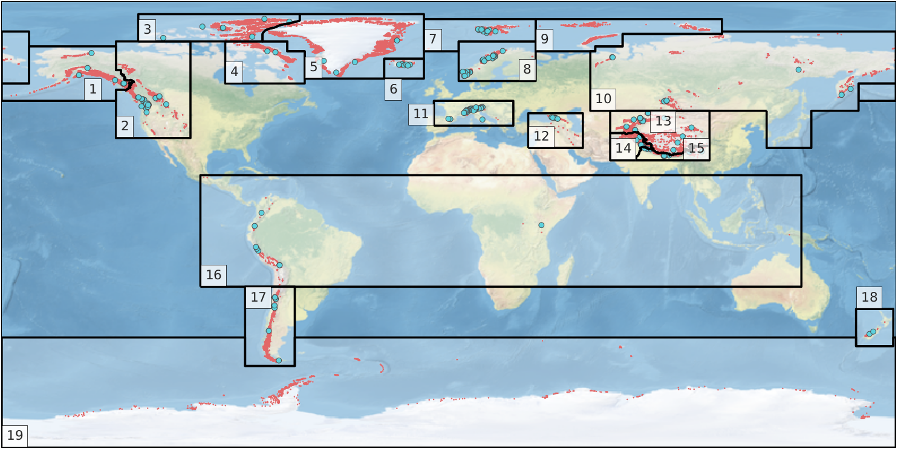

.. _input-data:

.. currentmodule:: oggm

Input data
==========

OGGM needs various data files to run. Currently, **we rely exclusively on
open-access data that are all downloaded automatically for the user**. This
page explains the various ways OGGM uses to get to the data it needs.

First, you will have to set-up your :ref:`system-settings` (you'll need to
do this only once per computer). Then, we recommend to start your runs from
:ref:`preprodir`: these are ready-to-run :ref:`glacierdir` at various levels
of pre-processing state, thus reducing the amount of pre-processing you'll
have to do yourself. It is also possible to do a full run "from scratch", in
which case OGGM will download the :ref:`rawdata` for you as well.

.. _system-settings:

System settings
---------------

OGGM implements a bunch of tools to make access to the input data as painless
as possible for you, including the automated download of all the required files.
This requires you to tell OGGM where to store these data.

Calibration data and testing: the ``~/.oggm`` directory
~~~~~~~~~~~~~~~~~~~~~~~~~~~~~~~~~~~~~~~~~~~~~~~~~~~~~~~

At the first import, OGGM will create a cached ``.oggm`` directory in your
``$HOME`` folder. This directory contains all data obtained from the
`oggm sample data`_ repository. It contains several files needed only for
testing, but also some important files needed for calibration and validation.
For example:

- The CRU `baseline climatology`_ (CL v2.0, obtained from
  `crudata.uea.ac.uk/ <https://crudata.uea.ac.uk/cru/data/hrg/>`_ and prepared
  for OGGM),
- The `reference mass-balance data`_ from WGMS with
  `links to the respective RGI polygons`_,
- The `reference ice thickness data`_ from WGMS (`GlaThiDa`_ database).

.. _oggm sample data: https://github.com/OGGM/oggm-sample-data
.. _baseline climatology: https://github.com/OGGM/oggm-sample-data/tree/master/cru
.. _reference mass-balance data: https://github.com/OGGM/oggm-sample-data/tree/master/wgms
.. _links to the respective RGI polygons: http://fabienmaussion.info/2017/02/19/wgms-rgi-links/
.. _reference ice thickness data: https://github.com/OGGM/oggm-sample-data/tree/master/glathida
.. _GlaThiDa: http://www.gtn-g.ch/data_catalogue_glathida/

The ``~/.oggm`` directory should be updated automatically when you update OGGM,
but if you encounter any problems with it, simply delete the directory (it will
be re-downloaded automatically at the next import).

All other data: auto-downloads and the ``~/.oggm_config`` file
~~~~~~~~~~~~~~~~~~~~~~~~~~~~~~~~~~~~~~~~~~~~~~~~~~~~~~~~~~~~~~

Unlike runtime parameters (such as physical constants or working directories),
the input data is shared accross runs and even accross computers if you want
to. Therefore, the paths to previously downloaded data are stored in a
configuration file that you'll find in your ``$HOME`` folder:
the ``~/.oggm_config`` file.

The file should look like::

    dl_cache_dir = /path/to/download_cache
    dl_cache_readonly = False
    tmp_dir = /path/to/tmp_dir
    cru_dir = /path/to/cru_dir
    rgi_dir = /path/to/rgi_dir
    test_dir = /path/to/test_dir
    has_internet = True

Some explanations:

- ``dl_cache_dir`` is a path to a directory where *all* the files you
  downloaded will be cached for later use. Most of the users won't need to
  explore this folder (it is organized as a list of urls) but you have to make
  sure to set this path to a folder with sufficient disk space available. This
  folder can be shared across computers if needed. Once a file is stored
  in this cache folder, OGGM won't download it again.
- ``dl_cache_readonly`` indicates if writing is allowed in this folder (this is
  the default). Setting this to ``True`` will prevent any further download in
  this directory (useful for cluster environments, where this data might be
  available on a readonly folder).
- ``tmp_dir`` is a path to OGGM's temporary directory. Most of the topography
  files used by OGGM are downloaded and cached in a compressed (zip) format.
  They will be extracted in ``tmp_dir`` before use. OGGM will never allow more
  than 100 ``.tif`` files to exist in this directory by deleting the oldest ones
  following the rule of the `Least Recently Used (LRU)`_ item. Nevertheless,
  this directory might still grow to quite a large size. Simply delete it
  if you want to get this space back.
- ``cru_dir`` is the location where the CRU climate files are extracted if
  needed. They are quite large! (approx. 6Gb)
- ``rgi_dir`` is the location where the RGI shapefiles are extracted.
- ``test_dir`` is the location where OGGM will write some of its output during
  tests. It can be set to ``tmp_dir`` if you want to, but it can also be
  another directory (for example a fast SSD disk). This folder shouldn't become
  too large but here again, don't hesitate to delete it if you need to.

.. note::

  For advanced users or cluster configuration:
  ``tmp_dir``, ``cru_dir`` and ``rgi_dir`` can be overridden and set to a
  specific directory by defining an environment variable ``OGGM_EXTRACT_DIR``
  to a directory path. Similarly, the environment variables
  ``OGGM_DOWNLOAD_CACHE`` and ``OGGM_DOWNLOAD_CACHE_RO`` override the
  ``dl_cache_dir`` and ``dl_cache_readonly`` settings.

.. _Least Recently Used (LRU): https://en.wikipedia.org/wiki/Cache_replacement_policies#Least_Recently_Used_.28LRU.29

.. _preprodir:

Pre-processed directories
-------------------------

The simplest way to run OGGM is to rely on :ref:`glacierdir` which have been
prepared for you by the OGGM developers. Depending on your use case,
you can start from various levels of pre-processing, and various map sizes.

All these directories have been generated with the default parameters
of the current stable OGGM version. If you want to change these parameters,
you'll have to do a full run from scratch using the :ref:`rawdata`.

To start from a pre-processed state, simply use the
:py:func:`workflow.init_glacier_regions` function with the
``from_prepro_level`` and ``prepro_border`` keyword arguments set to the
values of your choice.

Processing levels
~~~~~~~~~~~~~~~~~

Currently, there are five available levels of pre-processing:

- **Level 1**: the lowest level, with directories containing the glacier
  topography and glacier outlines only.
- **Level 2**, adding the baseline climate timeseries (CRU, see below) to this
  folder.
- **Level 3**, adding the output of all necessary pre-processing tasks
  for a dynamical run, including the bed inversion using the default
  parameters.
- **Level 4**, same as level 3 but with all intermediate ouptut files removed.
  The strong advantage of level 4 files is that their size is considerably
  reduced, at the cost that certain operations (like plotting on maps or
  running the bed inversion algorithm again) are not possible.

In practice, most users are going to use level 3 or level 4 files, with some
use cases relying on lower levels.

Map size
~~~~~~~~

The size of the local glacier map is given in number of grid points *outside*
the glacier boundaries. The larger the map, the largest the glacier can
become. Therefore, user should choose the map border parameter depending
on the expected glacier growth in their simulations: for most cases,
a border value of 80 or 160 should be enough.

Here is an example with the Hintereisferner in the Alps:

.. ipython:: python
   :suppress:

    import os
    import matplotlib.pyplot as plt
    import numpy as np
    from oggm import cfg, tasks, workflow, graphics
    from oggm.utils import gettempdir

    cfg.initialize()
    cfg.PATHS['working_dir'] = os.path.join(gettempdir(), 'Docs_BorderSize')

.. ipython:: python

    f, axs = plt.subplots(2, 2, figsize=(8, 6))
    for ax, border in zip(np.array(axs).flatten(), [10, 80, 160, 250]):
        gdir = workflow.init_glacier_regions('RGI60-11.00897',
                                             from_prepro_level=1,
                                             prepro_border=border)
        graphics.plot_domain(gdir, ax=ax, title='Border: {}'.format(border),
                             add_colorbar=False,
                             lonlat_contours_kwargs={'add_tick_labels':False})
    @savefig plot_border_size.png width=100%
    plt.tight_layout(); plt.show()

For runs into the Little Ice Age, a border value of 160 is more than enough.
For simulations into the 21st century, a border value of 80 is
sufficient.

Users should be aware that the amount of data to download isn't small,
especially for full directories at levels 3. Here is an indicative
table for the total amount of data for all 18 RGI regions
(excluding Antarctica):

======  =====  =====  =====  =====
Level   B  10  B  80  B 160  B 250
======  =====  =====  =====  =====
**L1**  2.4G   11G    29G    63G
**L2**  5.1G   14G    32G    65G
**L3**  13G    44G    115G   244G
**L4**  4.2G   4.5G   4.8G   5.3G
======  =====  =====  =====  =====

Certain regions are much smaller than others of course. As an indication,
with prepro level 3 and a map border of 160, the Alps are 2G large, Greenland
11G, and Iceland 334M.

Therefore, it is recommended to always pick the smallest border value suitable
for your research question, and to start your runs from level 4 if possible.

.. note::

  The data download of the preprocessed directories will occur one single time
  only: after the first download, the data will be cached in OGGM's
  ``dl_cache_dir`` folder (see above).

.. _rawdata:

Raw data sources
----------------

These data are used to create the pre-processed directories explained above.
If you want to run your own workflow from A to Z, or if you would like
to know which data are used in OGGM, read further!

Glacier outlines and intersects
~~~~~~~~~~~~~~~~~~~~~~~~~~~~~~~

Glacier outlines are obtained from the `Randolph Glacier Inventory (RGI)`_.
We recommend to download them right away by opening a python interpreter
and type:

.. code-block:: python

    from oggm import utils
    utils.get_rgi_intersects_dir()
    utils.get_rgi_dir()

The RGI folders should now contain the glacier outlines in the
`shapefile format <https://en.wikipedia.org/wiki/Shapefile>`_, a format widely
used in GIS applications. These files can be read by several softwares
(e.g. `qgis <https://www.qgis.org/en/site/>`_), and OGGM can read them too.

The "RGI Intersects" shapefiles contain the locations of the ice divides
(intersections between neighboring glaciers). OGGM can make use of them to
determine which bed shape should be used (rectangular or parabolic). See the
`rgi tools <https://rgitools.readthedocs.io/en/latest/tools.html#glacier-intersects>`_
documentation for more information about the intersects.

.. _Randolph Glacier Inventory (RGI): https://www.glims.org/RGI/

Topography data
~~~~~~~~~~~~~~~

When creating a :ref:`glacierdir` a suitable topographical data source is
chosen automatically, depending on the glacier's location. Currently we use:

- the `Shuttle Radar Topography Mission`_ (SRTM) 90m Digital Elevation Database v4.1
  for all locations in the [60°S; 60°N] range
- the `Greenland Mapping Project`_ (GIMP) Digital Elevation Model
  for mountain glaciers in Greenland (RGI region 05)
- the `Radarsat Antarctic Mapping Project`_ (RAMP) Digital Elevation Model, Version 2
  for mountain glaciers in the Antarctic continent
  (RGI region 19 with the exception of the peripheral islands)
- the `Viewfinder Panoramas DEM3`_ products
  elsewhere (most notably: North America, Russia, Iceland, Svalbard)

.. _Shuttle Radar Topography Mission: http://srtm.csi.cgiar.org/
.. _Greenland Mapping Project: https://bpcrc.osu.edu/gdg/data/gimpdem
.. _Radarsat Antarctic Mapping Project: http://nsidc.org/data/nsidc-0082
.. _Viewfinder Panoramas DEM3: http://viewfinderpanoramas.org/dem3.html

These data are downloaded only when needed (i.e.: during an OGGM run)
and they are stored in the ``dl_cache_dir``
directory. The gridded topography is then reprojected and resampled to the local
glacier map. The local grid is defined on a Transverse Mercator projection centered over
the glacier, and has a spatial resolution depending on the glacier size. The
default in OGGM is to use the following rule:

.. math::

    \Delta x = d_1 \sqrt{S} + d_2

where :math:`\Delta x` is the grid spatial resolution (in m), :math:`S` the
glacier area (in km\ :math:`^{2}`) and :math:`d_1`, :math:`d_2` some parameters (set to 14 and 10,
respectively). If the chosen spatial resolution is larger than 200 m
(:math:`S \ge` 185 km\ :math:`^{2}`) we clip it to this value.

.. ipython:: python
   :suppress:

    import json
    from oggm.utils import get_demo_file
    with open(get_demo_file('dem_sources.json'), 'r') as fr:
        DEM_SOURCE_INFO = json.loads(fr.read())
    # for k, v in DEM_SOURCE_INFO.items():
    #   print(v)

**Important:** when using these data sources for your OGGM runs, please refer
to the original data provider of the data! OGGM will add a ``dem_source.txt``
file in each glacier directory specifying how to cite these data. We
reproduce this information here:

SRTM V4
    Jarvis A., H.I. Reuter, A.  Nelson, E. Guevara, 2008, Hole-filled seamless SRTM data V4,
    International  Centre for Tropical  Agriculture (CIAT),
    available  from http://srtm.csi.cgiar.org.

RAMP V2
    Liu, H., K. C. Jezek, B. Li, and Z. Zhao. 2015.
    Radarsat Antarctic Mapping Project Digital Elevation Model, Version 2.
    Boulder, Colorado USA. NASA National Snow and Ice Data Center Distributed Active Archive Center.
    doi: https://doi.org/10.5067/8JKNEW6BFRVD.

GIMP V1.1
    Howat, I., A. Negrete, and B. Smith. 2014.
    The Greenland Ice Mapping Project (GIMP) land classification and surface
    elevation data sets, The Cryosphere. 8. 1509-1518.
    https://doi.org/10.5194/tc-8-1509-2014

VIEWFINDER PANORAMAS DEMs
    There is no recommended citation for these data. Please refer to the website above in case of doubt.

.. warning::

    A number of glaciers will still suffer from poor topographic information.
    Either the errors are large or obvious (in which case the model won't run),
    or they are left unnoticed. The importance of reliable topographic data for
    global glacier modelling cannot be emphasized enough, and it is a pity
    that no consistent, global DEM is yet available for scientific use.

Climate data
~~~~~~~~~~~~

The MB model implemented in OGGM needs monthly time series of temperature and
precipitation. The current default is to download and use the `CRU TS`_
data provided by the Climatic Research Unit of the University of East Anglia.

.. _CRU TS: https://crudata.uea.ac.uk/cru/data/hrg/

**‣ CRU (default)**

If not specified otherwise, OGGM will automatically download and unpack the
latest dataset from the CRU servers. We recommend to do this before your
first run. In a python interpreter, type:

.. code-block:: python

    from oggm import utils
    utils.get_cru_file(var='tmp')
    utils.get_cru_file(var='pre')

.. warning::

    While the downloaded zip files are ~370mb in size, they are ~5.6Gb large
    after decompression!

The raw, coarse (0.5°) dataset is then downscaled to a higher resolution grid
(CRU CL v2.0 at 10' resolution) following the anomaly mapping approach
described by Tim Mitchell in his `CRU faq`_ (Q25). Note that we don't expect
this downscaling to add any new information than already available at the
original resolution, but this allows us to have an elevation-dependent dataset
based on a presumably better climatology. The monthly anomalies are computed
following Harris et al., (2010): we use standard anomalies for temperature and
scaled (fractional) anomalies for precipitation. At the locations where the
monthly precipitation climatology is 0 we fall back to the standard anomalies.

**When using these data, please refer to the original provider:**

Harris, I., Jones, P. D., Osborn, T. J., & Lister, D. H. (2014). Updated
high-resolution grids of monthly climatic observations - the CRU TS3.10 Dataset.
International Journal of Climatology, 34(3), 623–642. https://doi.org/10.1002/joc.3711

.. _CRU faq: https://crudata.uea.ac.uk/~timm/grid/faq.html

**‣ User-provided dataset**

You can provide any other dataset to OGGM by setting the ``climate_file``
parameter in ``params.cfg``. See the HISTALP data file in the `sample-data`_
folder for an example.

.. _sample-data: https://github.com/OGGM/oggm-sample-data/tree/master/test-workflow

**‣ GCM data**

OGGM can also use climate model output to drive the mass-balance model. In
this case we still rely on gridded observations (CRU) for the baseline
climatology and apply the GCM anomalies computed from a preselected reference
period. This method is sometimes called the
`delta method <http://www.ciesin.org/documents/Downscaling_CLEARED_000.pdf>`_.

Currently we can process data from the
`CESM Last Millenium Ensemble <http://www.cesm.ucar.edu/projects/community-projects/LME/>`_
project (see :py:func:`tasks.process_cesm_data`), but adding other models
should be relatively easy.

Mass-balance data
~~~~~~~~~~~~~~~~~

In-situ mass-balance data is used by OGGM to calibrate and validate the
mass-balance model. We reliy on mass-balance observations provided by the
World Glacier Monitoring Service (`WGMS`_).
The `Fluctuations of Glaciers (FoG)`_ database contains annual mass-balance
values for several hundreds of glaciers worldwide. We exclude water-terminating
glaciers and the time series with less than five years of
data.
Since 2017, the WGMS provides a lookup table
linking the RGI and the WGMS databases. We updated this list for version 6 of
the RGI, leaving us with 254 mass balance time series. These are not equally
reparted over the globe:

    Map of the RGI regions; the red dots indicate the glacier locations
    and the blue circles the location of the 254 reference WGMS
    glaciers used by the OGGM calibration. From our `GMD paper`_.

These data are shipped automatically with OGGM. All reference glaciers
have access to the timeseries through the glacier directory:

.. ipython:: python

    gdir = workflow.init_glacier_regions('RGI60-11.00897', from_prepro_level=4,
                                         prepro_border=10)[0]
    mb = gdir.get_ref_mb_data()
    @savefig plot_ref_mbdata.png width=100%
    mb[['ANNUAL_BALANCE']].plot(title='WGMS data: Hintereisferner')

.. _WGMS: https://wgms.ch
.. _Fluctuations of Glaciers (FoG): https://wgms.ch/data_databaseversions/
.. _GMD Paper: https://www.geosci-model-dev-discuss.net/gmd-2018-9/