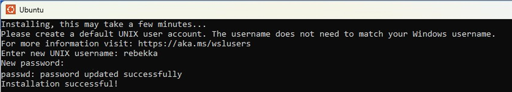

Installing OGGM on Windows
==========================

OGGM does not work on Windows. However, there is a workaround using the Windows 
Subsystem for Linux (WSL). There is no official support for installing OGGM on 
Windows. Nevertheless, the steps listed hereafter have been used for a successful
installation, but there is no guarantee that it will work for everyone.

Install WSL
-----------
Enable Intel Virtual Technology
~~~~~~~~~~~~~~~~~~~~~~~~~~~~~~~

As a first step, you need to enable ‘Intel Virtual Technology’ to allow WSL to be 
executed in the next step. To do this, restart your computer and access the BIOS or 
UEFI settings by one of the following keys: F2, F12, Esc, Del. Which key you need 
to use depends on your computer. With the arrow key you are now able to navigate to 
the ‘configuration’ tab. Select ‘Intel Virtual Technology’ and change the settings 
from ‘disabled’ to ‘enabled’. Save the change and exit the BIOS or UEFI settings by 
using F10.

Enable WSL
~~~~~~~~~~

Next you need to enable WSL. This is possible through the Windows Features dialog 
or Power Shell. In the Windows search bar, type 'features' to bring up the 
**Turn Windows Features on or off** dialog. Scroll down and check **Windows 
Subsystem for Linux**. It is also necessary to tick **Virtual Machine Platform** 
and **Windows Hypervisor Platform** to avoid errors. Click ‘OK’ and in the prompted 
new field ‘install’.

|

It is also possible to enable WSL as administrator via the Power Shell by using the 
following command::

    Enable-WindowsOptionalFeature -Online -FeatureName Microsoft-Windows-Subsystem-Linux

Afterwards you will be asked to restart Windows.

Check WSL
~~~~~~~~~

To be sure WSL is enabled you can check it by opening a Command Prompt and type ’WSL’ 
after restarting Windows:

This means, WLS in enabled but you have not installed a Linux distribution yet.

Download Windows Subsystem for Linux and a Linux distribution of your choice
~~~~~~~~~~~~~~~~~~~~~~~~~~~~~~~~~~~~~~~~~~~~~~~~~~~~~~~~~~~~~~~~~~~~~~~~~~~~

Download the free
`Windows subsystem for Linux <https://apps.microsoft.com/detail/windows-subsystem-for-linux/9P9TQF7MRM4R?hl=en-us&gl=US&ocid=pdpshare>`_ 
in the Microsoft Store. With that you keep Windows as main operating system and are able 
work with Linux alongside your Windows application. There are some limitations compared 
to a complete second operating system, but it is sufficient to install OGGM. In addition,
download and install `Ubuntu <https://apps.microsoft.com/detail/ubuntu/9PDXGNCFSCZV?hl=en-gb&gl=US>`_
or another Linux distribution of your choice. 

UNIX User Account
~~~~~~~~~~~~~~~~~

Now open Ubuntu. You will automatically be asked to create a UNIX account.

Installing OGGM
---------------

After successfully setting up Linux as a Windows subsystem, you can proceed with the OGGM 
installation process. There are multiple approaches available for `installing OGGM <https://docs.oggm.org/en/stable/installing-oggm.html>`_, 
and all of them should work with WSL. However, we are aware that this may not always be 
the case. Here, we provide an example of steps that have resulted in a successful installation. 

1. Install the `prerequisites <https://docs.oggm.org/en/stable/installing-oggm.html#prerequisites>`_ 
for creating a python environment.

2. Create a `python environment <https://docs.oggm.org/en/stable/installing-oggm.html#the-simplest-way-with-an-environment-file>`_
using a yml file.

3. `Install OGGM <https://docs.oggm.org/en/stable/installing-oggm.html#install-oggm-itself>`_
with ``pip install oggm``

4. `Test <https://docs.oggm.org/en/stable/installing-oggm.html#test-oggm>`_ if the installation was successful.

5. **Congrats**, you are now set-up for the `getting started <https://docs.oggm.org/en/stable/getting-started.html>`_ section!

If you encounter problems, check out the 
`trouble shooting <https://docs.oggm.org/en/stable/installing-oggm.html#install-troubleshooting>`_ documentation.
