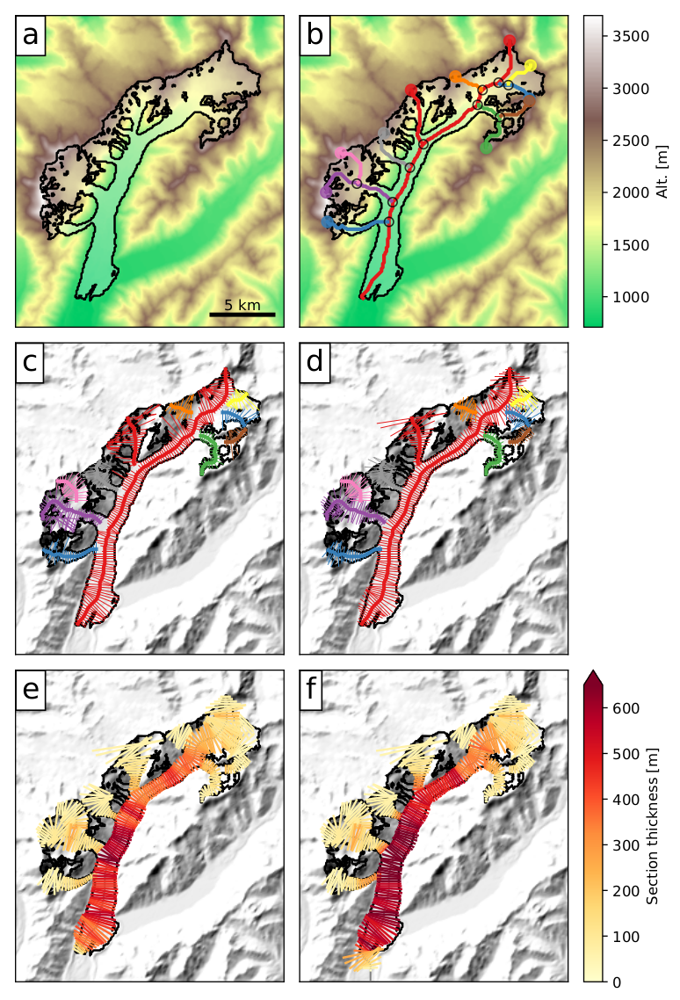

Introduction
============

We illustrate with an example how the OGGM workflow is applied to the
Hintereisferner (HEF) glacier in the Ötztal Alps, Austria (see the Figure
at the bottom of this page).
Here we describe shortly the purpose of each processing step, while more
details are provided in the other sections:

Preprocessing
  The glacier outlines extracted from the RGI are projected onto a local
  gridded map of the glacier (Fig. a). Depending on the
  glacier's location, a suitable source for the topographical data is
  downloaded automatically (here SRTM) and interpolated to the local grid.
  The map's spatial resolution depends on the size of the glacier
  (for HEF, 50~m). Optionally, an automated partitioning algorithm dividing
  glacier complexes into single dynamical entities can be applied (see Fig. b:
  the HEF RGI outline represents in fact three independent glaciers which used
  to be connected in the past).

Flowlines
  The glacier centerlines are computed using a geometrical routing algorithm
  and then filtered and slightly adapted modified to become glacier "flowlines"
  with a fixed grid spacing (Fig. c).

Catchment areas and widths
  The geometrical widths along the flowlines are obtained by intersecting the
  normals at each grid point with the glacier outlines and the tributaries'
  catchment areas. Each tributary and the main flowline has a catchment area,
  which is then used to correct the geometrical widths so that the flowline
  representation of the glacier is in close accordance with the actual
  altitude-area distribution of the glacier (Fig. d, note that the normals are
  now corrected and centred).

Climate data and mass-balance
  Gridded climate data (monthly temperature and precipitation) are interpolated
  to the glacier location and corrected for altitude at each flowline's grid
  point. A carefully calibrated temperature-index model is used to compute the
  mass-balance for any month in the past.

Ice thickness inversion
  Using the mass-balance data computed above and relying on mass-conservation
  considerations, an estimate of the ice flux along each glacier cross-section
  can be computed. by making assumptions about the shape of the cross-section
  (parabolic or rectangular) and using the physics of ice flow, the model
  computes the thickness of the glacier along the flowlines and the total
  volume of the glacier (Fig. e).

Glacier evolution
  A dynamical flowline model is used to simulate the advance and retreat of the
  glacier under preselected climate time series. Here (Fig. f), a 100-yrs long
  random climate sequence leads to a slight glacier advance.

