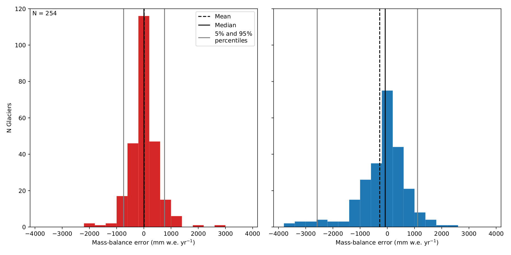

.. currentmodule:: oggm

.. _mass-balance-2012:

Temperature index model calibrated on traditional MB data
=========================================================

The first mass-balance (MB) model ever implemented in OGGM is an
extended version of the temperature-index model presented by
`Marzeion et al., (2012)`_.

While the equation governing the mass-balance is that of a traditional
temperature-index model, our special approach to calibration requires
that we spend some time describing it.

.. _Marzeion et al., (2012): http://www.the-cryosphere.net/6/1295/2012/tc-6-1295-2012.html

.. ipython:: python
   :suppress:

    fpath = "_code/prepare_climate.py"
    with open(fpath) as f:
        code = compile(f.read(), fpath, 'exec')
        exec(code)

The monthly mass-balance :math:`B_i` at elevation :math:`z` is computed as:

.. math::

    B_i(z) = P_i^{Solid}(z) - \mu ^{*} \, max \left( T_i(z) - T_{Melt}, 0 \right) + \epsilon

where :math:`P_i^{Solid}` is the monthly solid precipitation, :math:`T_i`
the monthly temperature and :math:`T_{Melt}` is the monthly mean air
temperature above which ice melt is assumed to occur (-1°C per default).
Solid precipitation is computed out of the total precipitation. The fraction of
solid precipitation is based on the monthly mean temperature: all solid below
``temp_all_solid`` (default: 0°C) and all liquid above ``temp_all_liq``
(default: 2°C), linear change in between.

The parameter :math:`\mu ^{*}` indicates the temperature sensitivity of the
glacier, and it needs to be calibrated. :math:`\epsilon` is a residual, to be
determined at the calibration step.

OGGM needs to compute the temperature and precipitation at the altitude
of the glacier grid points. The default is to use a fixed lapse rate of
-6.5K km :math:`^{-1}` and no gradient for precipitation.

Calibration
-----------

We will start by making two observations:

- the sensitivity parameter :math:`\mu ^{*}` is depending on many parameters,
  most of them being glacier-specific (e.g. avalanches, topographical shading,
  cloudiness...).
- the sensitivity parameter :math:`\mu ^{*}` will be affected by uncertainties
  and systematic biases in the input climate data.

As a result, :math:`\mu ^{*}` can vary greatly between neighboring glaciers.
The calibration procedure introduced by `Marzeion et al., (2012)`_ and
implemented in OGGM makes full use of these apparent handicaps by turning
them into assets.

The calibration procedure starts with glaciers for which we have direct
observations of the annual specific mass-balance SMB. We use the `WGMS FoG`_
(shipped with OGGM) for this purpose.

.. _WGMS FoG: http://wgms.ch/data_databaseversions/

For each of these glaciers, time-dependent "candidate" temperature sensitivities
:math:`\mu (t)` are estimated by requiring that the average specific
mass-balance :math:`\overline{B_{31}}` is equal to zero. :math:`\overline{B_{31}}` is computed
for a 31-year period centered around the year :math:`t` **and for a constant
glacier geometry fixed at the RGI date** (e.g. 2003 for most glaciers in the
European Alps).

.. ipython:: python
   :okwarning:

    @savefig plot_mu_ts.png width=100%
    example_plot_mu_ts()  # the code for these examples is posted below

Around 1900, the climate was cold and wet. As a consequence, the
temperature sensitivity required to maintain the 2003 glacier geometry is high.
Inversely, the recent climate is warm and the glacier must have a small
temperature sensitivity in order to preserve its 2003 geometry.

Note that these :math:`\mu (t)` are just
hypothetical sensitivities necessary to maintain the glacier in equilibrium in
an average climate at the year :math:`t`. We call them "candidates", since one
(or more) of them is likely to be close to the "real" sensitivity of the glacier.

This is when the mass-balance observations come into play: each of these
candidates is used to compute the mass-balance during the period
were we have observations. We then compare the model output
with the expected mass-balance and compute the model bias:

.. ipython:: python
   :okwarning:

    @savefig plot_bias_ts.png width=100%
    example_plot_bias_ts()  # the code for these examples is posted below

The residual bias is positive when :math:`\mu` is too low, and negative when :math:`\mu`
is too high. Here, the residual bias crosses the zero line twice. The two dates where the zero line is crossed
correspond to approximately the same :math:`\mu` (but not exactly,
as precipitation and temperature both have an influence on it).
These two dates at which the :math:`\mu` candidates
are close to the "real" :math:`\mu` are called :math:`t^*`
(the associated sensitivities :math:`\mu (t^*)` are called :math:`\mu^*`).
For the next step, one :math:`t^*` is sufficient: we pick the one which
corresponds to the smallest absolute residual bias.

At the glaciers where observations are available, this detour via the :math:`\mu`
candidates is not necessary to find the correct :math:`\mu^*`. Indeed, the goal
of these computations are in fact to find :math:`t^*`, **which is the actual
value interpolated to glaciers where no observations are available**.

The benefit of this approach is best shown with the results of a cross-validation
study realized by `Marzeion et al., (2012)`_ and confirmed by OGGM:

   Benefit of spatially interpolating :math:`t^{*}` instead of :math:`\mu ^{*}` as shown
   by leave-one-glacier-out cross-validation (N = 255). **Left**: error
   distribution of the computed mass-balance if determined by the
   interpolated :math:`t^{*}`. **Right**: error distribution of the mass-balance
   if determined by interpolation of :math:`\mu ^{*}`.

This substantial improvement in model performance is due to several factors:

- the equilibrium constraint applied on :math:`\mu` implies that the
  sensitivity cannot vary much during the last century.
  In fact, :math:`\mu` at one glacier varies far
  less in one century than between neighboring glaciers,
  because of all the factors mentioned above.
  In particular, it will vary comparatively little around a given year
  :math:`t` : errors in :math:`t^*` (even large) will result in small errors in
  :math:`\mu^*`.
- the equilibrium constraint will also imply that systematic biases in
  temperature and precipitation (no matter how large) will automatically be
  compensated by all :math:`\mu (t)`, and therefore also by :math:`\mu^*`.
  In that sense, the calibration procedure can be seen as a empirically driven
  downscaling strategy: if a glacier is here, then the local climate (or the
  glacier temperature sensitivity) **must** allow a glacier to be there. For
  example, the effect of avalanches or a negative bias in precipitation input
  will have the same impact on calibration: :math:`\mu^*` should be reduced to
  take these effects into account, even though they are not resolved by
  the mass-balance model.

The most important drawback of this calibration method is that it assumes that
two neighboring glaciers should have a similar :math:`t^*`. This is not
necessarily the case, as other factors than climate (such as the glacier size)
will influence :math:`t^*` too. Our results (and the arguments listed above)
show however that this is an approximation we can cope with.

In a final note, it is important to mention that this procedure
is primarily a calibration method, and as such it can be
statistically scrutinized (for example with cross-validation).
It can also be noted that the MB observations play a
relatively minor role in the calibration: they could be entirely avoided by
fixing a :math:`t^*` for all glaciers in a region (or even worldwide). The
resulting changes in calibrated :math:`\mu^*` will be comparatively small
(again, because of the local constraints on :math:`\mu`). The MB observations,
however, play a major role for the assessment of model uncertainty.

Regional calibration
--------------------

.. admonition:: **New in version 1.4!**

   As of version 1.4, we now also offer to calibrate the mass-balance at the
   regional level (RGI regions) based on geodetic mass-balance products
   ([Zemp_et_al_2019]_ or [Hugonnet_et_al_2021]_, see :py:func:`oggm.workflow.match_regional_geodetic_mb`).
   This is done by correcting (shifting) the residual for each glacier (:math:`\epsilon` in the equation
   above) by a constant value so that the regional estimates match the
   observations. This is not applied per default, as it might lead to
   unrealistic results at the single glacier scale (but it is very useful
   for global studies). An overview of the regional shifts for all regions
   and presently available set-ups can be assessed via
   `this notebook <https://cluster.klima.uni-bremen.de/~oggm/ref_mb_params/oggm_v1.4/compare_with_geod.html>`_.
   In the preprocessed directories, it is available under the path index *match_geod*.

References
----------

.. [Chimani_et_al_2012] Chimani, B., Matulla, C., Böhm, R., Hofstätter, M.:
   A new high resolution absolute Temperature Grid for the Greater Alpine Region
   back to 1780, Int. J. Climatol., 33(9), 2129–2141, DOI 10.1002/joc.3574, 2012.

.. [Harris_et_al_2010] Harris, I., Jones, P. D., Osborn, T. J., & Lister,
   D. H. (2014). Updated high-resolution grids of monthly climatic observations
   - the CRU TS3.10 Dataset. International Journal of Climatology, 34(3),
   623–642. https://doi.org/10.1002/joc.3711

.. [Hugonnet_et_al_2021] Hugonnet, R., McNabb, R., Berthier, E. et al. Accelerated global glacier mass loss in the
   early twenty-first century, Nature 592, 726–731 (2021). https://doi.org/10.1038/s41586-021-03436-z

.. [Zemp_et_al_2019] Zemp, M., Huss, M., Thibert, E., Eckert, N., McNabb, R.,
   Huber, J., Barandun, M., Machguth, H., Nussbaumer, S. U., Gärtner-Roer, I.,
   Thomson, L., Paul, F., Maussion, F., Kutuzov, S. and Cogley, J. G.:
   Global glacier mass changes and their contributions to sea-level rise from
   1961 to 2016, Nature, 568(7752), 382–386, doi:10.1038/s41586-019-1071-0, 2019.

Implementation details
----------------------

If you had the courage to read until here, it means that you have concrete
questions about the implementation of the mass-balance model in OGGM.
Here are some more details:

- the mass-balance in OGGM is computed from the altitudes and widths
  of the flowlines grid points (see :ref:`flowlines`). The easiest way to let
  OGGM compute the mass-balance for you is to use the
  :py:class:`core.massbalance.PastMassBalance`.
- the interpolation of :math:`t^*` is done with an inverse distance weighting
  algorithm (see :py:func:`tasks.local_t_star`)
- if more than one :math:`t^*` is found for some reference glaciers, than the
  glaciers with only one :math:`t^*` will determine the most likely :math:`t^*`
  for the other glaciers (see :py:func:`tasks.compute_ref_t_stars`)
- yes, the temperature gradients and the precipitation scaling factor will have
  an influence on the results, but it is small since any change will automatically
  be compensated by :math:`\mu^*`. We are currently quantifying these effects
  more precisely.

Code used to generate these examples:

.. literalinclude:: _code/prepare_climate.py
