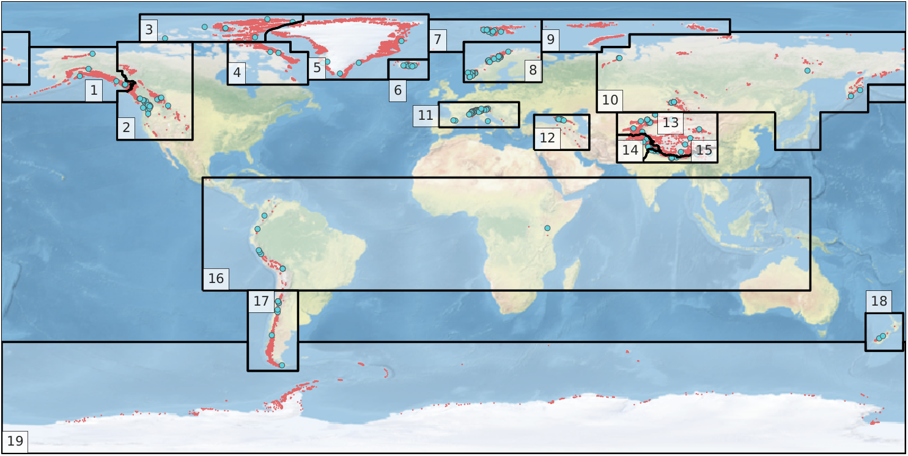

Reference mass balance data
===========================

Traditional in-situ MB data
~~~~~~~~~~~~~~~~~~~~~~~~~~~

In-situ mass balance data are used by OGGM to calibrate and validate the
first generation mass balance model.
We rely on mass balance observations provided by the
World Glacier Monitoring Service (`WGMS`_).
The `Fluctuations of Glaciers (FoG)`_ database contains annual mass balance
values for several hundreds of glaciers worldwide. We exclude water-terminating
glaciers and the time series with less than five years of
data. Since 2017, the WGMS provides a lookup table
linking the RGI and the WGMS databases. We updated this list for version 6 of
the RGI, leaving us with 268 mass balance time series. These are not equally
reparted over the globe:

    Map of the RGI regions; the red dots indicate the glacier locations
    and the blue circles the location of the 254 reference WGMS
    glaciers used by the OGGM calibration. From our `GMD paper`_.

These data are shipped automatically with OGGM. All reference glaciers
have access to the timeseries through the glacier directory:

.. ipython:: python
   :suppress:

    import os
    import matplotlib.pyplot as plt
    import numpy as np
    from oggm import cfg, tasks, workflow, graphics, DEFAULT_BASE_URL
    from oggm.utils import gettempdir

    cfg.initialize()
    cfg.PATHS['working_dir'] = os.path.join(gettempdir(), 'Docs_MB')

.. ipython:: python

    gdir = workflow.init_glacier_directories('RGI60-11.00897',
                                             from_prepro_level=5,
                                             prepro_base_url=DEFAULT_BASE_URL,
                                             prepro_border=80)[0]
    mb = gdir.get_ref_mb_data()
    @savefig plot_ref_mbdata.png width=100%
    mb[['ANNUAL_BALANCE']].plot(title='WGMS data: Hintereisferner');

.. _WGMS: https://wgms.ch
.. _Fluctuations of Glaciers (FoG): https://wgms.ch/data_databaseversions/
.. _GMD Paper: https://www.geosci-model-dev.net/12/909/2019/

.. _shop-geod:

Geodetic MB data
~~~~~~~~~~~~~~~~

OGGM ships with a geodetic mass balance table containing MB information for all
of the world's glaciers as obtained from `Hugonnet et al., 2021`_.

The original, raw data have been modified in three ways
(`code <https://nbviewer.jupyter.org/urls/cluster.klima.uni-bremen.de/~oggm/geodetic_ref_mb/convert.ipynb?flush_cache=true>`_):

- the glaciers in RGI region 12 (Caucasus) had to be manually linked to the product by
  Hugonnet because of large errors in the RGI outlines. The resulting product
  used by OGGM in region 12 has large uncertainties.
- outliers have been filtered as following: all glaciers with an error estimate
  larger than 3 :math:`\Sigma` at the RGI region level are filtered out
- all missing data (including outliers) are attributed with the regional average.

You can access the table with:

.. ipython:: python

    from oggm import utils
    mbdf = utils.get_geodetic_mb_dataframe()
    mbdf.head()

The data contains the climatic mass balance (in units meters water-equivalent per year)
for three reference periods (2000-2010, 2010-2020, 2000-2020):

.. ipython:: python

    mbdf['dmdtda'].loc[mbdf.period=='2000-01-01_2010-01-01'].plot.hist(bins=100, alpha=0.5, label='2000-2010');
    mbdf['dmdtda'].loc[mbdf.period=='2010-01-01_2020-01-01'].plot.hist(bins=100, alpha=0.5, label='2010-2020');
    @savefig plot_hugonnet_mbdata.png width=100%
    plt.xlabel(''); plt.xlim(-3, 3); plt.legend();

Just for fun, here is a comparison of both products at Hintereisferner:

.. ipython:: python

    sel = mbdf.loc[gdir.rgi_id].set_index('period') * 1000
    _mb, _err = sel.loc['2000-01-01_2010-01-01'][['dmdtda', 'err_dmdtda']]
    plt.fill_between([2000, 2010], [_mb-_err, _mb-_err], [_mb+_err, _mb+_err], alpha=0.5, color='C0');
    plt.plot([2000, 2010], [_mb, _mb], color='C0');
    _mb, _err = sel.loc['2010-01-01_2020-01-01'][['dmdtda', 'err_dmdtda']]
    plt.fill_between([2010, 2020], [_mb-_err, _mb-_err], [_mb+_err, _mb+_err], alpha=0.5, color='C1');
    plt.plot([2010, 2020], [_mb, _mb], color='C1');
    @savefig plot_hugonnet_mbdata_hef.png width=100%
    mb[['ANNUAL_BALANCE']].loc[2000:].plot(ax=plt.gca(), title='MB data: Hintereisferner', c='k', legend=False);

.. _Hugonnet et al., 2021: https://www.sedoo.fr/theia-publication-products/?uuid=c428c5b9-df8f-4f86-9b75-e04c778e29b9

