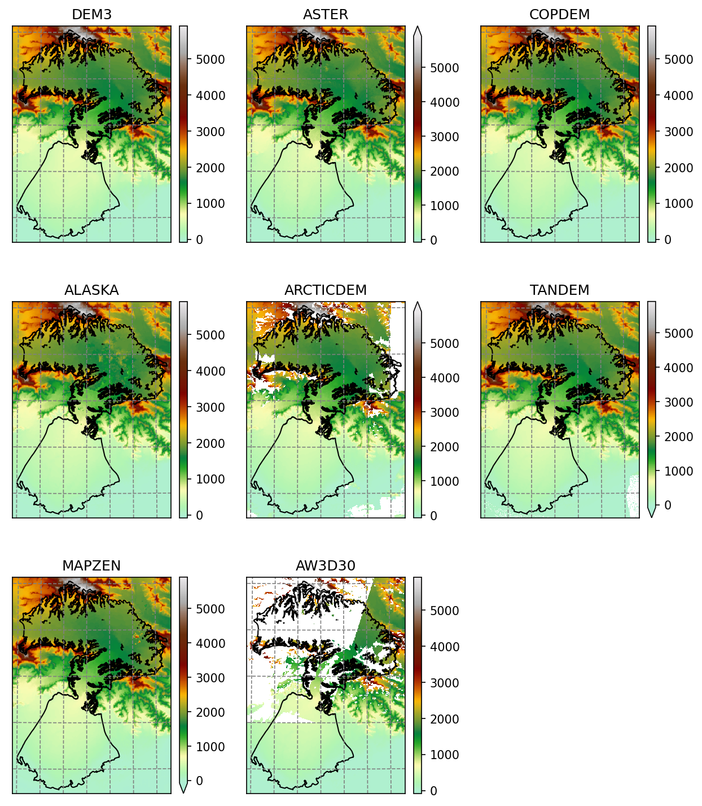

RGI-TOPO (New! also for RGI 7.0)
================================

The RGI-TOPO dataset provides a local topography map for each single glacier in the RGI.
It was generated with OGGM, and can be downloaded very easily with OGGM from the :doc:`shop` (visit
our `tutorials <https://oggm.org/tutorials>`_ if you want to learn how to do this!).

**Non-OGGM users can access the data by themselves at the following links**:

- RGI v6.0: https://cluster.klima.uni-bremen.de/data/gdirs/dems_v2/default/RGI62/b_010/L1
- RGI v7.0: https://cluster.klima.uni-bremen.de/~oggm/gdirs/oggm_v1.6/rgitopo/2023.1/RGI70/b_010/L1/

    Example of the various RGI-TOPO products at Malaspina glacier
