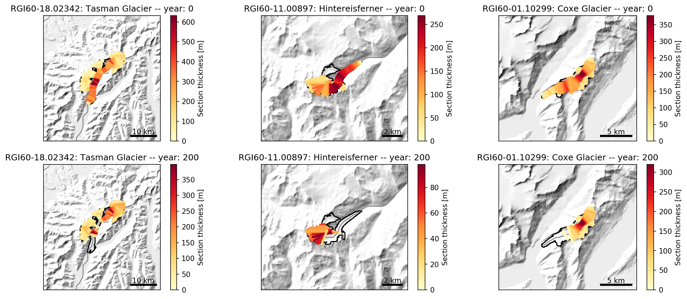

.. currentmodule:: oggm

.. _run-from-calibrated:

1. Set-up a default run for a list of glaciers
==============================================

This example shows how to run the OGGM  model for a list of selected glaciers
(here, four).
For this example we download the list of glaciers from Fabien's dropbox, but
you can use any list of glaciers for this. See the
`prepare_glacier_list.ipynb <https://github.com/OGGM/oggm/blob/master/docs/notebooks/prepare_glacier_list.ipynb>`_
notebook in the ``oggm/docs/notebooks`` directory for an example on how to
prepare such a file.

Note that the default in OGGM is to use a previously calibrated list of
:math:`t^*` for the run, which means that we don't have to calibrate the
mass balance model ourselves (thankfully, otherwise you would have to add
all the calibration glaciers to your list too).

Note that to be exact, this procedure can only be applied if the model
parameters don't change between the calibration and the run.
After testing, it appears that changing the 'border' parameter won't affect
the results much (as expected), so it's ok to change this parameter.
Some other parameters (e.g. topo smoothing, dx, precip factor, alternative
climate data...) will probably need a re-calibration
(see the OGGM calibration recipe for this).

Script
------

.. literalinclude:: _code/run_from_calibrated.py

If everything went well, you should see an output similar to::

    2017-10-21 00:07:17: oggm.cfg: Parameter file: /home/mowglie/Documents/git/oggm-fork/oggm/params.cfg
    2017-10-21 00:07:27: __main__: Starting OGGM run
    2017-10-21 00:07:27: __main__: Number of glaciers: 4
    2017-10-21 00:07:27: oggm.workflow: Multiprocessing: using all available processors (N=4)
    2017-10-21 00:07:27: oggm.core.gis: (RGI50-01.10299) define_glacier_region
    2017-10-21 00:07:27: oggm.core.gis: (RGI50-18.02342) define_glacier_region
    (...)
    2017-10-21 00:09:30: oggm.core.flowline: (RGI50-01.10299) default time stepping was successful!
    2017-10-21 00:09:39: oggm.core.flowline: (RGI50-18.02342) default time stepping was successful!
    2017-10-21 00:09:39: __main__: Compiling output
    2017-10-21 00:09:39: __main__: OGGM is done! Time needed: 0:02:22

.. note::

   During the ``random_glacier_evolution`` task some numerical warnings might
   occur. These are expected to happen and are caught by the solver, which then
   tries a more conservative time stepping scheme.

.. note::

    The ``random_glacier_evolution`` task can be replaced by any climate
    scenario built by the user. For this you'll have to develop your own task,
    which will be the topic of another example script.

Starting from a preprocessed state
----------------------------------

Now that we've gone through all the preprocessing steps once and that their
output is stored on disk, it isn't necessary to re-run everything to make
a new experiment. The code can be simplified to:

.. literalinclude:: _code/run_from_calibrated_and_prepro.py

.. note::

    Note the use of the ``filesuffix`` keyword argument. This allows to store
    the output of different runs in different files, useful for later analyses.

Some analyses
-------------

The output directory contains the compiled output files from the run. The
``glacier_characteristics.csv`` file contains various information about each
glacier obation after the preprocessing, either from the RGI directly
(location, name, glacier type...) or from the model itself (hypsometry,
inversion model output...).

Here is an example of how to read the file:

.. code-block:: python

    from os import path
    import pandas as pd
    WORKING_DIR = path.join(path.expanduser('~'), 'tmp', 'OGGM_precalibrated_run')
    df = pd.read_csv(path.join(WORKING_DIR, 'glacier_characteristics.csv'))
    print(df)

Output (reduced for clarity):

==============  ===============  =========  ========  ==============   ==================  ==============  ==============  ===============  ========================  =================  =================
rgi_id          name                cenlon    cenlat    rgi_area_km2   terminus_type         dem_max_elev    dem_min_elev    n_centerlines    longuest_centerline_km    inv_thickness_m    vas_thickness_m
==============  ===============  =========  ========  ==============   ==================  ==============  ==============  ===============  ========================  =================  =================
RGI50-18.02342  Tasman Glacier    170.238   -43.5653          95.216   Land-terminating              3662             715                7                  27.2195            186.38             187.713
RGI50-01.10299  Coxe Glacier     -148.037    61.144           19.282   Marine-terminating            1840               6                8                  11.6243            137.153            103.136
RGI50-11.00897  Hintereisferner    10.7584   46.8003           8.036   Land-terminating              3684            2447                3                   8.99975           107.642             74.2795
RGI50-08.02637  Storglaciaeren     18.5604   67.9042           3.163   Land-terminating              1909            1176                2                   3.54495            63.2469            52.362
==============  ===============  =========  ========  ==============   ==================  ==============  ==============  ===============  ========================  =================  =================

The run outpout is stored in netCDF files, and it can therefore be read with
any tool able to read those (Matlab, R, ...).

I myself am familiar with python, and I use the xarray package to
read the data:

.. literalinclude:: _code/example_analysis_ts.py

This code snippet should produce the following plot:

.. figure:: ../_static/run_example.png
    :width: 100%

.. warning::

    In the script above we have to "smooth" our length data for nicer plots.
    This is necessary because of annual snow cover: indeed, OGGM cannot
    differentiate between snow and ice. At the end of a cold mass-balance year,
    it can happen that some snow remains at the tongue and below: for the
    model, this looks like a longer glacier... (this cover is very thin, so
    that it doesn't influence the volume much).

More analyses
-------------

Here is a more complex example to demonstrate how to plot the glacier
geometries after the run:

.. literalinclude:: _code/example_analysis_maps.py

Which should produce the following plot:

