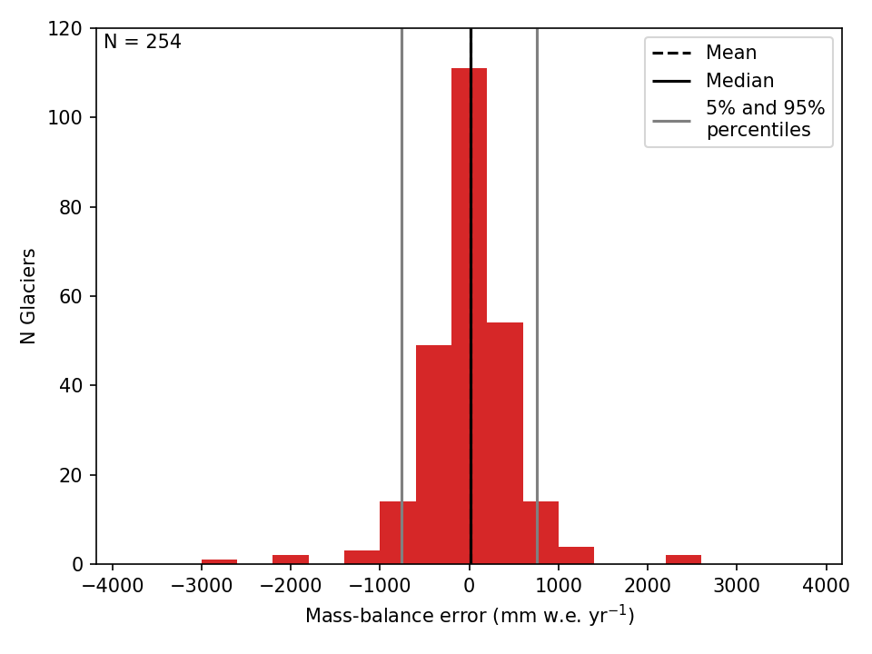

.. currentmodule:: oggm

.. _run-calibration:

2. Run the mass-balance calibration
===================================

Sometimes you will need to do the mass-balance calibration yourself. For
example if you use alternate climate data, or change the parameters of the
model. Here we show how to run the calibration for all available reference
glaciers, but you can also doit for any regional subset of course.

The output of this script are the ``ref_tstars.csv`` and
``crossval_tstars.csv`` files, both found in the working directory. The
``ref_tstars.csv`` file can then be used for further runs, simply by
copying it in the corresponding working directory.

Script
------

.. literalinclude:: _code/run_reference_mb_glaciers.py

Cross-validation
----------------

The results of the cross-validation are found in the ``crossval_tstars.csv``
file. Let's replicate Figure 3 in  `Marzeion et al., (2012)`_ :

.. literalinclude:: _code/mb_crossval.py

This should generate a figure similar to:

    Benefit of spatially interpolating :math:`t^{*}` instead of :math:`\mu ^{*}` as shown
    by leave-one-glacier-out cross-validation (N = 255). **Left**: error
    distribution of the computed mass-balance if determined by the
    interpolated :math:`t^{*}`. **Right**: error distribution of the mass-balance
    if determined by interpolation of :math:`\mu ^{*}`.

.. _Marzeion et al., (2012): http://www.the-cryosphere.net/6/1295/2012/tc-6-1295-2012.html
