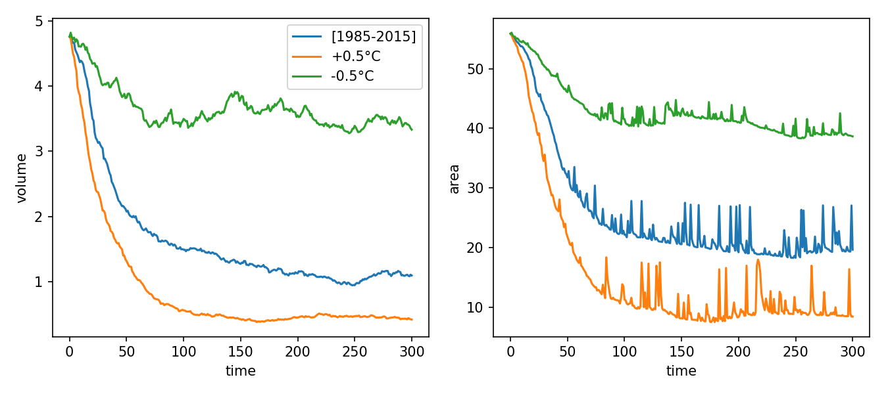
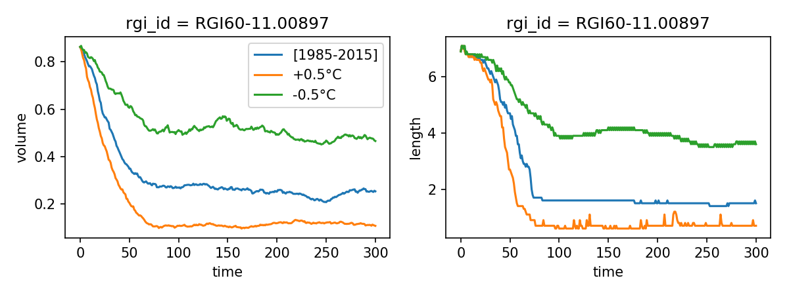

.. currentmodule:: oggm

1. Equilibrium runs on a subset of an RGI Region
================================================

This example shows how to run the OGGM glacier evolution model on
a subset of the Alps (the Rofental catchment in the Austrian Alps).

The first part of the script is related to setting up the run, then to select
certain glaciers out of the RGI file. If you are not familiar with RGI files,
you might want to do our short tutorial first:

.. image:: https://img.shields.io/badge/Launch-RGI%20tutorial-579ACA.svg?style=popout&logo=data:image/png;base64,iVBORw0KGgoAAAANSUhEUgAAACAAAAAlCAYAAAAjt+tHAAAACXBIWXMAABcSAAAXEgFnn9JSAAAAB3RJTUUH4wENDyoWA+0MpQAAAAZiS0dEAP8A/wD/oL2nkwAACE5JREFUWMO9WAtU1FUaH1BTQVJJKx+4BxDEgWEGFIzIVUMzPVBauYng8Jr3AxxAHObBvP6MinIUJdLwrTwqzXzkWVMSLW3N7bTrtmvpno7l6WEb7snMB6DffvfOzJ87A5a27t5zvjP/x/1/v9/9Xve7IxA84BFXYBMIi+zBIoUrOCLbxD9PVLgE/9MRtdhKfycW2gfGFzkMCFgXV2CPEStdAyQqLui/BhiXU3lP8xJkzkclSu77SapqSEYRyZ2bE+TO0b8JdGKRozeRRZWDcHXDEuWuEQkyx8gkJTcirtA2VCh3DvJYwJGT7AUngu9PDJ9nGH5/yM9oBU+X1fK3sXlVQyQKVyyu5lkELcUVviZRcHvECtc+BNiNz+vFSq5cWGifm6Sq/oghcE2s4GggRC+23Bv2hHwbfz1eankIFachkBsB/8mu7F4EyZyNzrNGUMsU2H4dfMxCI2v+cAQuRyWX+lSu5HrkbgSU3GcxeVWpgujZQd74uDs4+pS/jpZaxiD45kCFaHpIlDspaKp2JaQV10CavgYma5aDGJ/jN/RdAImvULc2Jt8WRnEIiQWGAPSZCr8oxiBrYRWRa6J8qqEW5tkbIXdlExSteQPkdbtR3oSC2lbIXr4DMq0bIb1kNU+SIXIdSdTE5FlHEoz4woDgFslc3mLhHIRA9X6rRuAUzQqY79gM2oa3wbTjCNib2/3E0eL5Xbb1MKjr98JLrq0wRbeCkmbioUskc64dm22iGRHPZ9gslSf4pLZ+yGwBTr7DghMzS1c1g2n7UbAhSFXTMbDueq+XmHYcpe9szcfAjNfEOjPK1lJr8AtSVneK5a5KksrelBUIAIASiFhUORx9fIE1+xPo37zVLRTgbsBEzDveg8bDH+Nvm3euZ77+1f0wa9l6PxJoiX9jZmX6V68iZ3/0kZI1/WS1GxZw234VvBIts+/05/CvH38G7vXjYGHeke+0DftgWukaak2fblI/hIW2CJ5AssqNvuc+7TE9BxkV66hPfwncsrMN1h04Dddu3gIyzpz/hhKyBpAoqH0dJuGCkhjrYkF7zlNac02C2AJbPGMiTLEVkLNyF9gxuHgwFDv6lyVEwM5c+BLu3LlDCXR2dcOu9rM0HlgCS7f8EeZaNvgFJV6vmVhkHyaIlzmCRDKHnvU9MVlp4ztg84L5zNr21y+g4dAZMOPKHc3vQ1atC56tk0P37dvgGx1Xr4OztR2t02MFkiEkkNnURIufwuyLInkfjOmxiSXwjLEeU+s4r8C47Qi0nvgb3Ojsgj99dgncb7wPFdvfgdHlT8MAlRDaPz/NE+jsvg0HPzoPRsYVJHs0mJ5PLanlSWAgdmDPIBZg5PdDafcRIL4ixcbZesIT4bjalbs/gPNf/0ABiLGb2/8B05eXwrDiFBisEYG+xcUT6OruggOfnAR9416o2uWxILHkktcO0rjyBWOSkkoaBmB1v2RmByNllRQSnwXI6vd+eI6u3je++O4KJNiyYIhOAqEoydw8/t2Nzptg318PT7qKqZt8cVC26RDMNr4SmA3TBNg49EM5xRJ40ckQ2P4unDx3EQKHvsUJ4UtSIEyfBAM1CXDpyrf0+c+3roN0SwWEl6SDdlMr2JuOUwKljYeoa1kCmG2/JyUxOKHI0cLWAFLTiQts+LFswxbYcOwt+P7qDxhs3TyBC5cvwnjzLBiCBEJ1YnAdbKDPf7zxEyS75kOoVgypDhkSOEFjoHjDfphRXkdT3BdrSGYK1n8uGCPSwgZhxtJ1NIrNO4/AVK4YQvUiyKjNg8N//4BPOTLmvaKBocWTqBUilk2Dn25eg8tXOyipEF0ijCqbDvkNG4FrPQnKdXvozskHocL1DTYyIkGU1Bo0ocCWxhJ4smQVqNe/DbKNm2FMeQYM1opAII+FREcWtJ37kCeg2lkFw0omUwIkFox7VsPWk3sgWBFHn4Xpk2GKU0FjgdQVP/8ruSPYK47z7APZxhB8cJHPBJUb5pjrYYa7DAZphVTZw6gsSDEBptbkwLZTb8HBs8dAZM/0AnlkiF4C0aaZNDjDvFaINM6F3LpGDMCGwEJkw2YlxLsNc/2xHuj9GhCNE6JKFlHz+wAICZL3jxhSYUTpFB6IJ4D3IdpEhpAYRi5Jh6QyA6RqatgN6Sa6fZZ/B1xgexzN/2kPCTfEq5fBY7rZqIgo7QEjQUeEBe8tnvmjtFkgUlqoPqazasbq+5jnQJHr6VYlai4Id8RMLA6drCsSkMQoXSZVSFb0y6A9riAyWvcciNRm1LOc7a6uYPBl+a1+TuV6z8a0sHIATihmXUFIiFVWiNLmQ7g+nbok0CKsycn7ofpUiNRKQay2+oN7fL9iXI5psKcDr/L1hMqe3kDuHIwTDaQksySSVE60hhGiNIXwuG4OgqQgWAJKPISgEPBHdNNhnHYhCNVL6fxJKlYHXf1ezDh6Stp0oC2gK1Y42XPeQDTTy+irgJacEHHhyqrQtCYkVAFCTSlKGd5XQqLaAhKVw8/fjOkPSZTVkT6Msdl9HPUmMt3qw/PLgnCrFmIPtw3j4lbvvt8dAOTuE9gbdK9G5pjC+zr89BqhmSUCac0Wpk13vIAKLt/vqchb6/+Mi5odmq3lT8dohfs4I05X98fVr2LjAQvWUVR8GEl1BAKSediAnsccr4/Nt6YTFRmla3l1v1tkur8zKnYsKQj0lx4/Vt9C8Kf4CZNzQ4c+b4gam22Mf2iuLkIQ8/wA9nvZqq140FX/9v8E0P+5GDy3EbybEMA60RSHBYu+TDL0/dFM1QP4uyPDd1QLIxtVKuZuE66+QyznXhb8v0bkYrPf/ag/VIwYLzWHsdXzQYz/ABScQI1BUjcgAAAAAElFTkSuQmCC
  :target: https://mybinder.org/v2/gh/OGGM/oggm-edu/master?urlpath=lab/tree/notebooks/oggm-tuto/working_with_rgi.ipynb

Then, we download the :ref:`preprodir` for this run. We use the level 4
data, which contain enough files to start a dynamical run, but not much more!

After the download, starting the runs take only one command. We show an example
with a temperature bias as well, illustrating the sensitivity of these
glaciers to temperature change.

Script
------

.. literalinclude:: _code/run_rgi_region.py

If everything went well, you should see an output similar to::

    2019-02-16 17:50:51: oggm.cfg: Using configuration file: /home/mowglie/Documents/git/oggm-fork/oggm/params.cfg
    2019-02-16 17:50:52: __main__: Starting OGGM run
    2019-02-16 17:50:52: __main__: Number of glaciers: 54
    2019-02-16 17:50:52: oggm.workflow: init_glacier_regions from prepro level 4 on 54 glaciers.
    2019-02-16 17:50:52: oggm.workflow: Execute entity task gdir_from_prepro on 54 glaciers
    2019-02-16 17:50:52: oggm.workflow: Multiprocessing: using all available processors (N=8)
    2019-02-16 17:50:54: oggm.workflow: Execute entity task run_random_climate on 54 glaciers
    2019-02-16 17:51:44: oggm.workflow: Execute entity task run_random_climate on 54 glaciers
    2019-02-16 17:52:36: oggm.workflow: Execute entity task run_random_climate on 54 glaciers
    2019-02-16 17:54:11: __main__: OGGM is done! Time needed: 0:03:20

Some analyses
-------------

The output directory contains many output files, most of them in the
individual glacier directories. Most often, users will use the compiled
data files, where the most relevant model outputs are stored together:

- the ``compile_glacier_statistics.csv`` file contains various information
  for each glacier (here the output is limited because we used a preprocessing
  level of 4 - see other examples for more information).
- the ``run_output_*.nc`` files contain the volume, area and length
  timeseries of each inddividual glacier.

Let's have a look at them:

.. literalinclude:: _code/example_analysis_rgi_region.py

This code snippet should produce the following plots:

The graphics above show the basin sums of glacier volume (km\ :sup:`3`) and
area (km\ :sup:`2`)
in a random climate corresponding to the period [1985-2015] (i.e. each year is
picked randomly out of this period). This is a "commitment" run, i.e.
showing the expected glacier change even if climate doesn't change any more
in the future. The time axis shows the number of years since the glacier inventory
date (here, 2003).

.. note::

    The glacier area and length plots can be noisy in certain
    conditions because OGGM currently doesn't differentiate between snow and
    ice, i.e. occasional years with large snowfall can artificially increase
    the glacier area. The effect on volume is negligible, though. A good
    way to deal with this noise is to smooth the time series: see
    `our dedicated tutorial <https://mybinder.org/v2/gh/OGGM/oggm-edu/master?urlpath=lab/tree/notebooks/oggm-tuto/area_length_filter.ipynb>`_
    for a possible way to deal with this.

The graphics below are for the Hintereisferner glacier only, and they
show glacier volume and glacier length evolution:

