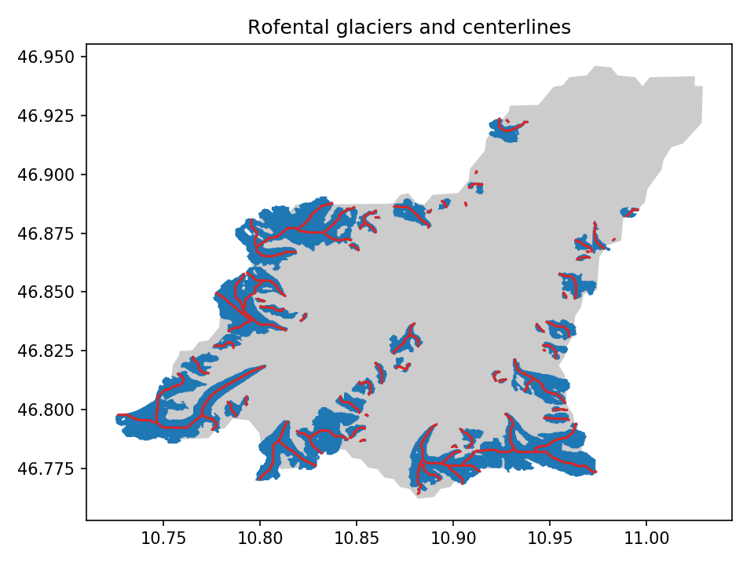

.. currentmodule:: oggm

.. _run-preprocess:

1. Preprocess a subset of an RGI Region
=======================================

This example shows how to run the first steps of the OGGM preprocessing chain
for a subset of the Alps (the Rofental catchment in the Austrian Alps).

Script
------

.. literalinclude:: _code/run_rofental.py

If everything went well, you should see an output similar to::

    2018-01-19 16:56:03: oggm.cfg: Parameter file:
    Starting OGGM run
    Number of glaciers: 54
    2018-01-19 16:56:04: oggm.workflow: Multiprocessing: using all available processors (N=8)
    2018-01-19 16:56:04: oggm.core.gis: (RGI60-11.00719) define_glacier_region
    (...)
    2018-01-19 16:56:20: oggm.core.inversion: (RGI60-11.00873) filter_inversion_output
    2018-01-19 16:56:20: oggm.core.inversion: (RGI60-11.00747) filter_inversion_output
    2018-01-19 16:56:20: oggm.core.inversion: (RGI60-11.01040) filter_inversion_output
    Compiling output
    OGGM is done! Time needed: 0:00:19

Some analyses
-------------

The output directory contains some compiled output files. The
``glacier_characteristics.csv`` file contains various information for each
glacier after the preprocessing, and we also wrote the centerlines as a
shapefile. Let's plot it:

.. literalinclude:: _code/example_analysis_rofental.py

This code snippet should produce the following plot:

