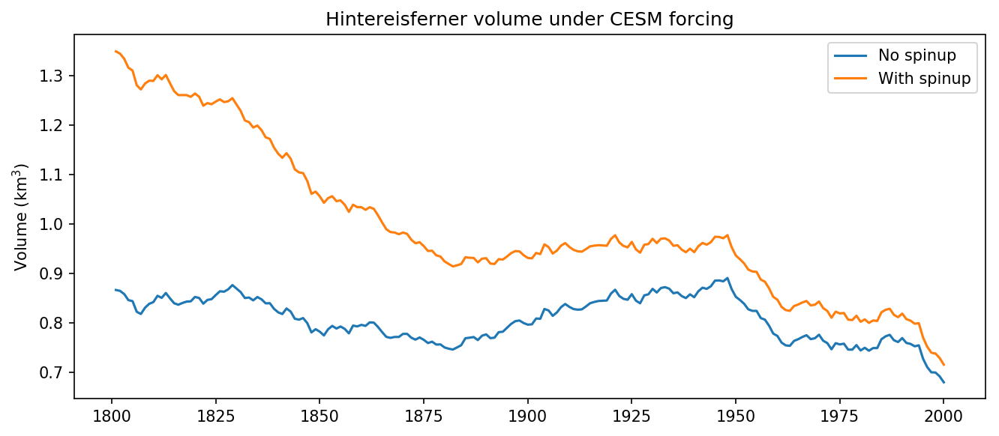

.. currentmodule:: oggm

.. _run-with-spinup:

4. Run with a spinup and GCM data
=================================

The initial state of glaciers play a large role for the model output.
In this example we illustrate how to "spinup" the glaciers (e.g.: make
them grow) before running the climate period. For this
example we use data from the `CESM Last Millennium Ensemble`_.

.. _CESM Last Millennium Ensemble: http://www.cesm.ucar.edu/projects/community-projects/LME/

Script
------

.. literalinclude:: _code/run_with_spinup.py

The output should look like this:

