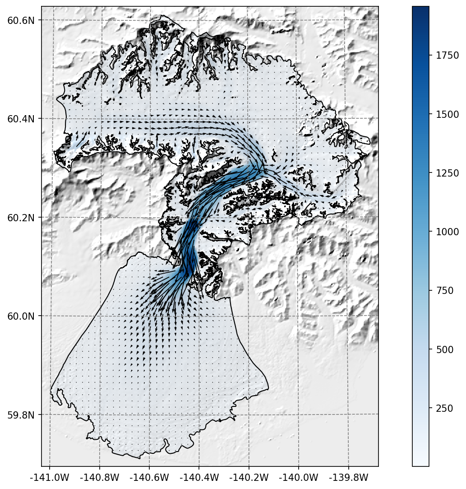
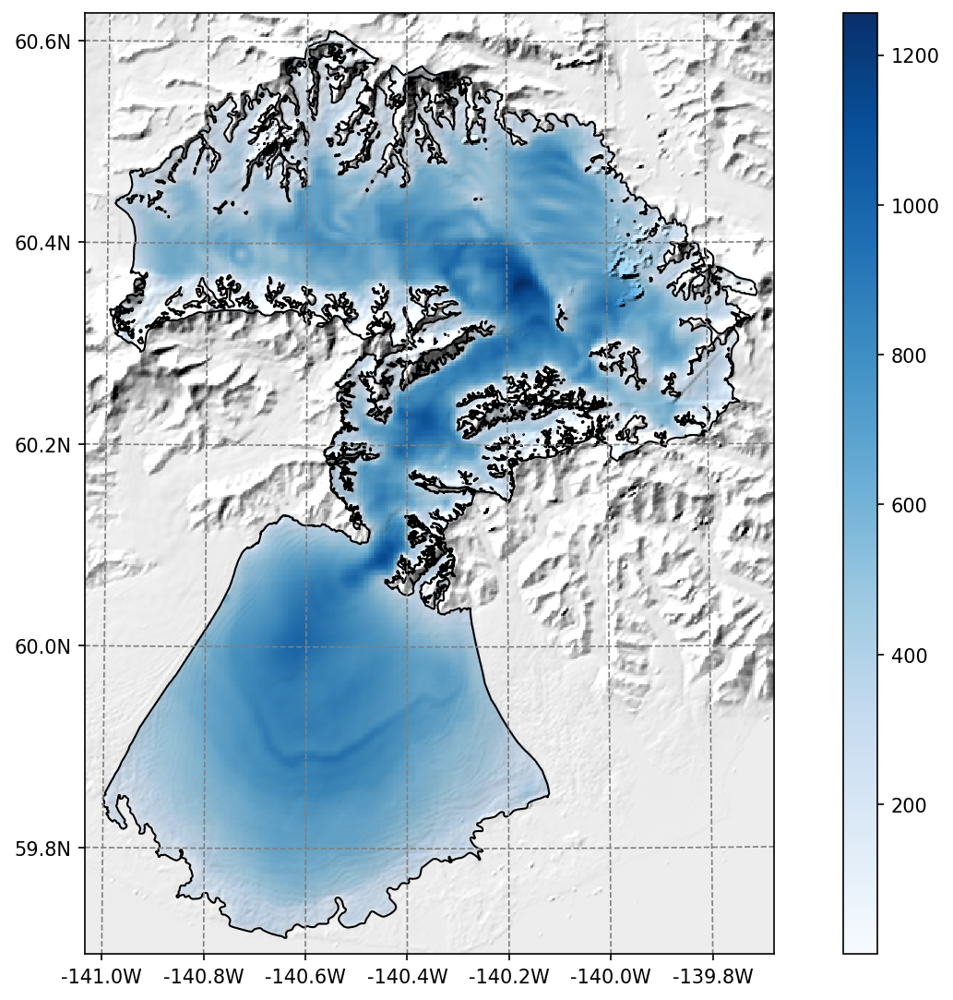
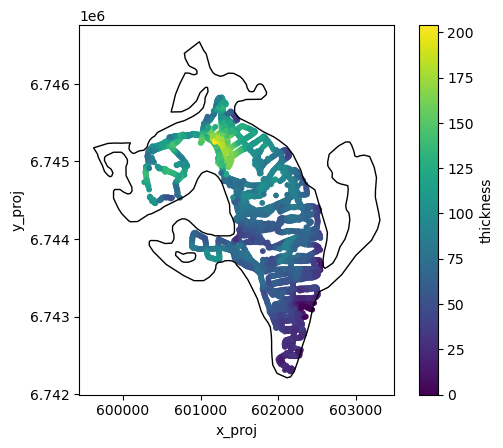
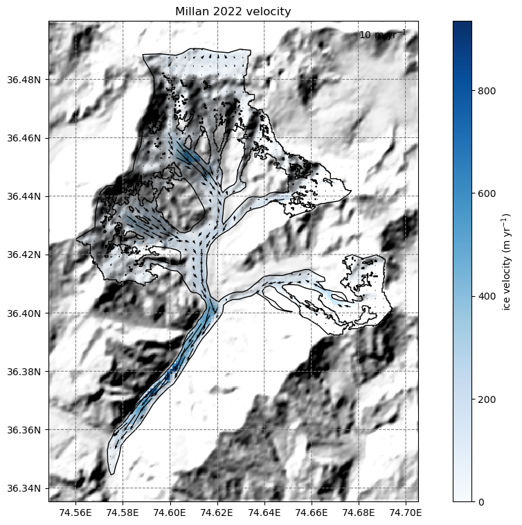
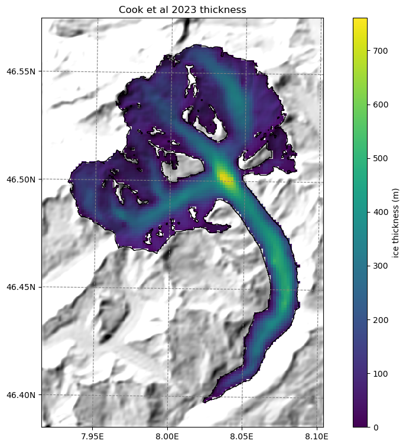

.. currentmodule:: oggm

.. margin::

   .. image:: _static/logos/logo_shop_small.png

OGGM Shop datasets
==================

The OGGM "shop" is a subpackage (`from oggm import shop`) containing the
code used to process and add the datasets listed below.

You can either add these datasets to existing glacier directories using the
shop, or download preprocessed directories with the ``_w_data`` suffix,
which include all datasets by default (and are therefore larger).

For example, to add ITS_LIVE velocity data to a glacier directory:

.. code-block:: python

    from oggm.shop import its_live
    its_live.itslive_velocity_to_gdir(gdir)

Below is a brief description of the available datasets. To explore them in
practice, see the
`OGGM as an accelerator tutorial <https://tutorials.oggm.org/stable/notebooks/10minutes/machine_learning.html>`_.

If you want more velocity products, feel free to open a new topic
on the OGGM issue tracker!

ITS_LIVE
--------

The `ITS_LIVE <https://its-live.jpl.nasa.gov/>`_ ice velocity products
can be downloaded and reprojected to the glacier directory
(visit our `tutorials <https://tutorials.oggm.org>`_ if you are interested!).

    Example of the reprojected ITS_LIVE products at Malaspina glacier

The data source used is https://its-live.jpl.nasa.gov/#data
Currently the only data downloaded is the v2 120m composite for both
(u, v) and their uncertainty. The composite is computed from the
2014 to 2018 average.

Gridded ice thickness
---------------------

The `Farinotti et al., 2019 <https://www.nature.com/articles/s41561-019-0300-3>`_
ice thickness products can be downloaded and reprojected to the glacier directory
(visit our `tutorials <https://tutorials.oggm.org>`_ if you are interested!).

    Example of the reprojected ice thickness products at Malaspina glacier

Ice thickness observations
--------------------------

You can now add observations from the Glacier Thickness Database
(`GlaThiDa <https://www.gtn-g.ch/data_catalogue_glathida/>`_) to your
glacier directory with:

.. code-block:: python

    from oggm.shop import glathida
    glathida.glathida_to_gdir(gdir)

Checkout :py:func:`shop.glathida.glathida_to_gdir`.

    Example of the GlaThiDa ice thickness observations at South Glacier

.. raw:: html

    

Millan et al. (2022) ice velocity and thickness products
--------------------------------------------------------

Similarly, we provide data from the
`Millan et al. (2022) <https://www.nature.com/articles/s41561-021-00885-z>`_
global study (visit our `tutorials <https://tutorials.oggm.org>`_ if you are interested!).

    Example of the reprojected Millan velocity products at `Hassanabad Glacier <https://oggm.org/training-lahore/day_4/01_data_prep.html>`_

.. raw:: html

    

Cook et al. (2023) thickness products for the Alps
--------------------------------------------------

`Cook et al. (2023) <https://agupubs.onlinelibrary.wiley.com/doi/10.1029/2023GL105029>`_
provided a new ice thickness dataset for the Alps. This is now also in the shop,
with :py:func:`shop.cook23.cook23_to_gdir`.

.. code-block:: python

    from oggm.shop import cook23
    cook23.cook23_to_gdir(gdir)

    Example of the reprojected Cook et al thickness products at Aletsch glacier
