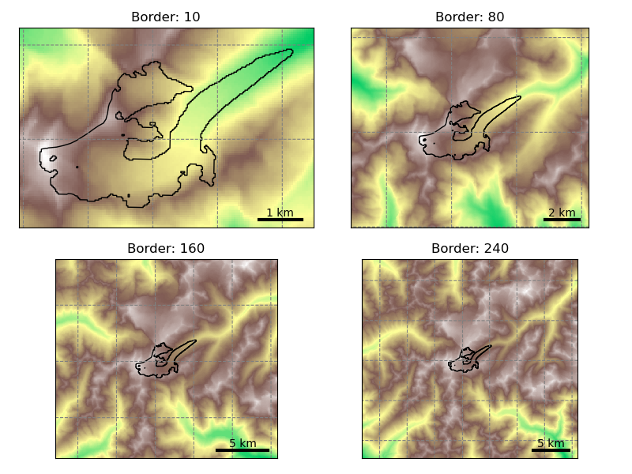

.. currentmodule:: oggm

.. margin::

   .. image:: _static/logos/logo_shop_small.png

.. _preprodir:

Preprocessed Glacier Directories
================================

The simplest way to run OGGM is to use :ref:`glacierdir` prepared by the
OGGM developers. Depending on your use case, you can start from different
stages of the processing chain, map sizes, and model setups.

These directories were generated using the standard parameters of the
corresponding OGGM version (and a few alternative configurations). If you
need to modify some parameters, you may have to start from an earlier
processing level and re-run parts of the workflow. Whether this is
necessary depends on where you want your workflow to diverge from the
default settings (this will become clearer in the examples below).

To initialize pre-processed directories, use
:py:func:`workflow.init_glacier_directories` with the
``prepro_base_url``, ``from_prepro_level`` and ``prepro_border`` arguments.
This will download the requested directories. Additional options are
described below.

If you prefer to get started immediately, see the
`10 minutes to… a preprocessed directory <https://tutorials.oggm.org/stable/notebooks/10minutes/preprocessed_directories.html>`_
tutorial.

Processing levels
-----------------

There are six available levels of pre-processing:

- **Level 0**: the lowest level, with directories containing the glacier
  outlines only.
- **Level 1**: directories now contain the glacier topography data as well.
- **Level 2**: at this stage, the glacier flowlines and their downstream lines are
  computed and ready to be used.
- **Level 3**: has the baseline climate timeseries (e.g. W5E5 or ERA5)
  added to the directories. It also contains all necessary pre-processing tasks
  for a dynamical run, including the mass balance calibration, bed inversion,
  up to the :py:func:`tasks.init_present_time_glacier` task.
  These directories still contain all data that were necessary for the processing.
  Therefore they are large in size but also the most flexible since
  the processing chain can be re-run from them.
- **Level 4**: includes a historical simulation from
  the RGI date to the last possible date of the baseline climate file
  (currently January 1st 2020 at 00H for W5E5, and January 1st 2026 at 00H for ERA5), stored with the file suffix
  ``_historical``. Moreover, most configurations (those that include ``spinup`` in their url) may include
  a simulation running a spinup from 1979 to the last possible date of the baseline climate file, stored
  with the file suffix ``_spinup_historical``. This spinup attempts to conduct a
  dynamic temperature sensitivity ("melt factor") calibration and a dynamic spinup matching the RGI area.
  If this fails, only a dynamic spinup is carried out. If this also fails, a
  fixed geometry spinup is conducted. To learn more about these different spinup types,
  check out :ref:`dynamic-spinup`.
- **Level 5**: is same as level 4 but with all intermediate output files removed.
  The strong advantage of level 5 directories is that their size is considerably
  reduced, at the cost that certain operations (like plotting on maps or
  re-running the bed inversion algorithm) are not possible anymore.

In practice, most users are going to use level 2, level 4 or level 5 files. To
save space on our servers, level 3 data might be unavailable for some
experiments (but are easily recovered if needed). For each level, there are also
summary files (e.g. `in this OGGM cluster folder <https://cluster.klima.uni-bremen.de/~oggm/gdirs/oggm_v1.6/L3-L5_files/2025.6/elev_bands/W5E5/per_glacier_spinup/RGI62/b_160/L5/summary/>`_)
which can be used for regional analyses of the glacier statistics, climate statistics,
fixed geometry mass-balance (without dynamical area changes), and historical
run outputs with and without spinup.

.. admonition:: **Changes to the version 1.4 directories (pre 2023)**
   :class: note, dropdown

   In previous versions, level 4 files were the "reduced" directories with intermediate
   files removed. Level 5 was very similar, but without the dynamic spinup files.
   In practice, most users won't really see a change.

Here are some example use cases for glacier directories, and recommendations on which
level to pick:

1. Running OGGM from climate model (GCM / RCM /ESM) data with the default settings: **start from level 5**
2. Using OGGM's flowlines but running your own baseline climate,
   mass balance or ice thickness inversion models: **start at level 2**.
   When using an own module, for instance for the mass balance, one can still decide to
   use OGGM again further on in the workflow, for instance for the glacier dynamics. This is
   the workflow used by associated model `PyGEM <https://github.com/PyGEM-Community/PyGEM>`_ for example.
3. Run sensitivity experiments for the ice thickness inversion: **start at level
   3** (with climate data available) and re-run the inversion steps.

.. _prepro_border:

Glacier map size: the prepro_border argument
--------------------------------------------

The size of the local glacier map is given in number of grid points *outside*
the glacier boundaries. The larger the domain, the larger the glacier can
become. Here is an example with Hintereisferner in the Alps:

.. ipython:: python
   :suppress:

    import os
    import matplotlib.pyplot as plt
    import numpy as np
    from oggm import cfg, tasks, workflow, graphics, DEFAULT_BASE_URL
    from oggm.utils import gettempdir

    cfg.initialize()
    cfg.PATHS['working_dir'] = os.path.join(gettempdir(), 'Docs_BorderSize')

..
  replace with
  .. ipython:: python
    :okwarning:
    ...
    @savefig plot_border_size.png width=100%
    plt.tight_layout(); plt.show()
  to test that this is still working

.. code-block:: python

    base_url = 'https://cluster.klima.uni-bremen.de/~oggm/gdirs/oggm_v1.6'
    base_url += '/L1-L2_files/elev_bands'
    f, axs = plt.subplots(2, 2, figsize=(8, 6))
    for ax, border in zip(np.array(axs).flatten(), [10, 80, 160, 240]):
        gdir = workflow.init_glacier_directories('RGI60-11.00897',
                                                 from_prepro_level=1,
                                                 prepro_base_url=base_url,
                                                 prepro_border=border)
        graphics.plot_domain(gdir, ax=ax, title='Border: {}'.format(border),
                             add_colorbar=False,
                             lonlat_contours_kwargs={'add_tick_labels':False})

Users should choose the border parameter depending
on the expected glacier growth in their simulations. For simulations into
the 21 :sup:`st` century, a border value of 80 is often sufficient. However,
for the :doc:`download-projections`
until 2100 or 2300, and most level 5 preprocessed glacier
directories we use a border value of 160.  For runs including the Little Ice Age,
a border value of 160 or even 240 is recommended. Newer OGGM preprocessed glacier
directories (since OGGM v1.6.3) do not have border 240 available,
but you could ask us to create it if you need it.

Users should be aware that the amount of data to download isn't small,
especially for full directories at processing level 3 and 4. It is recommended
to always pick the smallest border value suitable for your research question,
and to start your runs from level 5 if possible. Here is an indicative table for
the total amount of data for the default configuration
(`elev_bands/W5E5/per_glacier_spinup/RGI62`) as of 1.6.3
for all 19 RGI regions:

======  =====  =====  =====
Level   B  10  B  80  B 160
======  =====  =====  =====
**L0**  909M   909M   909M
**L1**  3.8G   22G    66G
**L2**  9.7G   63G    188G
**L3**         69G    195G
**L4**         96G    224G
**L5**         34G    36G
======  =====  =====  =====

*L4 and L5 data are not available for border 10 (the domain is too small for
the downstream lines)*.

Certain regions are much smaller than others of course. As an indication,
with prepro level 3 and a map border of 160, the Alps are ~3.4G large, Greenland
~19G, and Iceland ~596M.

.. note::

  The data download of the preprocessed directories will occur one single time
  only: after the first download, the data will be cached in OGGM's
  ``dl_cache_dir`` folder (see :ref:`system-settings`).

Available pre-processed configurations
--------------------------------------

OGGM has several configurations and directories to choose from,
and the list is getting larger regularly. Don't hesitate to ask us if you are
unsure about which to use, or if you'd like to have more configurations
to choose from!

To choose from a specific preprocessed configuration, use the ``prepro_base_url``
argument in your call to :py:func:`workflow.init_glacier_directories`,
and set it to the url of your choice.

The recommended ``prepro_base_url`` for a standard OGGM run is:

.. ipython:: python
   :okwarning:

    from oggm import DEFAULT_BASE_URL
    DEFAULT_BASE_URL

This is the URL that was used to generate the OGGM 1.6.3 standard projections
(:doc:`download-projections`) with the following basic set-up:

- all default OGGM parameters
- :ref:`eb-flowlines`
- :ref:`climate-w5e5` reference climate
- "informed three-step" mass balance model calibration (see :ref:`mb-calib`)
- :ref:`dynamic-spinup` with dynamic melt factor calibration and spinup to match the area at the RGI date

.. _preprodirlist:

Recommended level 3-5 configurations
~~~~~~~~~~~~~~~~~~~~~~~~~~~~~~~~~~~~

Our `tutorials <https://tutorials.oggm.org>`_ provide examples of applications based on
some of the preprocessed glacier directories. Below we describe the most commonly
used `oggm_v1.6/L3-L5_files` glacier directories.

We analysed the glacier directory and test projection differences in
this `OGGM blogpost <https://oggm.org/2026/02/18/oggm_v16-gdirs-and-projection-options>`__.

- **OGGM v1.6.1 standard directories**
  (`2023.3/elev_bands/W5E5_spinup/RGI62/.. <https://cluster.klima.uni-bremen.de/~oggm/gdirs/oggm_v1.6/L3-L5_files/2023.3/elev_bands/W5E5_spinup>`__)

  - OGGM standard directories using OGGM v1.6.1 (released in 2023), with W5E5 as baseline climate,
    RGI62 as glacier inventory, and dynamical spinup and calibration performed individually
    for each glacier.

- **OGGM v1.6.3 standard directories**
  (`2025.6/elev_bands/W5E5/per_glacier_spinup/RGI62/.. <https://cluster.klima.uni-bremen.de/~oggm/gdirs/oggm_v1.6/L3-L5_files/2025.6/elev_bands/W5E5/per_glacier_spinup/>`__)

  - Updated standard projections using OGGM v1.6.3 and the 2025.6 preprocessed glacier
    directories (the differences between versions are described in :ref:`preprodirupdates`).

- **OGGM v1.6.3 standard directories with ALL shop datasets**
  (`2025.6/elev_bands_w_data/W5E5/per_glacier_spinup/RGI62/.. <https://cluster.klima.uni-bremen.de/~oggm/gdirs/oggm_v1.6/L3-L5_files/2025.6/elev_bands/W5E5/per_glacier_spinup/>`__)

  - Same as above, but with all shop datasets added to the directories per default.
    See :doc:`shop-datasets` for a full list.

- **ERA5-based calibration**
  (`2025.6/../ERA5/per_glacier_spinup/RGI62/.. <https://cluster.klima.uni-bremen.de/~oggm/gdirs/oggm_v1.6/L3-L5_files/2025.6/elev_bands/ERA5/per_glacier_spinup/>`__)

  - Identical to the OGGM v1.6.3 standard projections, but using :ref:`ERA5 <climate-era5>` instead of :ref:`climate-w5e5` as
    baseline climate for the calibration. ERA5 has a higher spatial resolution (0.25° × 0.25°) than W5E5 (0.5°).
  - For the precipitation factor initial guess, we use a linear fit to the winter precipitation instead of a logarithmic
    fit that was used for W5E5. Details are in `this MB calibration tutorial <https://tutorials.oggm.org/stable/notebooks/tutorials/massbalance_calibration.html>`_ and `this jupyter notebook <https://nbviewer.org/urls/cluster.klima.uni-bremen.de/~oggm/gdirs/oggm_v1.6/_notebooks/oggm_v16_winter_mb_match_to_prescribe_prcp_fac/match_winter_mb_w5e5_era5.ipynb>`_ that estimated the fit using in-situ winter mass-balance data.

- **Regional calibration (RGI62)**
  (`2025.6/elev_bands/W5E5/regional_spinup/RGI62/.. <https://cluster.klima.uni-bremen.de/~oggm/gdirs/oggm_v1.6/L3-L5_files/2025.6/elev_bands/W5E5/regional_spinup/RGI62/>`__)

  - Each glacier is calibrated to match the regionally averaged specific mass balance
    (`regional_spinup`) instead of the individual glacier-specific estimates (similar to
    `Zekollari et al., 2024 <https://doi.org/10.5194/tc-18-5045-2024>`_). The purpose
    of this experiment is to provide a baseline to which the experia

- **Regional calibration with RGI 7.0G**
  (`2025.6/../W5E5/regional_spinup/RGI70G/.. <https://cluster.klima.uni-bremen.de/~oggm/gdirs/oggm_v1.6/L3-L5_files/2025.6/elev_bands/W5E5/regional_spinup/RGI70G/>`__)

  - Same as above, but using the RGI70G glacier inventory
    instead of RGI62. Differences between RGI versions are described in the
    `RGI documentation <https://www.glims.org/rgi_user_guide/04_revisions.html>`_.
    The calibration strategy developped for RGI7 is described below.

- **Regional calibration with RGI 7.0C (glacier complexes)**
  (`2025.6/../W5E5/regional_spinup/RGI70C/.. <https://cluster.klima.uni-bremen.de/~oggm/gdirs/oggm_v1.6/L3-L5_files/2025.6/elev_bands/W5E5/regional_spinup/RGI70C/>`__)

  - Same as above, but uses the glacier complex product (RGI70C;
    `more details here <https://www.glims.org/rgi_user_guide/products/glacier_complex_product.html>`_),
    resulting in fewer modeled glacier entities compared to individual glaciers (but the same area).

.. admonition:: **New 2025.6 RGI 7.0 initialisation and calibration!**

    - We used the same input datasets (climate, topography, etc.) to generate OGGM glacier directories for RGI6, RGI7G,
      and RGI7C.
    - Since RGI7 currently has no mass-balance observations, we calibrated OGGM for all versions using the same regional
      mass-balance estimates from `Hugonnet et al., 2021`_, assuming the regional average is constant for all glaciers in a
      region (as done in `Zekollari et al., 2024 <https://doi.org/10.5194/tc-18-5045-2024>`_) and do not change
      between RGI6 and RGI7. This is a strong assumption, but it has limited influence on the inversion itself
      (more so on projections).
    - We applied the OGGM inversion to RGI6, tuning glenA to match the regional ice-volume estimates from the
      [Farinotti_etal_2019]_ consensus.
    - The regionally tuned glenA parameters from RGI6 were then applied to RGI7G. As a result, any volume differences
      between RGI6 and RGI7 arise solely from updated glacier outlines, not data or methods changes.
    - Finally (less critical, but useful), we aggregated the RGI7G results to the glacier-complex level and re-ran the
      inversion on RGI7C, tuning it to match the RGI7G totals. This allows us to produce ice-thickness maps at
      the glacier complex scale without artefacts.

Directory structure and naming conventions for all levels
~~~~~~~~~~~~~~~~~~~~~~~~~~~~~~~~~~~~~~~~~~~~~~~~~~~~~~~~~

Within `cluster.klima.uni-bremen.de/~oggm/gdirs/oggm_v1.6 <https://cluster.klima.uni-bremen.de/~oggm/gdirs/oggm_v1.6>`_, there are multiple options to
choose from and we describe the folder structure in the following:

- **Step 1**:
   - L1_L2_files: here the directories with pre-processing level 1 and 2 can be found.
   - L3_L5_files: here the directories with pre-processing level 3 to 5 can be found.
- **Step 2**: select a version of the directories (e.g. 2025.6 since OGGM v1.6.3) or 2023.3 (old)
- **Step 3**: select the flowline type, centerlines or elevation band flowlines (elev_bands), optionally with the extension of your choice when using L1_L2_files.
- **Step 4**: this is only needed when taking the L3_L5_files route. The folder name starts with the name of the baseline climate (e.g. W5E5) that has been used. For the 2023.3 glacier directories, additional folder name extensions exist.
- **Step 5** (*only for the 2025.6 glacier directories within the L3_L5_files route*): select the calibration option choice `per_glacier`, i.e. matching `Hugonnet et al., 2021`_ for every glacier individually (approach used for the `2023.3` gdirs) or `regional`, i.e. calibrating every glacier to the regional mass-balance estimate and additional folder name extensions exist.
- **Step 6**: select the Randolph Glacier Inventory (RGI) version. In OGGM v1.6.1, only RGI62 was available. In OGGM v1.6.3, for some directories also RGI70G or RGI70C available.
- **Step 7**: select the border option (see :ref:`prepro_border`)

Explanation of the naming convention for the folder name extensions:

- `_spinup` indicates that the dynamic spin-up has been used for the calibration, if left out the calibration was done without the dynamic spin-up.
- `_w_data` indicates that additional data has been added to the directories: ITS-LIVE, Millan et al. ice velocity product and the consensus ice thickness estimate (all described in more detail later).

.. admonition:: Deprecated: **version 1.4 and 1.5 directories (before 2023)**
    :class: note, dropdown

    **v1.4 directories are still working with OGGM v1.6: however, you may have to change
    the run parameters back to their previous values**. We document them here:

    **A. Default**

    If not provided with a specific ``prepro_base_url`` argument,
    :py:func:`workflow.init_glacier_directories` will download the glacier
    directories from the default urls. Here is a summary of the default configuration:

    - model parameters as of the ``oggm/params.cfg`` file at the published model version
    - flowline glaciers computed from the geometrical centerlines (including tributaries)
    - baseline climate from CRU (not available for Antarctica) using a global precipitation factor of 2.5 (path index: *pcp2.5*)
    - baseline climate quality checked and corrected if needed with :py:func:`tasks.historical_climate_qc` with ``N=3``.
      If the condition of at least 3 months of melt per year at the terminus and 3 months of accumulation
      at the glacier top is not reached, temperatures are shifted (path index: *qc3*).
    - mass balance parameters calibrated with the standard OGGM procedure (path index: *no_match*).
      No calibration against geodetic MB (see options below for regional calibration).
    - ice volume inversion calibrated to match the ice volume from [Farinotti_etal_2019]_
      **at the RGI region level**, i.e. glacier estimates might differ. If not specified otherwise,
      it's also the precalibrated parameters that will be used for the dynamical run.
    - frontal ablation by calving (at inversion and for the dynamical runs) is switched off

    To see the code that generated these directories (for example if you want to
    make your own, visit :py:func:`cli.prepro_levels.run_prepro_levels`
    or this `file on github <https://github.com/OGGM/oggm/blob/master/oggm/cli/prepro_levels.py>`_).

    The urls used by OGGM per default are in the following ftp server:

    `https://cluster.klima.uni-bremen.de/~oggm/gdirs/oggm_v1.4/ <https://cluster.klima.uni-bremen.de/~oggm/gdirs/oggm_v1.4/>`_ :

    - `L1-L2_files/centerlines <https://cluster.klima.uni-bremen.de/~oggm/gdirs/oggm_v1.4/L1-L2_files/centerlines/>`_ for level 1 and level 2
    - `L3-L5_files/CRU/centerlines/qc3/pcp2.5/no_match <https://cluster.klima.uni-bremen.de/~oggm/gdirs/oggm_v1.4/L3-L5_files/CRU/centerlines/qc3/pcp2.5/no_match/>`_ for level 3 to 5

    If you are new to this, we recommend to explore these directories to familiarize yourself
    to their content. Of course, when provided with an url such as above,
    OGGM will know where to find the respective files
    automatically, but is is good to understand how they are structured. The `summary folder`
    (`example <https://cluster.klima.uni-bremen.de/~oggm/gdirs/oggm_v1.4/L1-L2_files/centerlines/RGI62/b_080/L2/summary/>`_)
    contains diagnostic files which can be useful as well.

    **B. Option: Geometrical centerlines or elevation band flowlines**

    The type of flowline to use (see :doc:`flowlines`) can be decided at level 2 already.
    Therefore, the two configurations available at level 2 from these urls:

    - `L1-L2_files/centerlines <https://cluster.klima.uni-bremen.de/~oggm/gdirs/oggm_v1.4/L1-L2_files/centerlines/>`_ for centerlines
    - `L1-L2_files/elev_bands <https://cluster.klima.uni-bremen.de/~oggm/gdirs/oggm_v1.4/L1-L2_files/elev_bands/>`_ for elevation bands

    The default pre-processing set-ups are also available with each of these
    flowline types. For example with CRU:

    - `L3-L5_files/CRU/centerlines/qc3/pcp2.5/no_match <https://cluster.klima.uni-bremen.de/~oggm/gdirs/oggm_v1.4/L3-L5_files/CRU/centerlines/qc3/pcp2.5/no_match/>`_ for centerlines
    - `L3-L5_files/CRU/elev_bands/qc3/pcp2.5/no_match <https://cluster.klima.uni-bremen.de/~oggm/gdirs/oggm_v1.4/L3-L5_files/CRU/elev_bands/qc3/pcp2.5/no_match/>`_ for elevation bands

    **C. Option: Baseline climate data**

    For the two most important default configurations (CRU or ERA5 as baseline climate),
    we provide all levels for both the geometrical centerlines or the elevation band
    flowlines:

    - `L3-L5_files/CRU/centerlines/qc3/pcp2.5/no_match <https://cluster.klima.uni-bremen.de/~oggm/gdirs/oggm_v1.4/L3-L5_files/CRU/centerlines/qc3/pcp2.5/no_match/>`_ for CRU + centerlines
    - `L3-L5_files/CRU/elev_bands/qc3/pcp2.5/no_match <https://cluster.klima.uni-bremen.de/~oggm/gdirs/oggm_v1.4/L3-L5_files/CRU/elev_bands/qc3/pcp2.5/no_match/>`_ for CRU + elevation bands
    - `L3-L5_files/ERA5/centerlines/qc3/pcp1.6/no_match <https://cluster.klima.uni-bremen.de/~oggm/gdirs/oggm_v1.4/L3-L5_files/ERA5/centerlines/qc3/pcp1.6/no_match/>`_ for ERA5 + centerlines
    - `L3-L5_files/ERA5/elev_bands/qc3/pcp1.6/no_match <https://cluster.klima.uni-bremen.de/~oggm/gdirs/oggm_v1.4/L3-L5_files/ERA5/elev_bands/qc3/pcp1.6/no_match/>`_ for ERA5 + elevation bands

    Note that the globally calibrated multiplicative precipitation factor (pcp) depends on the used baseline climate
    (e.g. pcp is 2.5 for CRU and 1.6 for ERA5). If you want to use another baseline climate, you have to calibrate the
    precipitation factor yourself. Please get in touch with us in that case!

    **D. Option: Mass balance calibration method**

    There are different mass balance calibration options available in the preprocessed directories:

    -   **no_match**: This is the default calibration option. For calibration, the direct glaciological WGMS data is used
        and the `Marzeion et al., 2012`_ *tstar* method is applied to interpolate to glaciers without measurements. With this method, the geodetic estimates are not matched.
    -   **match_geod**: The default calibration with direct glaciological WGMS data is still applied on the glacier per
        glacier level, but on the regional level the epsilon (residual) is corrected to match the geodetic estimates
        from `Hugonnet et al., 2021`_. For example:

        - `L3-L5_files/CRU/elev_bands/qc3/pcp2.5/match_geod <https://cluster.klima.uni-bremen.de/~oggm/gdirs/oggm_v1.4/L3-L5_files/CRU/elev_bands/qc3/pcp2.5/match_geod/>`_ for CRU + elevation bands flowlines + matched on regional geodetic mass balances
        - `L3-L5_files/ERA5/elev_bands/qc3/pcp1.6/match_geod <https://cluster.klima.uni-bremen.de/~oggm/gdirs/oggm_v1.4/L3-L5_files/ERA5/elev_bands/qc3/pcp1.6/match_geod/>`_ for ERA5 + elevation bands flowlines + matched on regional geodetic mass balances

    -   **match_geod_pergla**: Only the per-glacier geodetic estimates from `Hugonnet et al., 2021`_
        (mean mass balance change between 2000 and 2020) are used for calibration. The mass balance model parameter
        :math:`\mu ^{*}` of each glacier is calibrated to match individually the geodetic estimates (using
        :py:func:`oggm.core.climate.mustar_calibration_from_geodetic_mb`). For the preprocessed glacier directories, the
        allowed :math:`\mu ^{*}` range is set to 20--600 (more in :doc:`mass-balance-monthly`).
        This option only works for elevation band flowlines at the moment. match_geod_pergla makes only sense without
        "external" climate quality check and correction (i.e. qc0) as this is already done internally. For example:

        - `L3-L5_files/CRU/elev_bands/qc0/pcp2.5/match_geod_pergla <https://cluster.klima.uni-bremen.de/~oggm/gdirs/oggm_v1.6/L3-L5_files/CRU/elev_bands/qc0/pcp2.5/match_geod_pergla/>`_ for CRU + elevation bands flowlines + matched geodetic mass balances on individual glacier level
        - `L3-L5_files/ERA5/elev_bands/qc0/pcp1.6/match_geod_pergla <https://cluster.klima.uni-bremen.de/~oggm/gdirs/oggm_v1.6/L3-L5_files/ERA5/elev_bands/qc0/pcp1.6/match_geod_pergla/>`_ for ERA5 + elevation bands flowlines + matched geodetic mass balances on individual glacier level

    .. warning::
        make sure that you use the oggm_v1.6 directory for match_geod_pergla and match_geod_pergla_massredis!
        In the `gdirs/oggm_v1.4 <https://cluster.klima.uni-bremen.de/~oggm/gdirs/oggm_v1.4/>`_ folder from the OGGM
        server, the `match_geod_pergla` preprocessed directories have a minor bug in the calibration
        (`see this GitHUB issue <https://github.com/OGGM/oggm/pull/1351>`_). This bug is removed in the latest OGGM
        version and the corrected preprocessed glacier directories are inside the
        `gdirs/oggm_v1.6 <https://cluster.klima.uni-bremen.de/~oggm/gdirs/oggm_v1.6/>`_ folder.

    **E. Further set-ups**

    Here is a list of other available configurations at the time of writing (explore the server for more!):

    - `L3-L5_files/CERA+ERA5/elev_bands/qc3/pcp1.6/no_match <https://cluster.klima.uni-bremen.de/~oggm/gdirs/oggm_v1.4/L3-L5_files/CERA+ERA5/elev_bands/qc3/pcp1.6/no_match/>`_ for CERA+ERA5 + elevation bands flowlines
    - `L3-L5_files/CERA+ERA5/elev_bands/qc3/pcp1.6/match_geod <https://cluster.klima.uni-bremen.de/~oggm/gdirs/oggm_v1.4/L3-L5_files/CERA+ERA5/elev_bands/qc3/pcp1.6/match_geod/>`_ for CERA+ERA5 + elevation bands flowlines + matched on regional geodetic mass balances
    - `L3-L5_files/ERA5/elev_bands/qc3/pcp1.8/match_geod <https://cluster.klima.uni-bremen.de/~oggm/gdirs/oggm_v1.4/L3-L5_files/ERA5/elev_bands/qc3/pcp1.8/match_geod/>`_ for ERA5 + elevation bands flowlines + matched on regional geodetic mass balances + precipitation factor 1.8
    - `L3-L5_files/CRU/elev_bands/qc0/pcp2.5/match_geod <https://cluster.klima.uni-bremen.de/~oggm/gdirs/oggm_v1.4/L3-L5_files/CRU/elev_bands/qc0/pcp2.5/match_geod/>`_ for CRU + elevation bands flowlines + matched on regional geodetic mass balances + no climate quality check
    - `L3-L5_files/CRU/elev_bands/qc0/pcp2.5/no_match <https://cluster.klima.uni-bremen.de/~oggm/gdirs/oggm_v1.4/L3-L5_files/CRU/elev_bands/qc0/pcp2.5/no_match/>`_ for CRU + elevation bands flowlines + no climate quality check
    - `L3-L5_files/CRU/elev_bands/qc0/pcp2.5/match_geod_pergla_massredis <https://cluster.klima.uni-bremen.de/~oggm/gdirs/oggm_v1.6/L3-L5_files/CRU/elev_bands/qc0/pcp2.5/match_geod_pergla_massredis/>`_ for CRU + elevation bands flowlines + matched on regional geodetic mass balances + mass redistribution instead of SIA (see: :doc:`mass-redistribution`)
    - `L3-L5_files/ERA5/elev_bands/qc0/pcp1.6/match_geod_pergla_massredis <https://cluster.klima.uni-bremen.de/~oggm/gdirs/oggm_v1.6/L3-L5_files/ERA5/elev_bands/qc0/pcp1.6/match_geod_pergla_massredis/>`_ for ERA5 + elevation bands flowlines + matched on regional geodetic mass balances + mass redistribution instead of SIA

    Note: the additional set-ups might not always have all map sizes available. Please
    get in touch if you have interest in a specific set-up. Remember that per default, the climate quality check
    and correction (:py:func:`oggm.tasks.historical_climate_qc`) is applied (*qc3*). However, if the pre-processed directory
    has the path index "*qc0*", it was not applied (except for match_geod_pergla where it is applied internally).

    **F. Error analysis and further volume and mass change comparison for different pre-processed glacier directories**

    .. figure:: _static/relative_failing_glacier_area.png
        :width: 100%
        :align: left

        Overall, calibrating with ERA5 using a precipitation factor of 1.6 results in much less errors than CRU with pf=2.5.
        In addition, less errors occur for elevation bands and when using the match_geod_pergla option.

    A more detailed analysis about the type, amount and relative failing glacier area (in total and per RGI region) can be
    found in this `error analysis jupyter notebook <https://nbviewer.jupyter.org/urls/cluster.klima.uni-bremen.de/~lschuster/error_analysis/error_analysis_v1.ipynb?flush_cache=true>`_.

    If you are also interested in how the "common" non-failing glaciers differ in terms of historical volume change, total
    mass change and specific mass balance between different pre-processed glacier directories,
    you can check out this
    `jupyter notebook <https://nbviewer.org/urls/cluster.klima.uni-bremen.de/~lschuster/error_analysis/working_glacier_gdirs_comparison.ipynb?flush_cache=true>`_.

.. _Marzeion et al., 2012: http://www.the-cryosphere.net/6/1295/2012/tc-6-1295-2012.html

.. _Hugonnet et al., 2021: https://www.nature.com/articles/s41586-021-03436-z
