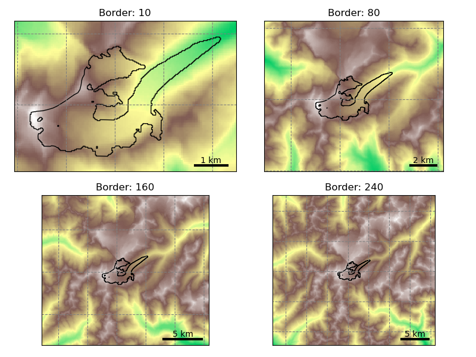
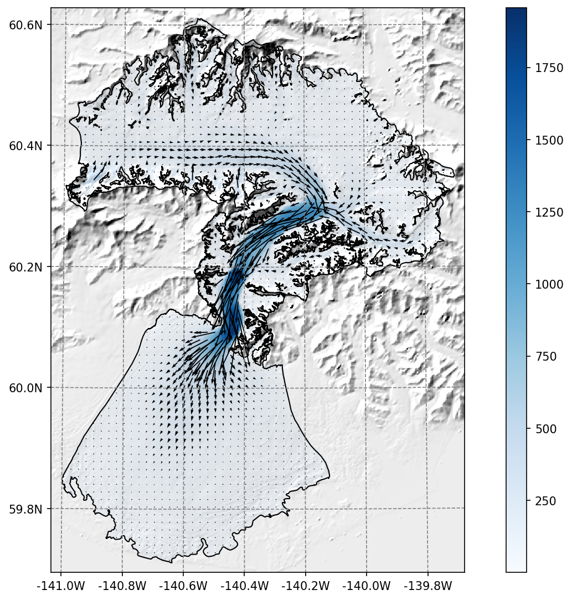
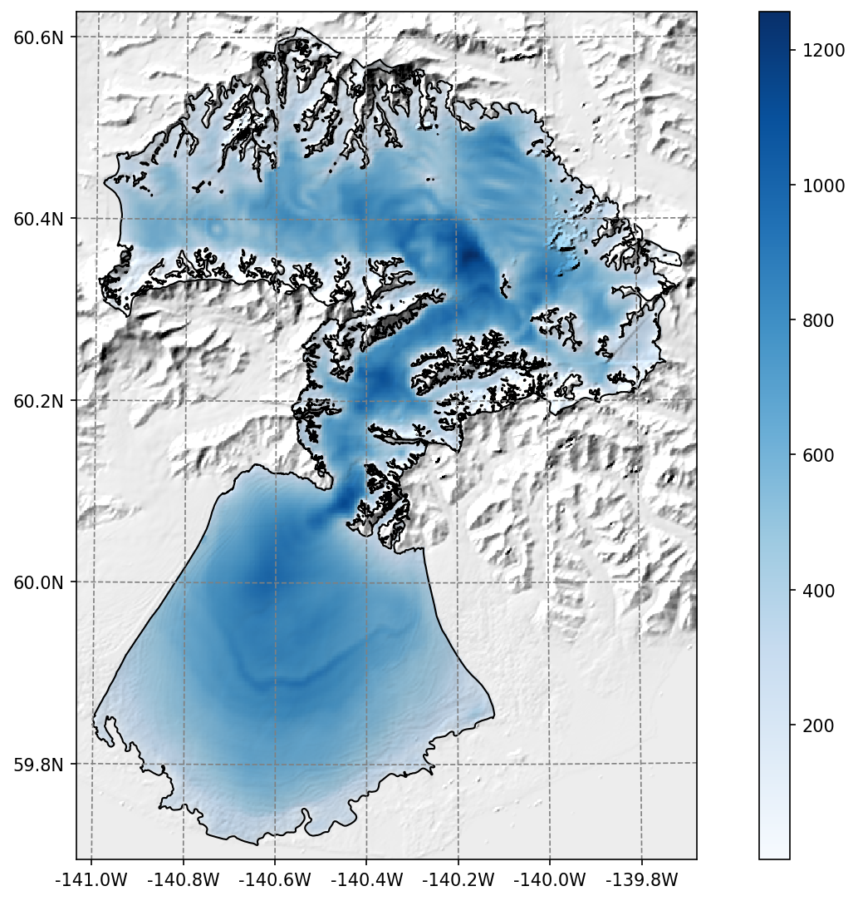

.. currentmodule:: oggm

OGGM Shop
=========

OGGM needs various data files to run. **We rely exclusively on
open-access data that can be downloaded automatically for the user**. This
data needs to be extracted and pre-processed for each individual glacier. To
avoid that everyone needs to repeat these steps, we have added a
service that we like to call a "shop", allowing users to define a shopping list
of data that they wish to add to their :ref:`glacierdir`. The data that can be
included your glacier directories range from essentials for standard OGGM workflow
to other data, like velocity provided as gridded_data for each respective glacier,
that might be of interest to you.

This page describes the various products you will find in the shop. Don't forget to
cite the original data sources of the data that you use (all details can be found
the glacier directories, but details are also listed throughout the documentation).

.. important::

    Don't forget to set-up or check your system (:ref:`system-settings`) before
    downloading new data! You'll need to do this only once per computer.

.. _preprodir:

Pre-processed directories
-------------------------

The simplest way to run OGGM is to rely on :ref:`glacierdir` which have been
prepared for you by the OGGM developers. Depending on your use case,
you can start from various stages in the processing chain, map sizes,
and model set-ups.

The directories have been generated with the standard parameters
of the respective OGGM version (and a few alternative combinations).
If you want to change some of these parameters, you may have to start a
run from a lower processing level and re-run the processing tasks.
Whether or not this is necessary depends on the stage of the workflow
you'd like your computations to diverge from the
defaults (this will become clearer as we provide examples workflow below).

To start from a pre-processed state, simply use the
:py:func:`workflow.init_glacier_directories` function with the
``prepro_base_url``, ``from_prepro_level`` and ``prepro_border`` keyword arguments
set to the values of your choice. This will fetch the desired directories:
there are more options to these, which we explain in detail below.
If you like to start using the pre-processed directories right away, with out
reading about all the different options and details first, you can go to the
[10 minutes to… a preprocessed directory](https://oggm.org/tutorials/stable/notebooks/10minutes/preprocessed_directories.html)
tutorial.

Processing levels
~~~~~~~~~~~~~~~~~

.. admonition:: **New in version 1.6!**

   In v1.6, Level 4 and Level 5 have changed! The explanations below are
   valid for OGGM version 1.6.0 and above.

There are six available levels of pre-processing:

- **Level 0**: the lowest level, with directories containing the glacier
  outlines only.
- **Level 1**: directories now contain the glacier topography data as well.
- **Level 2**: at this stage, the glacier flowlines and their downstream lines are
  computed and ready to be used.
- **Level 3**: has the baseline climate timeseries (e.g. W5E5, CRU or ERA5)
  added to the directories. It also contains all necessary pre-processing tasks
  for a dynamical run, including the mass balance calibration, bed inversion,
  up to the :py:func:`tasks.init_present_time_glacier` task.
  These directories still contain all data that were necessary for the processing.
  Therefore they are large in size but also the most flexible since
  the processing chain can be re-run from them.
- **Level 4**: includes a historical simulation from
  the RGI date to the last possible date of the baseline climate file
  (currently January 1st 2020 at 00H for most datasets), stored with the file suffix
  ``_historical``. Moreover, some configurations (called ``spinup``) may include
  a simulation running a spinup from 1979 to the last possible date of the baseline climate file,
  stored with the file suffix ``_spinup_historical``. This spinup attempts to conduct a
  dynamic melt factor calibration and a dynamic spinup matching the RGI area.
  If this fails, only a dynamic spinup is carried out. If this also fails, a
  fixed geometry spinup is conducted. To learn more about these different spinup types,
  check out :ref:`dynamic-spinup`.
- **Level 5**: is same as level 4 but with all intermediate output files removed.
  The strong advantage of level 5 directories is that their size is considerably
  reduced, at the cost that certain operations (like plotting on maps or
  re-running the bed inversion algorithm) are not possible anymore.

In practice, most users are going to use level 2, level 3 or level 5 files. To
save space on our servers, level 4 data might be unavailable for some
experiments (but are easily recovered if needed).

.. admonition:: **Changes to the version 1.4 directories**
   :class: note, dropdown

   In previous versions, level 4 files were the "reduced" directories with intermediate
   files removed. Level 5 was very similar, but without the dynamic spinup files.
   In practice, most users won't really see a change.

Here are some example use cases for glacier directories, and recommendations on which
level to pick:

1. Running OGGM from GCM / RCM data with the default settings: **start from level 5**
2. Using OGGM's flowlines but running your own baseline climate,
   mass balance or ice thickness inversion models: **start at level 2**.
   When using an own module, for instance for the mass balance, one can still decide to
   use OGGM again further on in the workflow, for instance for the glacier dynamics. This is
   the workflow used by associated model `PyGEM <https://github.com/drounce/PyGEM>`_ for example.
3. Run sensitivity experiments for the ice thickness inversion: start at level
   3 (with climate data available) and re-run the inversion steps.

Glacier map size: the prepro_border argument
~~~~~~~~~~~~~~~~~~~~~~~~~~~~~~~~~~~~~~~~~~~~

The size of the local glacier map is given in number of grid points *outside*
the glacier boundaries. The larger the domain, the larger the glacier can
become. Here is an example with Hintereisferner in the Alps:

.. ipython:: python
   :suppress:

    import os
    import matplotlib.pyplot as plt
    import numpy as np
    from oggm import cfg, tasks, workflow, graphics, DEFAULT_BASE_URL
    from oggm.utils import gettempdir

    cfg.initialize()
    cfg.PATHS['working_dir'] = os.path.join(gettempdir(), 'Docs_BorderSize')

..
  replace with
  .. ipython:: python
    :okwarning:
    ...
    @savefig plot_border_size.png width=100%
    plt.tight_layout(); plt.show()
  to test that this is still working

.. code-block:: python

    base_url = 'https://cluster.klima.uni-bremen.de/~oggm/gdirs/oggm_v1.6'
    base_url += '/L1-L2_files/elev_bands'
    f, axs = plt.subplots(2, 2, figsize=(8, 6))
    for ax, border in zip(np.array(axs).flatten(), [10, 80, 160, 240]):
        gdir = workflow.init_glacier_directories('RGI60-11.00897',
                                                 from_prepro_level=1,
                                                 prepro_base_url=base_url,
                                                 prepro_border=border)
        graphics.plot_domain(gdir, ax=ax, title='Border: {}'.format(border),
                             add_colorbar=False,
                             lonlat_contours_kwargs={'add_tick_labels':False})

Users should choose the border parameter depending
on the expected glacier growth in their simulations. For simulations into
the 21st century, a border value of 80 is sufficient.
For runs including the Little Ice Age, a border value of 160 or 240 is recommended.

Users should be aware that the amount of data to download isn't small,
especially for full directories at processing level 3 and 4. It is recommended
to always pick the smallest border value suitable for your research question,
and to start your runs from level 5 if possible. Here is an indicative table for
the total amount of data with ERA5 centerlines for all 19 RGI regions:

======  =====  =====  =====  =====
Level   B  10  B  80  B 160  B 240
======  =====  =====  =====  =====
**L0**  979M   979M   979M   979M
**L1**  3.3G   17G    47G    95G
**L2**  8.3G   49G    142G   285G
**L3**  14G    55G    148G   292G
**L4**         58G    152G   296G
**L5**         11G    11G    12G
======  =====  =====  =====  =====

*L4 and L5 data are not available for border 10 (the domain is too small for
the downstream lines)*.

Certain regions are much smaller than others of course. As an indication,
with prepro level 3 and a map border of 160, the Alps are ~2.1G large, Greenland
~21G, and Iceland ~660M.

.. note::

  The data download of the preprocessed directories will occur one single time
  only: after the first download, the data will be cached in OGGM's
  ``dl_cache_dir`` folder (see :ref:`system-settings`).

Available pre-processed configurations
~~~~~~~~~~~~~~~~~~~~~~~~~~~~~~~~~~~~~~

OGGM has several configurations and directories to choose from,
and the list is getting larger regularly. Don't hesitate to ask us if you are
unsure about which to use, or if you'd like to have more configurations
to choose from!

To choose from a specific preprocessed configuration, use the ``prepro_base_url``
argument in your call to :py:func:`workflow.init_glacier_directories`,
and set it to the url of your choice.

The recommended ``prepro_base_url`` for a standard OGGM run is:

.. ipython:: python
   :okwarning:

    from oggm import DEFAULT_BASE_URL
    DEFAULT_BASE_URL

This is the set-up that was used to generate the OGGM 1.6.1 standard projections
(:doc:`download-projections`).
The basic set-up is following:

- all default OGGM parameters
- :ref:`eb-flowlines`
- :ref:`climate-w5e5` reference climate
- "informed three-step" mass balance model calibration (see :ref:`mb-calib`)
- :ref:`dynamic-spinup` with dynamic melt factor calibration

There are however multiple options to choose from. Our `tutorials <https://oggm.org/tutorials>`_
showcase example of applications for some of them. One can explore
`cluster.klima.uni-bremen.de/~oggm/gdirs/oggm_v1.6 <https://cluster.klima.uni-bremen.de/~oggm/gdirs/oggm_v1.6>`_
for more options. Here follows a brief guide through the folder structure:

- Step 1:
   L1_L2_files: here the directories with pre-processing level 1 and 2 can be found.
   L3_L5_files: here the directories with pre-processing level 3 to 5 can be found.
- Step 2: one can select a version of the directories (e.g. 2023.3)
- Step 3: select the flowline type, centerlines or elevation band flowlines (elev_bands), optionally with the extension of you choice in when using L1_L2_files.
- Step 4: This is only needed when taking the L3_L5_files route. The folder name starts with the name of the baseline climate (e.g. w5e5) that has been used, optionally followed by one or more extensions.

Explanation of the naming convention for the folder name extensions:

- `_spinup` indicates that the dynamic spin-up has been used for the calibration, if left out the calibration was done without the dynamic spin-up.
- `w_data` indicates that additional data has been added to the directories: ITS-LIVE, Millan et al. ice velocity product and the consensus ice thickness estimate (all described in more detail later).

.. admonition:: Deprecated: **version 1.4 and 1.5 directories (before v1.6)**
    :class: note, dropdown

    **All v1.4 directories are still working with OGGM v1.6: however, you may have to change
    the run parameters back to their previous values**. We document them here:

    **A. Default**

    If not provided with a specific ``prepro_base_url`` argument,
    :py:func:`workflow.init_glacier_directories` will download the glacier
    directories from the default urls. Here is a summary of the default configuration:

    - model parameters as of the ``oggm/params.cfg`` file at the published model version
    - flowline glaciers computed from the geometrical centerlines (including tributaries)
    - baseline climate from CRU (not available for Antarctica) using a global precipitation factor of 2.5 (path index: *pcp2.5*)
    - baseline climate quality checked and corrected if needed with :py:func:`tasks.historical_climate_qc` with ``N=3``.
      If the condition of at least 3 months of melt per year at the terminus and 3 months of accumulation
      at the glacier top is not reached, temperatures are shifted (path index: *qc3*).
    - mass balance parameters calibrated with the standard OGGM procedure (path index: *no_match*).
      No calibration against geodetic MB (see options below for regional calibration).
    - ice volume inversion calibrated to match the ice volume from [Farinotti_etal_2019]_
      **at the RGI region level**, i.e. glacier estimates might differ. If not specified otherwise,
      it's also the precalibrated parameters that will be used for the dynamical run.
    - frontal ablation by calving (at inversion and for the dynamical runs) is switched off

    To see the code that generated these directories (for example if you want to
    make your own, visit :py:func:`cli.prepro_levels.run_prepro_levels`
    or this `file on github <https://github.com/OGGM/oggm/blob/master/oggm/cli/prepro_levels.py>`_).

    The urls used by OGGM per default are in the following ftp servor:

    `https://cluster.klima.uni-bremen.de/~oggm/gdirs/oggm_v1.4/ <https://cluster.klima.uni-bremen.de/~oggm/gdirs/oggm_v1.4/>`_ :

    - `L1-L2_files/centerlines <https://cluster.klima.uni-bremen.de/~oggm/gdirs/oggm_v1.4/L1-L2_files/centerlines/>`_ for level 1 and level 2
    - `L3-L5_files/CRU/centerlines/qc3/pcp2.5/no_match <https://cluster.klima.uni-bremen.de/~oggm/gdirs/oggm_v1.4/L3-L5_files/CRU/centerlines/qc3/pcp2.5/no_match/>`_ for level 3 to 5

    If you are new to this, we recommend to explore these directories to familiarize yourself
    to their content. Of course, when provided with an url such as above,
    OGGM will know where to find the respective files
    automatically, but is is good to understand how they are structured. The `summary folder`
    (`example <https://cluster.klima.uni-bremen.de/~oggm/gdirs/oggm_v1.4/L1-L2_files/centerlines/RGI62/b_080/L2/summary/>`_)
    contains diagnostic files which can be useful as well.

    **B. Option: Geometrical centerlines or elevation band flowlines**

    The type of flowline to use (see :doc:`flowlines`) can be decided at level 2 already.
    Therefore, the two configurations available at level 2 from these urls:

    - `L1-L2_files/centerlines <https://cluster.klima.uni-bremen.de/~oggm/gdirs/oggm_v1.4/L1-L2_files/centerlines/>`_ for centerlines
    - `L1-L2_files/elev_bands <https://cluster.klima.uni-bremen.de/~oggm/gdirs/oggm_v1.4/L1-L2_files/elev_bands/>`_ for elevation bands

    The default pre-processing set-ups are also available with each of these
    flowline types. For example with CRU:

    - `L3-L5_files/CRU/centerlines/qc3/pcp2.5/no_match <https://cluster.klima.uni-bremen.de/~oggm/gdirs/oggm_v1.4/L3-L5_files/CRU/centerlines/qc3/pcp2.5/no_match/>`_ for centerlines
    - `L3-L5_files/CRU/elev_bands/qc3/pcp2.5/no_match <https://cluster.klima.uni-bremen.de/~oggm/gdirs/oggm_v1.4/L3-L5_files/CRU/elev_bands/qc3/pcp2.5/no_match/>`_ for elevation bands

    **C. Option: Baseline climate data**

    For the two most important default configurations (CRU or ERA5 as baseline climate),
    we provide all levels for both the geometrical centerlines or the elevation band
    flowlines:

    - `L3-L5_files/CRU/centerlines/qc3/pcp2.5/no_match <https://cluster.klima.uni-bremen.de/~oggm/gdirs/oggm_v1.4/L3-L5_files/CRU/centerlines/qc3/pcp2.5/no_match/>`_ for CRU + centerlines
    - `L3-L5_files/CRU/elev_bands/qc3/pcp2.5/no_match <https://cluster.klima.uni-bremen.de/~oggm/gdirs/oggm_v1.4/L3-L5_files/CRU/elev_bands/qc3/pcp2.5/no_match/>`_ for CRU + elevation bands
    - `L3-L5_files/ERA5/centerlines/qc3/pcp1.6/no_match <https://cluster.klima.uni-bremen.de/~oggm/gdirs/oggm_v1.4/L3-L5_files/ERA5/centerlines/qc3/pcp1.6/no_match/>`_ for ERA5 + centerlines
    - `L3-L5_files/ERA5/elev_bands/qc3/pcp1.6/no_match <https://cluster.klima.uni-bremen.de/~oggm/gdirs/oggm_v1.4/L3-L5_files/ERA5/elev_bands/qc3/pcp1.6/no_match/>`_ for ERA5 + elevation bands

    Note that the globally calibrated multiplicative precipitation factor (pcp) depends on the used baseline climate
    (e.g. pcp is 2.5 for CRU and 1.6 for ERA5). If you want to use another baseline climate, you have to calibrate the
    precipitation factor yourself. Please get in touch with us in that case!

    **D. Option: Mass balance calibration method**

    There are different mass balance calibration options available in the preprocessed directories:

    -   **no_match**: This is the default calibration option. For calibration, the direct glaciological WGMS data is used
        and the `Marzeion et al., 2012`_ *tstar* method is applied to interpolate to glaciers without measurements. With this method, the geodetic estimates are not matched.
    -   **match_geod**: The default calibration with direct glaciological WGMS data is still applied on the glacier per
        glacier level, but on the regional level the epsilon (residual) is corrected to match the geodetic estimates
        from `Hugonnet et al., 2021`_. For example:

        - `L3-L5_files/CRU/elev_bands/qc3/pcp2.5/match_geod <https://cluster.klima.uni-bremen.de/~oggm/gdirs/oggm_v1.4/L3-L5_files/CRU/elev_bands/qc3/pcp2.5/match_geod/>`_ for CRU + elevation bands flowlines + matched on regional geodetic mass balances
        - `L3-L5_files/ERA5/elev_bands/qc3/pcp1.6/match_geod <https://cluster.klima.uni-bremen.de/~oggm/gdirs/oggm_v1.4/L3-L5_files/ERA5/elev_bands/qc3/pcp1.6/match_geod/>`_ for ERA5 + elevation bands flowlines + matched on regional geodetic mass balances

    -   **match_geod_pergla**: Only the per-glacier geodetic estimates from `Hugonnet et al., 2021`_
        (mean mass balance change between 2000 and 2020) are used for calibration. The mass balance model parameter
        :math:`\mu ^{*}` of each glacier is calibrated to match individually the geodetic estimates (using
        :py:func:`oggm.core.climate.mustar_calibration_from_geodetic_mb`). For the preprocessed glacier directories, the
        allowed :math:`\mu ^{*}` range is set to 20--600 (more in :doc:`mass-balance-monthly`).
        This option only works for elevation band flowlines at the moment. match_geod_pergla makes only sense without
        "external" climate quality check and correction (i.e. qc0) as this is already done internally. For example:

        - `L3-L5_files/CRU/elev_bands/qc0/pcp2.5/match_geod_pergla <https://cluster.klima.uni-bremen.de/~oggm/gdirs/oggm_v1.6/L3-L5_files/CRU/elev_bands/qc0/pcp2.5/match_geod_pergla/>`_ for CRU + elevation bands flowlines + matched geodetic mass balances on individual glacier level
        - `L3-L5_files/ERA5/elev_bands/qc0/pcp1.6/match_geod_pergla <https://cluster.klima.uni-bremen.de/~oggm/gdirs/oggm_v1.6/L3-L5_files/ERA5/elev_bands/qc0/pcp1.6/match_geod_pergla/>`_ for ERA5 + elevation bands flowlines + matched geodetic mass balances on individual glacier level

    .. warning::
        make sure that you use the oggm_v1.6 directory for match_geod_pergla and match_geod_pergla_massredis!
        In the `gdirs/oggm_v1.4 <https://cluster.klima.uni-bremen.de/~oggm/gdirs/oggm_v1.4/>`_ folder from the OGGM
        server, the `match_geod_pergla` preprocessed directories have a minor bug in the calibration
        (`see this GitHUB issue <https://github.com/OGGM/oggm/pull/1351>`_). This bug is removed in the latest OGGM
        version and the corrected preprocessed glacier directories are inside the
        `gdirs/oggm_v1.6 <https://cluster.klima.uni-bremen.de/~oggm/gdirs/oggm_v1.6/>`_ folder.

    **E. Further set-ups**

    Here is a list of other available configurations at the time of writing (explore the server for more!):

    - `L3-L5_files/CERA+ERA5/elev_bands/qc3/pcp1.6/no_match <https://cluster.klima.uni-bremen.de/~oggm/gdirs/oggm_v1.4/L3-L5_files/CERA+ERA5/elev_bands/qc3/pcp1.6/no_match/>`_ for CERA+ERA5 + elevation bands flowlines
    - `L3-L5_files/CERA+ERA5/elev_bands/qc3/pcp1.6/match_geod <https://cluster.klima.uni-bremen.de/~oggm/gdirs/oggm_v1.4/L3-L5_files/CERA+ERA5/elev_bands/qc3/pcp1.6/match_geod/>`_ for CERA+ERA5 + elevation bands flowlines + matched on regional geodetic mass balances
    - `L3-L5_files/ERA5/elev_bands/qc3/pcp1.8/match_geod <https://cluster.klima.uni-bremen.de/~oggm/gdirs/oggm_v1.4/L3-L5_files/ERA5/elev_bands/qc3/pcp1.8/match_geod/>`_ for ERA5 + elevation bands flowlines + matched on regional geodetic mass balances + precipitation factor 1.8
    - `L3-L5_files/CRU/elev_bands/qc0/pcp2.5/match_geod <https://cluster.klima.uni-bremen.de/~oggm/gdirs/oggm_v1.4/L3-L5_files/CRU/elev_bands/qc0/pcp2.5/match_geod/>`_ for CRU + elevation bands flowlines + matched on regional geodetic mass balances + no climate quality check
    - `L3-L5_files/CRU/elev_bands/qc0/pcp2.5/no_match <https://cluster.klima.uni-bremen.de/~oggm/gdirs/oggm_v1.4/L3-L5_files/CRU/elev_bands/qc0/pcp2.5/no_match/>`_ for CRU + elevation bands flowlines + no climate quality check
    - `L3-L5_files/CRU/elev_bands/qc0/pcp2.5/match_geod_pergla_massredis <https://cluster.klima.uni-bremen.de/~oggm/gdirs/oggm_v1.6/L3-L5_files/CRU/elev_bands/qc0/pcp2.5/match_geod_pergla_massredis/>`_ for CRU + elevation bands flowlines + matched on regional geodetic mass balances + mass redistribution instead of SIA (see: :doc:`mass-redistribution`)
    - `L3-L5_files/ERA5/elev_bands/qc0/pcp1.6/match_geod_pergla_massredis <https://cluster.klima.uni-bremen.de/~oggm/gdirs/oggm_v1.6/L3-L5_files/ERA5/elev_bands/qc0/pcp1.6/match_geod_pergla_massredis/>`_ for ERA5 + elevation bands flowlines + matched on regional geodetic mass balances + mass redistribution instead of SIA

    Note: the additional set-ups might not always have all map sizes available. Please
    get in touch if you have interest in a specific set-up. Remember that per default, the climate quality check
    and correction (:py:func:`oggm.tasks.historical_climate_qc`) is applied (*qc3*). However, if the pre-processed directory
    has the path index "*qc0*", it was not applied (except for match_geod_pergla where it is applied internally).

    **F. Error analysis and further volume and mass change comparison for different pre-processed glacier directories**

    .. figure:: _static/relative_failing_glacier_area.png
        :width: 100%
        :align: left

        Overall, calibrating with ERA5 using a precipitation factor of 1.6 results in much less errors than CRU with pf=2.5.
        In addition, less errors occur for elevation bands and when using the match_geod_pergla option.

    A more detailed analysis about the type, amount and relative failing glacier area (in total and per RGI region) can be
    found in this `error analysis jupyter notebook <https://nbviewer.jupyter.org/urls/cluster.klima.uni-bremen.de/~lschuster/error_analysis/error_analysis_v1.ipynb?flush_cache=true>`_.

    If you are also interested in how the "common" non-failing glaciers differ in terms of historical volume change, total
    mass change and specific mass balance between different pre-processed glacier directories,
    you can check out this
    `jupyter notebook <https://nbviewer.org/urls/cluster.klima.uni-bremen.de/~lschuster/error_analysis/working_glacier_gdirs_comparison.ipynb?flush_cache=true>`_.

.. _Marzeion et al., 2012: http://www.the-cryosphere.net/6/1295/2012/tc-6-1295-2012.html

Additional available data
-------------------------

Here follows a description of the additional data that can be added to the
pre-processed glacier directories, by choosing the 'w_data' option.

ITS_LIVE
~~~~~~~~

The `ITS_LIVE <https://its-live.jpl.nasa.gov/>`_ ice velocity products
can be downloaded and reprojected to the glacier directory
(visit our `tutorials`_ if you are interested!).

    Example of the reprojected ITS_LIVE products at Malaspina glacier

The data source used is https://its-live.jpl.nasa.gov/#data
Currently the only data downloaded is the 120m composite for both
(u, v) and their uncertainty. The composite is computed from the
1985 to 2018 average.

If you want more velocity products, feel free to open a new topic
on the OGGM issue tracker!

Ice thickness
~~~~~~~~~~~~~

The `Farinotti et al., 2019 <https://www.nature.com/articles/s41561-019-0300-3>`_
ice thickness products can be downloaded and reprojected to the glacier directory
(visit our `tutorials`_ if you are interested!).

    Example of the reprojected ice thickness products at Malaspina glacier

Millan et al. (2022) ice velocity and thickness products
~~~~~~~~~~~~~~~~~~~~~~~~~~~~~~~~~~~~~~~~~~~~~~~~~~~~~~~~

Similarly, we provide data from the recent
`Millan et al. (2022) <https://www.nature.com/articles/s41561-021-00885-z>`_
global study (visit our `tutorials`_ if you are interested!).

Raw data sources
----------------

If you want to run your own workflow from A to Z, or if you would like
to know which data are used in OGGM before being available in the
pre-processed directories, read further for some more details!

.. _outlines:

Glacier outlines and intersects
~~~~~~~~~~~~~~~~~~~~~~~~~~~~~~~

Glacier outlines are obtained from the `Randolph Glacier Inventory (RGI)`_.
We recommend to download them right away by opening a python interpreter
and type:

.. code-block:: python

    from oggm import cfg, utils
    cfg.initialize()
    utils.get_rgi_intersects_dir()
    utils.get_rgi_dir()

The RGI folders should now contain the glacier outlines in the
`shapefile format <https://en.wikipedia.org/wiki/Shapefile>`_, a format widely
used in GIS applications. These files can be read by several software
(e.g. `qgis <https://www.qgis.org/en/site/>`_), and OGGM can read them too.

The "RGI Intersects" shapefiles contain the locations of the ice divides
(intersections between neighboring glaciers). OGGM can make use of them to
determine which bed shape should be used (rectangular or parabolic). See the
`rgi tools <https://rgitools.readthedocs.io/en/latest/tools.html#glacier-intersects>`_
documentation for more information about the intersects.

The following table summarizes the RGI attributes used by OGGM. It
can be useful to refer to this list if you use your own glacier outlines
with OGGM.

==================  ===========================  ======================
RGI attribute       Equivalent OGGM variable     Comments
==================  ===========================  ======================
RGIId               ``gdir.rgi_id``              [#f1]_
GLIMSId             ``gdir.glims_id``            not used
CenLon              ``gdir.cenlon``              [#f2]_
CenLat              ``gdir.cenlat``              [#f2]_
O1Region            ``gdir.rgi_region``          not used
O2Region            ``gdir.rgi_subregion``       not used
Name                ``gdir.name``                used for graphics only
BgnDate             ``gdir.rgi_date``            [#f3]_
Form                ``gdir.glacier_type``        [#f4]_
TermType            ``gdir.terminus_type``       [#f5]_
Status              ``gdir.status``              [#f6]_
Area                ``gdir.rgi_area_km2``        [#f7]_
Zmin                ``glacier_statistics.csv``   recomputed by OGGM
Zmax                ``glacier_statistics.csv``   recomputed by OGGM
Zmed                ``glacier_statistics.csv``   recomputed by OGGM
Slope               ``glacier_statistics.csv``   recomputed by OGGM
Aspect              ``glacier_statistics.csv``   recomputed by OGGM
Lmax                ``glacier_statistics.csv``   recomputed by OGGM
Connect             not included
Surging             not included
Linkages            not included
EndDate             not included
==================  ===========================  ======================

For Greenland and Antarctica peripheral glaciers, OGGM does not take into account the
connectivity level between the Glaciers and the Ice sheets.
We recommend to the users to think about this before they
run the task: ``workflow.init_glacier_directories``.

.. _Randolph Glacier Inventory (RGI): https://www.glims.org/RGI/

.. rubric:: Comments

.. [#f1] The RGI id needs to be unique for each entity. It should resemble the
         RGI, but can have longer ids. Here are example of valid IDs:
         ``RGI60-11.00897``, ``RGI60-11.00897a``, ``RGI60-11.00897_d01``.
.. [#f2] ``CenLon`` and ``CenLat`` are used to center the glacier local map and DEM.
.. [#f3] The date is the acquisition year, stored as an integer.
.. [#f4] Glacier type: ``'Glacier'``, ``'Ice cap'``, ``'Perennial snowfield'``,
         ``'Seasonal snowfield'``, ``'Not assigned'``. Ice caps are treated
         differently than glaciers in OGGM: we force use a single flowline
         instead of multiple ones.
.. [#f5] Terminus type: ``'Land-terminating'``, ``'Marine-terminating'``,
         ``'Lake-terminating'``, ``'Dry calving'``, ``'Regenerated'``,
         ``'Shelf-terminating'``, ``'Not assigned'``. Marine and Lake
         terminating are classified as "tidewater" in OGGM and cannot advance
         - they "calve" instead, using a very simple parameterization.
.. [#f6] Glacier status: ``'Glacier or ice cap'``, ``'Glacier complex'``,
         ``'Nominal glacier'``, ``'Not assigned'``. Nominal glaciers fail at
         the "Glacier Mask" processing step in OGGM.
.. [#f7] The area of OGGM's flowline glaciers is corrected to the one provided
         by the RGI, for area conservation and inter-comparison reasons. If
         you do not want to use the RGI area but the one computed from the
         shape geometry in the local OGGM map projection instead, set
         ``cfg.PARAMS['use_rgi_area']`` to ``False``. This is useful when
         using homemade inventories.

Topography data
~~~~~~~~~~~~~~~

When creating a :ref:`glacierdir`, a suitable topographical data source is
chosen automatically, depending on the glacier's location. OGGM supports
a large number of datasets (almost all of the freely available ones, we
hope). They are listed on the
`RGI-TOPO <https://rgitools.readthedocs.io/en/latest/dems.html>`_ website.

The current default is to use the following datasets:

- NASADEM: 60°S-60°N
- COPDEM90: Global, with missing regions (islands, etc.)
- GIMP, REMA: Regional datasets
- TANDEM: Global, with artefacts / missing data
- MAPZEN: Global, when all other things failed

These data are chosen in the provided order. If a dataset is not available,
the next on the list will be tested: if the tested dataset covers
75% of the glacier area, it is selected. In practice, NASADEM and COPDEM90
are sufficient for all but about 300 of the world's glaciers.

These data are downloaded only when needed (i.e. during an OGGM run)
and they are stored in the ``dl_cache_dir``
directory. The gridded topography is then reprojected and resampled to the local
glacier map. The local grid is defined on a Transverse Mercator projection centered over
the glacier, and has a spatial resolution depending on the glacier size. The
default in OGGM is to use the following rule:

.. math::

    \Delta x = d_1 \sqrt{S} + d_2

where :math:`\Delta x` is the grid spatial resolution (in m), :math:`S` the
glacier area (in km\ :math:`^{2}`) and :math:`d_1`, :math:`d_2` some parameters (set to 14 and 10,
respectively). If the chosen spatial resolution is larger than 200 m
(:math:`S \ge` 185 km\ :math:`^{2}`) we clip it to this value.

.. ipython:: python
   :suppress:

    import json
    from oggm.utils import get_demo_file
    with open(get_demo_file('dem_sources.json'), 'r') as fr:
        DEM_SOURCE_INFO = json.loads(fr.read())
    # for k, v in DEM_SOURCE_INFO.items():
    #   print(v)

**Important:** when using these data sources for your OGGM runs, please refer
to the original data provider of the data! OGGM adds a ``dem_source.txt``
file in each glacier directory specifying how to cite these data. We
reproduce this information
`here <https://github.com/OGGM/oggm/blob/master/oggm/data/dem_sources.txt>`_.

.. warning::

    A number of glaciers will still suffer from poor topographic information.
    Either the errors are large or obvious (in which case the model won't run),
    or they are left unnoticed. The importance of reliable topographic data for
    global glacier modelling cannot be emphasized enough, and it is a pity
    that no consistent, global DEM is yet available for scientific use.
    Visit `rgitools <https://rgitools.readthedocs.io/en/latest/dems.html>`_
    for a discussion about our current efforts to find "the best" DEMs.

.. note::

    `In this blogpost <https://oggm.org/2019/10/08/dems/>`_ we talk about which
    requirements a DEM must fulfill to be helpful to OGGM. And we also explain
    why and how we preprocess some DEMs before we make them available to the
    OGGM workflow.

.. _Hugonnet et al., 2021: https://www.nature.com/articles/s41586-021-03436-z
