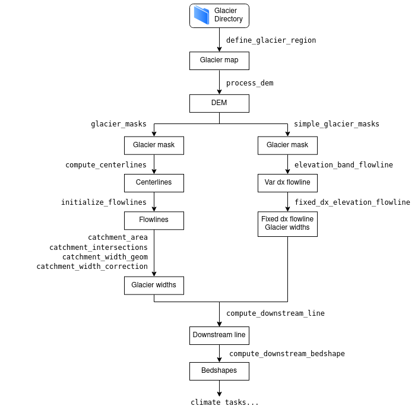

Model structure and fundamentals
================================

.. currentmodule:: oggm

Glacier centric model
---------------------

OGGM is what we called a "glacier centric model", which means that it runs for each
glacier independently of the others. In the case of glacier complexes, it
relies on the glacier inventory to properly separate the individual glacier
entities by the ice divides, ensuring that all ice in a glacier basin flows
towards a single glacier terminus.

.. figure:: https://oggm.org/framework_talk/img/iceland.png
    :align: left

    Glacier centric approach applied to the Eyjafjallajökull ice cap in Iceland.
    Glacier outlines provided by the Randolph Glacier Inventory v6.0.

The glacier centric approach is used by most large-scale glacier models to date.
Alternative strategies include global gridded approaches, where all glaciers
in a model grid cell are added together and possibly organized into elevation bins.
Another approach would be to handle entire glacier complexes as one single body of ice ("ice caps").
**With the release of RGI7 (early 2022), OGGM will also be able to consider glacier
complexes as if they were single glacier entities.**

.. admonition:: More details on the glacier centric approach
    :class: note, dropdown

    The advantage of glacier centric models is their adherence to the de-facto standard
    inventory of glacier outlines: the Randolph Glacier Inventory. Any glacier can be selected
    and simulated, and the model output can be compared to standard reference datasets
    such as length changes or surface mass balance data from the World Glacier Monitoring Service.
    Various models can be compared on a glacier per glacier basis or a combination of them.
    It is also computationally efficient, since models can focus on simulating the areas
    where glaciers are really located. This may sound trivial, but glacier centric models
    can also make use of the glacier location as a boundary condition, e.g. by excluding
    unrealistic solutions to the problem of computing mass balance or inferring ice thickness,
    for example.

    The disadvantage of glacier centric models is their questionable scientific validity in
    presence of glacier complexes and ice divides (this problem can be mitigated by
    defining glacier complexes as one single entity, requiring other strategies than
    currently standard in OGGM). A larger issue of glacier centric models is that
    they are focussed on simulating glaciers that have been inventoried, i.e. they cannot
    retrieve past (or present) uncharted glaciers. For these reasons, they are not well adapted for
    studying glacier evolution in climates when glaciers were widely
    different from today (e.g. the Last Glacial Maximum).

Data structures and glacier directories
---------------------------------------

The fundamental data structure used in OGGM is the so-called **Glacier Directory**.
:ref:`glacierdir` are simple folders on disk which store the input and output
data for a single glacier during a run. OGGM offers an interface
to access and store these files programmatically.

This very simple idea is at the core of the OGGM workflow: actions to perform
on glaciers ("**tasks**", see below) are given access to the data files via
the glacier directory interface, read data they need from disk, and write back to it.
This design matches perfectly the "glacier centric" modelling strategy,
and has many advantages as outlined below.

Here is an example of how glacier directories work in practice. The user
indicates a repository (``base_url``, here leading to
`this online folder <https://cluster.klima.uni-bremen.de/~oggm/gdirs/oggm_v1.4/L3-L5_files/CRU/centerlines/qc3/pcp2.5/no_match>`_)
from which they want to fetch the data,
and a list of glacier IDs they’d like to start from. The
:py:func:`workflow.init_glacier_directories` task performs the action of
downloading and extracting these data locally:

.. ipython:: python
    :suppress:

    from oggm import cfg, utils
    cfg.initialize()

    cfg.PATHS['working_dir'] = utils.gettempdir('structure')

    # Where to fetch the pre-processed directories - this can be changed
    server_url = 'https://cluster.klima.uni-bremen.de/~oggm/gdirs/'
    experiment_url = 'oggm_v1.4/L3-L5_files/CRU/centerlines/qc3/pcp2.5/no_match'
    base_url = server_url + experiment_url

.. ipython:: python

    from oggm import workflow, graphics

    rgi_ids = ['RGI60-11.01328', 'RGI60-11.00897']
    gdirs = workflow.init_glacier_directories(rgi_ids,  # glaciers to download
                                              from_prepro_level=3,  # pre-processing level
                                              prepro_base_url=base_url)  # online repository
    @savefig plot_example_inversion.png width=100%
    graphics.plot_inversion(gdirs[0])

See also the documentation page for :ref:`shop` for more examples of
the kind of data that can be added to glacier directories.

.. admonition:: More details: pros and cons of glacier directories
    :class: note, dropdown

    **Pros**:

    - there is no practical difference between simulating one single,
      or many glaciers: all glacier directories are independent of another.
    - data is persistent on disk: workflows can be interrupted and restarted
      from disk at no cost overhead. Workflows can even be prepared on one
      computer and restarted from another computer (see example).
    - "modularity" is achieved via data formats, not via programmatic
      interfaces: various ways to compute the flowlines (for example) can
      co-exist if they agree on how a flowline is stored on disk.
    - multiprocessing is trivial: the same task can be run on many glaciers at
      once without having to share data across processes, since everything
      is on disk and independent.

    **Cons**:

    - for the glacier directories to be independent, several data sources are
      duplicated: topography for example (each glacier has its own subset of the
      original data, often overlapping with neighbors), or climate
      timeseries (the same data from the same grid point is stored in various
      directories). This can lead to rather large data storage requirements,
      but can be mitigated by deleting intermediate files.
    - since users can restart workflows from pre-processed states, the code that
      was used to produce them is often ignored or might be older, etc.
      This can lead to silent bugs (for example mismatching model parameters
      between the preprocessing and the simulations, leading to incorrect results).
      Because of this issue, we had to implement safeguards against such mistakes
      where possible.
    - users can be confused by glacier directories. Since an OGGM program does not
      always read like linear "A to Z" workflows (but for example "start from Q, then Q to Z"),
      mistakes like the ones described above can happen unnoticed.
    - it can make certain types of sensitivity experiments more difficult to implement,
      since users have to wrry not only about variable names, but also about data file names.

OGGM tasks
----------

**Tasks** in OGGM are actions to perform on one single glacier (:ref:`apientitytasks`)
or several of them (:ref:`apiglobaltasks`). Tasks have a special meaning in the
OGGM workflow and are applied as such:

.. code-block:: python

    # Initialize glacier directories
    from oggm import workflow, tasks
    gdirs = workflow.init_glacier_directories(rgi_ids)

    # Define the list of tasks
    task_list = [
        tasks.define_glacier_region,
        tasks.glacier_masks,
        tasks.compute_centerlines,
        tasks.catchment_area,
        tasks.catchment_width_geom,
    ]

    # Apply them sequentially
    for task in task_list:
        workflow.execute_entity_task(task, gdirs)

:py:func:`workflow.execute_entity_task` will apply the given task to a list of
glaciers. If multiprocessing is switched on, all glaciers will be processed in
parallel, making full use of all available processors. Here we apply the default
tasks with default settings, but parameters can be changed via global
settings or function arguments.

Depending on the desired set-up, tasks can be replaced by others
(e.g. the centerlines tasks can be replaced by other algorithms) or
omitted (for example, users can choose whether a quality check filter
should be applied to the climate timeseries or not).

    Example flowchart illustrating how OGGM implemented support for
    two kinds of flowline representations for a glacier: centerlines on the
    left (OGGM’s default) and binned elevation bands flowlines on the right
    (after `Huss & Farinotti (2012) <https://doi.org/10.1029/2012JF002523>`_).

Coupling of climatic mass-balance and geometry evolution models
---------------------------------------------------------------

(in construction)
